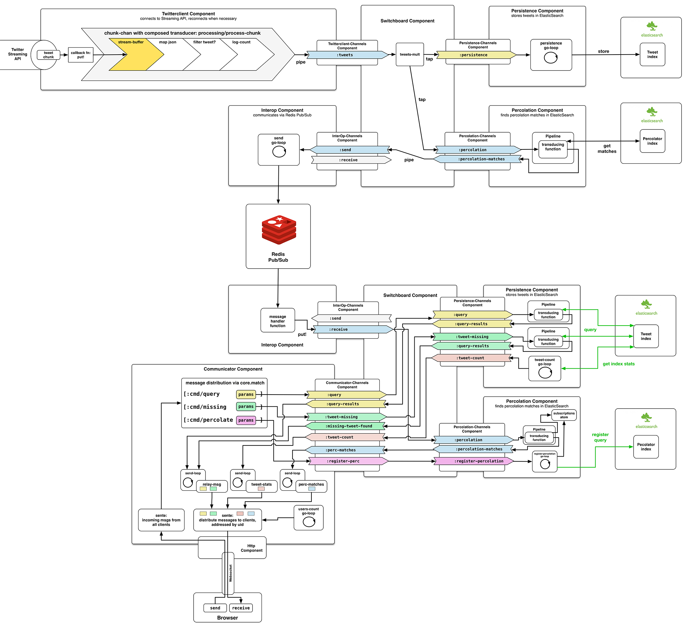

# Old Server-side Architecture

## Architectural Overview

In the following chapters, we will look at an earlier version of my **[BirdWatch](https://github.com/matthiasn/BirdWatch)** application. The approach outlined here is not my recommended approach any longer, as there were a lot of functionalities that were common to each and all the components in the system. Instead, I have moved this common functionality into a separate library called **[systems-toolbox](https://github.com/matthiasn/systems-toolbox)**. However, by going through the initial approach, you will have a good reference for why I wanted to have the library. In particular, please look out for repetitiveness and try to think how you may get rid of it. Then later on in this book, we can compare notes as I will present what I did. Please also email me (the address is on my **[GitHub](https://github.com/matthiasn)** page) and discuss what you would do differently.

Now let's start with the basic architecture of the server side. Here's an overview:

You can see an animated version of this drawing in the **[original blog post](http://matthiasnehlsen.com/blog/2014/09/24/Building-Systems-in-Clojure-1/)** that demonstrates how components in the system get wired up when the application initializes.

In the initial version that I wrote, where everything depended on everything, things were very different. Some people would call that "spaghetti code", but I think that is not doing justice to spaghetti. Unlike bad code, I don't mind touching spaghetti. I would rather liken bad code to hairballs, of the worst kind that is. Have you ever experienced the following: you are standing in the shower and the water doesn't drain. You notice something in the sink, so you squat down to pull it out only to start screaming, "Oh my god, it's a dead rat" a second later. I am referring to that kind of entangled hairball mess.

This is where dependency injection comes in. Can we agree that we don't like hairballs? Good. Usually, what we are trying to achieve is a so-called inversion of control, in which a component of the application knows that it will be injected something which implements a known interface at runtime. Then, no matter what the actual implementation is, it knows what methods it can call on that something because of the implemented interface.

Here, unlike in object-oriented dependency injection, things are a little different because we don't really have objects. The components play the role of objects, but as a further way of decoupling, I wanted them to only communicate via **core.async** channels. Channels are a great abstraction. Rich Hickey likens them to conveyor belts onto which you put something without having to know at all what happens on the other side. We will have a more detailed look at the channels in the next article. For now, as an abstraction, we can think about the channel components (the flat ones connecting the components with the switchboard) as **wiring harnesses**, like the one that connects the electronics of your car to your engine. The only way to interface with a modern engine (that doesn't have separate mechanical controls) is by connecting to this wiring harness and either send or receive information, depending on the channel / cable that you interface with.

## Scaling out

I recently did a lot of transcript proofreading concerning enlightening talk for my **[talk-transcripts project](https://github.com/matthiasn/talk-transcripts)**. The most recent one was **[Design, Composition and Performance](https://github.com/matthiasn/talk-transcripts/blob/master/Hickey_Rich/DesignCompositionPerformance.md)**, the tenth transcript of a talk by **Rich Hickey**. That one in particular got me thinking that there are quite a few ideas I want to adopt, so it was time to make up my mind what exactly it is that I am trying to solve with this application.

So here's the idea:

* We have a stream of information and we are interested in a subset of that information, which we can match on via **full-text search** and **ranges**. The searches are anything that **[ElasticSearch](http://www.elasticsearch.com)** / **[Lucene](http://lucene.apache.org)** can match on.
* Furthermore, we are interested in **live results** plus a certain period of time back into the **recent** past. For now, we are using tweets from the **[Twitter Streaming API](https://dev.twitter.com/streaming/overview)**, but the source could be anything, such as other social media data. Sensor data could also be really interesting. Live means new matches are added to the displayed results within about a second.
* The results are supposed to be shown in a browser, including on **mobile devices**. The number of items reasoned about should **not be limited by** the available **memory** of the browser[^redesign-browser].
* My next goal is to be able to reason about the **last one million tweets** for a certain topic. Also, it should be possible to serve **many concurrent ad-hoc queries**, like hundreds or more different ones.

What comes to mind immediately when regurgitating the requirements above is **[Storm](https://storm.apache.org)** and the **[Lambda Architecture](http://lambda-architecture.net)**. First I thought, great, such a search could be realized as a **bolt** in Storm. But then I realized, and please correct me if I'm wrong, that topologies are fixed once they are running. This limits the flexibility to add and tear down additional live searches. I am afraid that keeping a few stand-by bolts to assign to queries dynamically would not be flexible enough.

So instead I suggest doing the **final aggregation** (the reduce phase) on the browser side in a **ClojureScript** application. On the server side, partial results are aggregated for shorter time periods. These partial results can be generated in a cluster of nodes whilst the client is fed with live data immediately. Let's have a look at a drawing before I walk you through the individual steps:

Initially, this application was designed to run in a single JVM but after some redesign, I split the server side into two different components. The architecture you saw in the drawing above turned out to be a great preparation for separating parts of the application into separate JVMs for scaling out the application. My idea was that there should be one **TwitterClient** application (as Twitter only allows one connection to the capped Streaming API) but multiple web client facing applications so that the number of connections the system could handle would not be limited by whatever a single machine could handle. Let's call that the **MainApp** application. The separation of components and limiting their interaction to passing messages on channels made it extremely simple to scale the application by fanning out the streaming data to multiple client-facing JVMs. All that was needed in addition was a component for interoperability. None of the existing components needed to be changed except for the switchboard where the data flow gets wired together.

Let's walk through the interactions of the entire system step by step:

1. Tweets are received from the Twitter Streaming API in chunks of (oftentimes incomplete) JSON. A **stateful transducer** is used to reassemble the JSON and parse chunks into Clojure maps.

2. Tweets are stored in **[ElasticSearch](http://www.elasticsearch.com)** in their respective index. If the received tweet contains a retweet, the retweet status will be used to update an existing item (e.g. the RT count).

3. The newly received tweet is presented to ElasticSearch's **[percolation index](http://www.elasticsearch.org/guide/en/elasticsearch/reference/current/search-percolate.html)** in order to find clients interested in this tweet. It is kind of a reverse matching where the new item is matched against **existing searches**. We will cover percolation in more detail when we look at the percolation component.

4. Together with information on matched queries the tweet is published using **[Redis's Pub/Sub](http://redis.io/topics/pubsub)** feature. Potentially, the search ID of the matches could be used to publish to different topics[^redesign-id]. This constitutes the border of the first Clojure application.

5. The second Clojure application, which serves the client-side ClojureScript application as well, receives a new search via a **WebSocket** connection.

6. It then **registers** the query in ElasticSearch's **percolation** index.

7. Next, the socket connection **subscribes** to the search ID's topic in Redis's **Pub/Sub** feature.

8. From now on matches to the client's search will be delivered immediately to the client-side ClojureScript application.

9. The idea is to **aggregate data on the server side** and only deliver the aggregated data structures back to the client side. For example, this could be a few hundred aggregates over increments of five minutes each. These increments can easily be made addressable (and cacheable): let's say it is 1:17pm. Then, we have a last and incomplete increment from 1:15pm that will be added on in the browser whereas all previous ones are complete and fixed. By treating the complete ones as **immutable**, we can cache them and forego unnecessary and expensive requests to ElasticSearch. Since these immutable previous chunks can be addressed individually, it may make sense to deliver them through REST endpoints instead of via the WebSocket connection (the dashed line)[^redesign-rest]. This is not implemented yet; instead, the client requests chunks of previous tweets and all reasoning about them happens in the browser.

10. We've already established that previous chunks can be cached. **[Redis](http://redis.io)** seems like a great match utilizing the **[EXPIRE feature](http://redis.io/commands/expire)**. So Redis would be queried for the presence of a certain chunk first. If it exists, it will be delivered right away. If not, ElasticSearch will be queried and the result will be delivered and stored in Redis for the next couple of hours or so to avoid unnecessary load on the ElasticSearch cluster. Currently, here we only query ElasticSearch without caching.

11. Finally, the aggregate will be delivered to the client. This could either be through the WebSocket connection or through **[REST](http://en.wikipedia.org/wiki/Representational_state_transfer)** (the dashed line). Currently, a (larger) chunk with 500 tweets each is delivered to the client instead of an aggregate.

So far, these changes have only been partially implemented. **Decoupling** the processes between a Twitter client and the client-serving part is done and allows restarting the latter **without disconnecting** from the Streaming API and also allows horizontal scaling where multiple client-serving applications can connect to the Pub/Sub:

The server-side aggregation has not been implemented yet, that part will follow soon.

[^redesign-browser]: Right now with all tweets loaded onto the client, the maximum for a desktop browser is somewhere in the range of a **few tens of thousands** of tweets before the application slows down noticeably.

[^redesign-id]: I'm undecided about this one. On one hand, it is strikingly simple to have a topic per search ID, which is a hash of the query itself. But on the other hand, this likely involves **book-keeping** of the subscriptions on the consuming side, where the subscription would have to be removed once the client disconnects. Maybe it is simpler to just serialize a set of IDs with the tweet and publish that on a single topic.

[^redesign-rest]: Using REST makes communication somewhat more complex, but I still think it would make sense to move this aspect of the application into separate JVMs. The **GC characteristics** of aggregating large amounts of data in spikes are vastly different from the (near-) real-time aspects of the WebSocket delivery of new tweets. For the aggregation, it would not affect user experience much if there was a **stop-the-world** garbage collection pause of even a few seconds, but I don't want that to happen for the streaming data.

