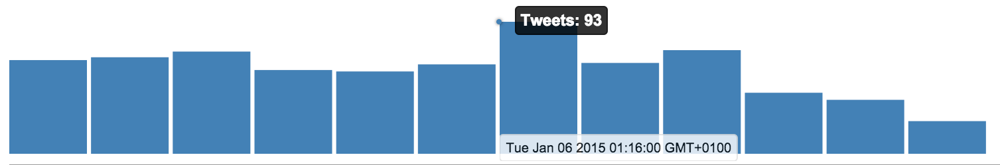

### Timeseries Chart

We've already looked at the timeseries chart in the last chapter to get an idea what the data represents. Let's have a look at the **[code](https://github.com/matthiasn/BirdWatch/blob/83ff6bfc4b930e877f8f8414b53fc381bf5b4366/Clojure-Websockets/MainApp/src/cljs/birdwatch/charts/ts_chart.cljs)**:

~~~
(ns birdwatch.charts.ts-chart
  (:require-macros [cljs.core.async.macros :refer [go-loop]])
  (:require [birdwatch.util :as util]
            [birdwatch.stats.timeseries :as ts]
            [reagent.core :as r :refer [atom]]
            [cljs.core.async :as async :refer [chan sub timeout sliding-buffer]]))

(def ts-elem (util/by-id "timeseries1"))
(def ts-w (aget ts-elem "offsetWidth"))
(def ts-h 100)

(defn bar
  "Renders a vertical bar. Enables showing a label when the mouse is
   positioned above the bar."
  [x y h w idx label]
  [:rect {:x x :y (- y h) :fill "steelblue" :width w :height h
          :on-mouse-enter #(reset! label {:idx idx})
          :on-mouse-leave #(reset! label {})}])

(defn barchart
  "Renders a bar chart, making use of the bar function above. Returns
   entire SVG element."
  [indexed mx cnt w label]
  (let [gap (/ (/ ts-w 20) cnt)]
    [:svg {:width ts-w :height ts-h}
     [:g
      (for [[idx [k v]] indexed]
        ^{:key k} [bar (* idx w) ts-h (* (/ v mx) ts-h) (- w gap) idx label])]]))

(defn labels
  "Renders a label for a bar chart. Makes use of Rickshaws CSS."
  [bars mx cnt w label]
  (when-not (empty? @label)
    (let [idx (:idx @label)
          [k v] (get bars idx)
          top (- ts-h (* (/ v mx) ts-h))
          lr (if (< (/ idx cnt) 0.6) "left" "right")]
      [:div.detail {:style {:left (* idx w)}}
       [:div.x_label {:class lr} (.toString (.unix js/moment k))]
       [:div.item.active {:class lr :style {:top top}} "Tweets: " v]
       [:div.dot.active {:style {:top top :border-color "steelblue"}}]])))

(defn ts-chart
  "Renders timeseries chart consisting of SVG for the bars and a label.
   Appearance is similar to the Rickshaw timeseries chart, which this
   component has replaced, except for the CSS."
  [bars-atom label]
  (let [bars @bars-atom
        indexed (vec (map-indexed vector bars))
        mx (apply max (map (fn [[k v]] v) bars))
        cnt (count bars)
        w (/ ts-w cnt)]
    [:div.rickshaw_graph
     [barchart indexed mx cnt w label]
     [labels bars mx cnt w label]]))

(defn mount-ts-chart
  "Mount timeseries chart and subscribe to specified pub for state changes.
   The wait time until re-render is specified in the configuration map."
  [state-pub {:keys [every-ms]}]
  (let [state-chan (chan (sliding-buffer 1))
        bars (atom [])
        label (atom {})]
    (go-loop []
             (let [[_ state] (<! state-chan)]
               (reset! bars (ts/ts-data state))
               (<! (timeout every-ms))
               (recur)))
    (r/render-component [ts-chart bars label] ts-elem)
    (sub state-pub :app-state state-chan)))
~~~

First, we have a couple of ````def````s:

~~~
(def ts-elem (util/by-id "timeseries1"))
(def ts-w (aget ts-elem "offsetWidth"))
(def ts-h 100)
~~~

````ts-elem```` is the DOM element where the chart is rendered. ````ts-w```` and ````ts-h```` are simply the width and height of the chart. The width is dependent on the responsive layout managed by the CSS. The height ````ts-h```` is 100 pixels.

Next, we have the ````bar```` function:

~~~
(defn bar
  "Renders a vertical bar. Enables showing a label when the mouse is
   positioned above the bar."
  [x y h w idx label]
  [:rect {:x x :y (- y h) :fill "steelblue" :width w :height h
          :on-mouse-enter #(reset! label {:idx idx})
          :on-mouse-leave #(reset! label {})}])
~~~

This renders a single bar of height ````h```` and width ````w```` at the ````x```` and ````y```` coordinates. Note the ````:y (- y h)````. This is because in SVG's coordinate system, x=0 and y=0 is in the upper left corner, which is not that useful for charts. Then, we also have the ````idx````, which is the index of each bar. This is used for rendering a label. When the mouse enters the bar, the label is shown by setting the ````label```` atom: ````:on-mouse-enter #(reset! label {:idx idx})````, which is cleared again when the mouse leaves ````:on-mouse-leave #(reset! label {})````. We will look at the label below.

The ````bar```` component can now be used inside the ````barchart```` component:

~~~
(defn barchart
  "Renders a bar chart, making use of the bar function above. Returns
   entire SVG element."
  [indexed mx cnt w label]
  (let [gap (/ (/ ts-w 20) cnt)]
    [:svg {:width ts-w :height ts-h}
     [:g
      (for [[idx [k v]] indexed]
        ^{:key k} [bar (* idx w) ts-h (* (/ v mx) ts-h) (- w gap) idx label])]]))
~~~

This function first of all determines the ````gap```` between the bars. It then renders the ````:svg```` with all bars inside a group ````:g````. Once again, we are setting the key so that React can reuse elements and be more efficient. The ````label```` atom is passed on to the individual bars for the mouse-in/mouse-out behavior, showing the data for a specific bar in the label.

Then, we have the ````labels```` component. Let's first see how that looks like with the sample data from when we discussed the ````birdwatch.timeseries```` namespace:



~~~
(defn labels
  "Renders a label for a bar chart. Makes use of Rickshaws CSS."
  [bars mx cnt w label]
  (when-not (empty? @label)
    (let [idx (:idx @label)
          [k v] (get bars idx)
          top (- ts-h (* (/ v mx) ts-h))
          lr (if (< (/ idx cnt) 0.6) "left" "right")]
      [:div.detail {:style {:left (* idx w)}}
       [:div.x_label {:class lr} (.toString (.unix js/moment k))]
       [:div.item.active {:class lr :style {:top top}} "Tweets: " v]
       [:div.dot.active {:style {:top top :border-color "steelblue"}}]])))
~~~

As you can see above, the ````labels```` component consists of two parts. On top it shows how many tweets were encountered in the interval, and at the bottom it shows us the start of the interval.

Now we have all components together, and we can combine them into the ````ts-chart```` component holding the entire bar chart including labels:

~~~
(defn ts-chart
  "Renders timeseries chart consisting of SVG for the bars and a label.
   Appearance is similar to the Rickshaw timeseries chart, which this
   component has replaced, except for the CSS."
  [bars-atom label]
  (let [bars @bars-atom
        indexed (vec (map-indexed vector bars))
        mx (apply max (map (fn [[k v]] v) bars))
        cnt (count bars)
        w (/ ts-w cnt)]
    [:div.rickshaw_graph
     [barchart indexed mx cnt w label]
     [labels bars mx cnt w label]]))
~~~


This component creates the ````:div```` that holds both the ````barchart```` and ````labels```` components. Note that I've removed the Rickshaw library from the project, but for now I'm still using some of its CSS, e.g. the ````rickshaw_graph```` class, or the classes used in the ````labels```` component. 

Finally, the ````ts-chart```` needs to be mounted into the DOM. Also, the mechanism for subscribing to application state changes needs to be fired up. This happens in the ````mount-ts-chart```` function:

~~~
(defn mount-ts-chart
  "Mount timeseries chart and subscribe to specified pub for state changes.
   The wait time until re-render is specified in the configuration map."
  [state-pub {:keys [every-ms]}]
  (let [state-chan (chan (sliding-buffer 1))
        bars (atom [])
        label (atom {})]
    (go-loop []
             (let [[_ state] (<! state-chan)]
               (reset! bars (ts/ts-data state))
               (<! (timeout every-ms))
               (recur)))
    (r/render-component [ts-chart bars label] ts-elem)
    (sub state-pub :app-state state-chan)))
~~~

The mechanism here is similar to other Reagent components we've seen. The function receives the ````state-pub```` and a time interval as arguments. Inside a let-binding, the bars and the label info are held in atoms in addition to the local ````state-chan````. Then, inside a ````go-loop````, ````state```` snapshots are taken off ````state-chan````. This ````state```` snapshot is then used to derive the timeseries data by calling ````ts-data````, a pure function inside ````birdwatch.stats.timeseries````. The timeout here should be longer as it would be a waste of CPU cycles to call the ````ts-data```` function every 10 milliseconds. Every second is fine. Also, the component is rendered into the DOM element ````ts-elem````, and ````state-chan```` subscribes to the ````state-pub```` for the ````:app-state```` topic. This is exactly the same for all UI components in this application.

