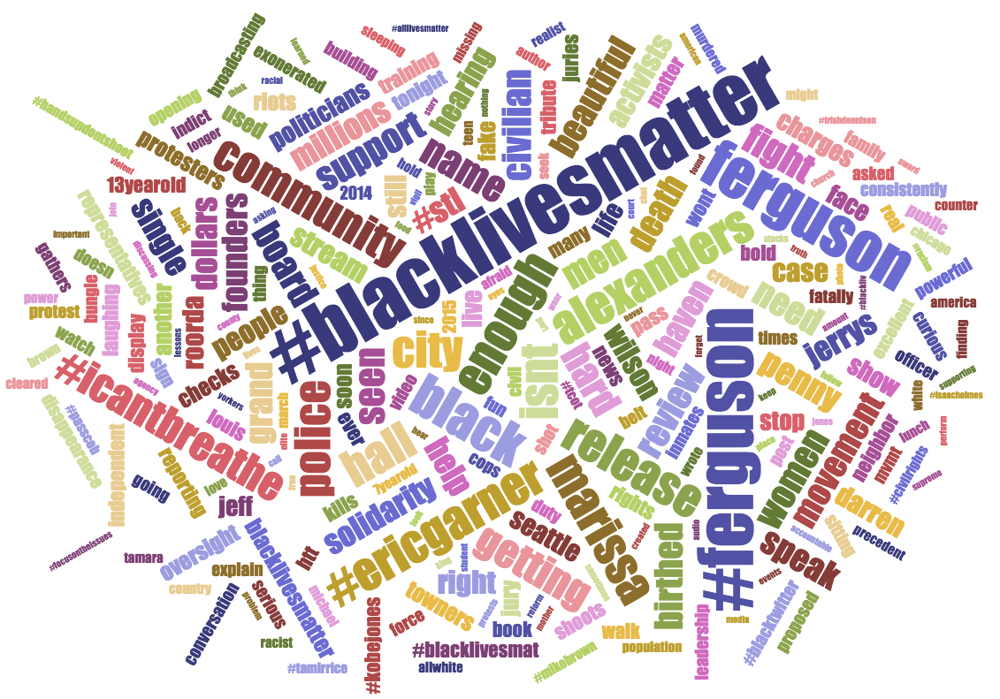

### Word Cloud Chart



The word cloud is generated using **[D3.js](http://d3js.org)** and Jason Davies' **[d3-cloud](https://github.com/jasondavies/d3-cloud)** on top of it. I then wrote some JavaScript code to interact with with **d3-cloud**. There's not much of a point in going through the **d3** code here, but if you're interested, you can check it out on GitHub: **[wordcloud.js](https://github.com/matthiasn/BirdWatch/blob/83ff6bfc4b930e877f8f8414b53fc381bf5b4366/Clojure-Websockets/MainApp/resources/public/js/wordcloud.js)**.

Here's the ClojureScript code to interact with ````wordcloud.js```` in the ````birdwatch.charts.cloud-chart```` **[namespace](https://github.com/matthiasn/BirdWatch/blob/83ff6bfc4b930e877f8f8414b53fc381bf5b4366/Clojure-Websockets/MainApp/src/cljs/birdwatch/charts/cloud_chart.cljs)**:

~~~
(ns birdwatch.charts.cloud-chart
  (:require-macros [cljs.core.async.macros :refer [go-loop]])
  (:require [birdwatch.util :as util]
            [birdwatch.stats.wordcount :as wc]
            [cljs.core.async :as async :refer [put! chan sub sliding-buffer timeout]]))

;;; WordCloud element (implemented externally in JavaScript)
(def cloud-elem (util/by-id "wordCloud"))
(def w (util/elem-width cloud-elem))

(defn mount-word cloud
  "Mount word cloud and wire channels for incoming data and outgoing commands."
  [state-pub cmd-chan {:keys [n every-ms]}]
  (let [on-click #(put! cmd-chan [:append-search-text %])
        word-cloud (.WordCloud js/BirdWatch w (* w 0.7) 250 on-click cloud-elem)
        state-chan (chan (sliding-buffer 1))]
    (go-loop []
             (let [[_ state] (<! state-chan)]
               (.redraw word-cloud (clj->js (wc/get-words state n)))
               (<! (timeout every-ms))
               (recur)))
    (sub state-pub :app-state state-chan)))
~~~

By now, there should be any surprises in here at all any more. We have the ````go-loop```` listening to state changes and the timeout for control over how often a value is taken off the channel. This is particularly important for the word cloud as this is by far the most CPU-intensive operation in the entire BirdWatch application. It would be interesting to implement the word cloud in pure ClojureScript. Maybe one day. 

Inside the ````mount-word cloud```` function, we create the ````word-cloud```` through JavaScript interop and then inside the ````go-loop````, we call the ````.redraw```` function with ````(clj->js (wc/get-words state n))````, which is the data structure returned from ````wc/get-words```` and then converted to a JavaScript data structure.
