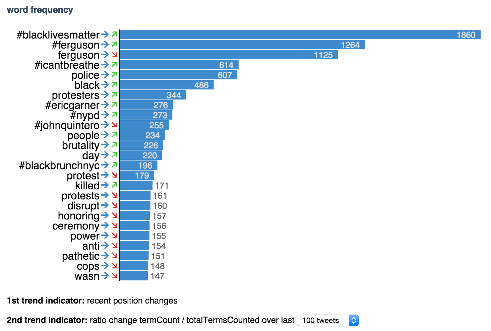

### Word Count Trends Chart (with Linear Regression)
The word count trends chart shows the top 25 words within the body of tweets loaded in the application as determined in the ````birdwatch.wordcount```` namespace we discussed previously. The ranking is in descending order, with a bar and a count number allowing for comparison between different words. In addition, there are trend arrows that show how a word has developed recently and over time. Each bar is also clickable, which adds the word to the search in the input field below the menu bar. Here's how it looks like:



Let's start with the simplest part, the ````birdwatch.charts.shapes```` **[namespace](https://github.com/matthiasn/BirdWatch/blob/83ff6bfc4b930e877f8f8414b53fc381bf5b4366/Clojure-Websockets/MainApp/src/cljs/birdwatch/charts/shapes.cljs)**:

~~~
(ns birdwatch.charts.shapes)

(def arrows
  {:RIGHT      ["#428bca" "-600,100 200,100 -200,500 100,500 600,0 100,-500 -200,-500 200,-100 -600,-100 "]
   :UP         ["#45cc40" "100,600 100,-200 500,200 500,-100 0,-600 -500,-100 -500,200 -100,-200 -100,600"]
   :DOWN       ["#dc322f" "100,-600 100,200 500,-200 500,100 0,600 -500,100 -500,-200 -100,200 -100,-600"]
   :RIGHT-UP   ["#45cc40" "400,-400 -200,-400 -350,-250 125,-250 -400,275 -275,400 250,-125 250,350 400,200"]
   :RIGHT-DOWN ["#dc322f" "400,400 -200,400 -350,250 125,250 -400,-275 -275,-400 250,125 250,-350 400,-200"]})

(defn arrow [x y dir]
  (let [[color points] (dir arrows)
        arrowTrans (str "translate(" x ", " (+ y 7) ") scale(0.01) ")]
    [:polygon {:transform arrowTrans :stroke "none" :fill color :points points}]))
~~~

Above, we first have a map named ````arrows````, which contains a vector with the color and the points for each arrow polygon. Then, we have a Reagent component that takes ````x```` and ````y```` coordinates and the direction ````dir```` and that returns a ````:polygon```` in the matching shape and color for the specified orientation of the arrow, positioned at the specified coordinates.

The ````arrow```` component is used in the ````birdwatch.charts.wordcount-chart```` **[namespace](https://github.com/matthiasn/BirdWatch/blob/83ff6bfc4b930e877f8f8414b53fc381bf5b4366/Clojure-Websockets/MainApp/src/cljs/birdwatch/charts/wordcount_chart.cljs)**, which we'll look at next:

~~~
(ns birdwatch.charts.wordcount-chart
  (:require-macros [cljs.core.async.macros :refer [go-loop]])
  (:require [birdwatch.util :as util]
            [birdwatch.stats.wordcount :as wc]
            [birdwatch.stats.regression :as reg]
            [birdwatch.charts.shapes :as s]
            [reagent.core :as r :refer [atom]]
            [cljs.core.async :as async :refer [put! chan sub timeout sliding-buffer]]))

(def items (atom []))
(def pos-trends (atom {}))
(def pos-items (atom {}))
(def ratio-trends (atom {}))
(def ratio-items (atom {}))
(def wc-elem (util/by-id "wordcount-barchart"))
(def wc-w (util/elem-width wc-elem))
(def text-defaults {:stroke "none" :fill "#DDD" :fontWeight 500 :fontSize "0.8em" :dy ".35em" :textAnchor "end"})
(def opts [[10 "10 tweets"][100 "100 tweets"][500 "500 tweets"][1000 "1000 tweets"]])

(defn- bar [text cnt y h w idx cmd-chan]
  (let [pos-slope (get @pos-trends text)
        ratio-slope (get @ratio-trends text)]
    [:g {:on-click #(put! cmd-chan [:append-search-text text])}
     [:text {:y (+ y 8) :x 138 :stroke "none" :fill "black" :dy ".35em" :textAnchor "end"} text]
     [s/arrow 146 y (cond (pos? pos-slope)   :UP       (neg? pos-slope )   :DOWN       :else :RIGHT)]
     [s/arrow 160 y (cond (pos? ratio-slope) :RIGHT-UP (neg? ratio-slope ) :RIGHT-DOWN :else :RIGHT)]
     [:rect {:y y :x 168 :height 15 :width w :stroke "white" :fill "#428bca"}]
     (if (> w 50)
       [:text (merge text-defaults {:y (+ y 8) :x (+ w 160)}) cnt]
       [:text (merge text-defaults {:y (+ y 8) :x (+ w 171) :fill "#666" :textAnchor "start"}) cnt])]))

(defn- word count-barchart [cmd-chan]
  (let [indexed @items
        mx (apply max (map (fn [[idx [k v]]] v) indexed))
        cnt (count indexed)]
    [:div
     [:svg {:width wc-w :height (+ (* cnt 15) 5)}
      [:g
       (for [[idx [text cnt]] indexed]
         ^{:key text} [bar text cnt (* idx 15) 15 (* (- wc-w 190) (/ cnt mx)) idx cmd-chan])
       [:line {:transform "translate(168, 0)" :y 0 :y2 (* cnt 15) :stroke "black"}]]]
     [:p.legend [:strong "1st trend indicator:"]
      " recent position changes"]
     [:p.legend [:strong "2nd trend indicator:"]
      " ratio change termCount / totalTermsCounted over last "
      [:select {:defaultValue 100}
       (for [[v t] opts] ^{:key v} [:option {:value v} t])]]]))

(defn- update-words
  "update word count chart"
  [words]
  (reset! items (vec (map-indexed vector words)))
  (let [items @items
        total-cnt (apply + (map (fn [[_[_ cnt]]] cnt) items))]
    (doseq [[idx [text cnt]] items]
      (swap! pos-items update-in [text] conj idx)
      (swap! ratio-items update-in [text] conj (/ total-cnt cnt))
      (swap! pos-trends assoc-in [text]
             (get (reg/linear-regression (take 3 (get @pos-items text))) 1))
      (swap! ratio-trends assoc-in [text]
             (get (reg/linear-regression (take 1000 (get @ratio-items text))) 1)))))

(defn mount-wc-chart
  "Mount word count bar chart and wire channels for incoming data and outgoing commands.
   The number of bars and the wait time until re-render is specified in the configuration map."
  [state-pub cmd-chan {:keys [bars every-ms]}]
  (r/render-component [wordcount-barchart cmd-chan] wc-elem)
  (let [state-chan (chan (sliding-buffer 1))]
    (go-loop []
             (let [[_ state] (<! state-chan)]
               (update-words (wc/get-words2 state bars))
               (<! (timeout every-ms))
               (recur)))
    (sub state-pub :app-state state-chan)))
~~~

Okay, there is quite a bit to go through here, and the code also takes care of the linear regression for the trend arrows. Before discussing each function, let's have a look at the ````birdwatch.stats.regression```` **[namespace](https://github.com/matthiasn/BirdWatch/blob/83ff6bfc4b930e877f8f8414b53fc381bf5b4366/Clojure-Websockets/MainApp/src/cljs/birdwatch/stats/regression.cljs)** first:

~~~
(ns birdwatch.stats.regression)

(defn square [x] (* x x))
(defn mean [xs]
  (let [cnt (count xs)]
    (when (pos? cnt) (/ (apply + xs) cnt))))

(defn linear-regression
  "Computes linear regression. Adapted from
   http://compbio.ucdenver.edu/Hunter_lab/Hunter/cl-statistics.lisp"
  [ys]
  (let [n (count ys)]
    (when (pos? n)
      (let [xs (range n)
            x-bar (mean xs)
            y-bar (mean ys)
            Lxx (reduce + (map (fn [xi] (square (- xi x-bar))) xs))
            Lyy (reduce + (map (fn [yi] (square (- yi y-bar))) ys))
            Lxy (reduce + (map (fn [xi yi] (* (- xi x-bar) (- yi y-bar))) xs ys))
            slope (/ Lxy Lxx)
            intercept (- y-bar (* slope x-bar))
            reg-ss (* slope Lxy)
            res-ms (/ (- Lyy reg-ss) (- n 2))]
        [intercept slope]))))
~~~

I've adapted the code from **[Statistical functions in Common Lisp. Version 1.04](http://compbio.ucdenver.edu/Hunter_lab/Hunter/cl-statistics.lisp)** and just removed the stuff I didn't need. I also created the functions ````square```` and ````mean```` for use in the ````linear-regression```` function below.

Why linear regression, you may ask? Linear regression allows us to fit a predictive model to individual data points, where in this simple case the model is a linear equation represented by a slope and the intercept with the y-axis. Here's an example from the **[Wikipedia-article](http://en.wikipedia.org/wiki/Linear_regression)**:


In this particular case, we're not using the model for specific predictions; instead, we'll simply look at the slope to determine if there's an overall upward or downward trend for a specific word.

~~~
(def pos-trends (atom {}))
(def pos-items (atom {}))
(def ratio-trends (atom {}))
(def ratio-items (atom {}))
~~~

We need a couple of ````atom````s in order to store data related to the intended regression analysis as you can see above. These are then used in the ````update-words```` function:

~~~
(defn- update-words
  "update word count chart"
  [words]
  (reset! items (vec (map-indexed vector words)))
  (let [items @items
        total-cnt (apply + (map (fn [[_[_ cnt]]] cnt) items))]
    (doseq [[idx [text cnt]] items]
      (swap! pos-items update-in [text] conj idx)
      (swap! ratio-items update-in [text] conj (/ total-cnt cnt))
      (swap! pos-trends assoc-in [text]
             (get (reg/linear-regression (take 3 (get @pos-items text))) 1))
      (swap! ratio-trends assoc-in [text]
             (get (reg/linear-regression (take 1000 (get @ratio-items text))) 1)))))
~~~

First of all, the function takes the parameter ````words````, which is the current top-n list from the application state. We use that to ````reset!```` the ````items```` atom as a vector of indexed vectors, in which the index is in first position and a vector with ````text```` and ````count```` in the second position as you can see in the ````do-seq```` below: ````[idx [text cnt]]````.

Next, we dereference ````items```` and get ````total-cnt````, which is simply the total count of words within ````items````. Then, we do a couple of things with each item within ````items````, destructured as seen above. Within ````pos-items````, we add / ````conj```` as the latest position to the sequence we keep for each word. We do the same for ````ratio-items````, only that here we use a ratio. Having updated all, we determine the slope for each item by running ````reg/linear-regression```` and store the result in the ````pos-trends```` and ````ratio-trends```` map for the particular word. These will later be dereferenced when we determine the direction of the arrow.

Now let's have a look at the ````bar```` component:

~~~
(defn- bar [text cnt y h w idx cmd-chan]
  (let [pos-slope (get @pos-trends text)
        ratio-slope (get @ratio-trends text)]
    [:g {:on-click #(put! cmd-chan [:append-search-text text])}
     [:text {:y (+ y 8) :x 138 :stroke "none" :fill "black" :dy ".35em" :textAnchor "end"} text]
     [s/arrow 146 y (cond (pos? pos-slope)   :UP       (neg? pos-slope )   :DOWN       :else :RIGHT)]
     [s/arrow 160 y (cond (pos? ratio-slope) :RIGHT-UP (neg? ratio-slope ) :RIGHT-DOWN :else :RIGHT)]
     [:rect {:y y :x 168 :height 15 :width w :stroke "white" :fill "#428bca"}]
     (if (> w 50)
       [:text (merge text-defaults {:y (+ y 8) :x (+ w 160)}) cnt]
       [:text (merge text-defaults {:y (+ y 8) :x (+ w 171) :fill "#666" :textAnchor "start"}) cnt])]))
~~~

For every bar, we dereference ````pos-slope```` and ````ratio-slope````. With that, we create a ````:g```` element, which is a group in SVG. Within it, we position text, the arrows and the bar rectangle ````:rect````. Finally, depending on the width of the bar, we position the counter either inside the bar if it's wide enough or outside if it's too narrow.

To put things together, we then have the ````wordcount-barchart```` component:

~~~
(defn- wordcount-barchart [cmd-chan]
  (let [indexed @items
        mx (apply max (map (fn [[idx [k v]]] v) indexed))
        cnt (count indexed)]
    [:div
     [:svg {:width wc-w :height (+ (* cnt 15) 5)}
      [:g
       (for [[idx [text cnt]] indexed]
         ^{:key text} [bar text cnt (* idx 15) 15 (* (- wc-w 190) (/ cnt mx)) idx cmd-chan])
       [:line {:transform "translate(168, 0)" :y 0 :y2 (* cnt 15) :stroke "black"}]]]
     [:p.legend [:strong "1st trend indicator:"]
      " recent position changes"]
     [:p.legend [:strong "2nd trend indicator:"]
      " ratio change termCount / totalTermsCounted over last "
      [:select {:defaultValue 100}
       (for [[v t] opts] ^{:key v} [:option {:value v} t])]]]))
~~~

The ````wordcount-barchart```` renders a ````:div```` with the ````:svg```` inside, with one ````bar```` component for each item in ````indexed````, which is the dereferenced ````items```` atom. In addition, there's some text plus a ````:select````, which is intended for choosing the number of recent items to be included in the regression analysis over the ratios. That's not actually implemented yet, though. Pull request, anyone?

Finally, the chart needs to be mounted, which follows the pattern we've seen a few times already:

~~~
(defn mount-wc-chart
  "Mount word count bar chart and wire channels for incoming data and outgoing commands.
   The number of bars and the wait time until re-render is specified in the configuration map."
  [state-pub cmd-chan {:keys [bars every-ms]}]
  (r/render-component [wordcount-barchart cmd-chan] wc-elem)
  (let [state-chan (chan (sliding-buffer 1))]
    (go-loop []
             (let [[_ state] (<! state-chan)]
               (update-words (wc/get-words2 state bars))
               (<! (timeout every-ms))
               (recur)))
    (sub state-pub :app-state state-chan)))
~~~

I only store the atoms inside the let-binding of the ````mount-wc-chart```` function in the timeseries chart. There's no particular reason for that, one could as well keep the atoms contained inside the function.
