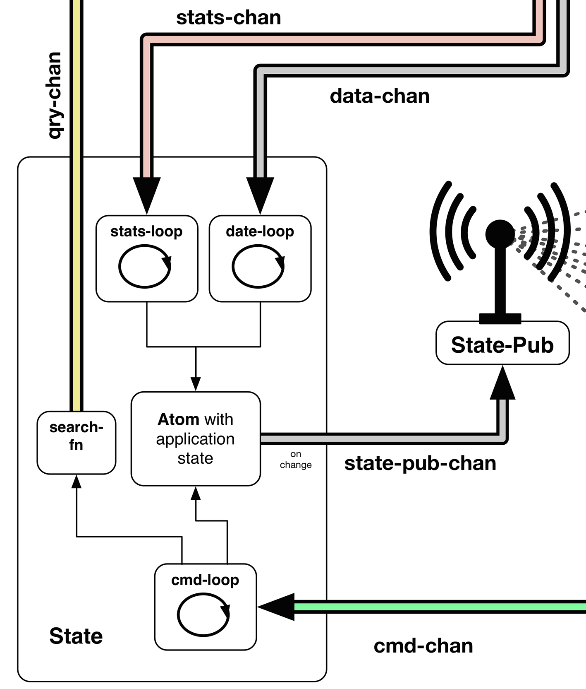

## Application State



### The birdwatch.state.data namespace
The application state of the application is held inside the _let-binding_ of the ````init-state```` function within the ````birdwatch.state.data```` **[namespace](https://github.com/matthiasn/BirdWatch/blob/2cfa1c68d911418e57fad7a6fa363a868b24b65a/Clojure-Websockets/MainApp/src/cljs/birdwatch/state/data.cljs)**: 

~~~
(ns birdwatch.state.data
  (:require [birdwatch.state.initial :as i]
            [birdwatch.state.comm :as c]))

(defn init-state
  "Init app state and wire all channels required in the state namespace. The app
   atom is held inside the let binding of this function and thus protected from
   outside access / alteration. The only way to interact with it is by sending
   messages on channels, such as the provided data channel for adding new data or
   sending commands on the cmd-chan."
  [data-chan qry-chan stats-chan cmd-chan state-pub-chan]
  (let [app (atom {})]
    (i/init app)
    (c/stats-loop stats-chan app)
    (c/data-loop data-chan qry-chan app)
    (c/cmd-loop cmd-chan qry-chan app)
    (c/broadcast-state state-pub-chan app)))
~~~

After creating an atom named ````app```` in the aforementioned let-binding, this atom is initialized. Let's look at the initialization process quickly before covering the rest of the function.

### The birdwatch.state.initial namespace
Before instantiating the "business logic", the state needs to be initialized. This is done by calling the ````init```` function inside the ````birdwatch.state.initial```` **[namespace](https://github.com/matthiasn/BirdWatch/blob/c10fd4ecf7e2d763a5f6476fb4be6605d51123e7/Clojure-Websockets/MainApp/src/cljs/birdwatch/state/initial.cljs)**:

~~~
(ns birdwatch.state.initial
  (:require [birdwatch.util :as util]
            [tailrecursion.priority-map :refer [priority-map-by]]))

(defn initial-state
  "Returns fresh application state."
  []
  {:count 0
   :n 10
   :prev-chunks-loaded 0
   :tweets-map {}
   :search-text ""
   :page 1
   :search "*"
   :users-count 0
   :total-tweet-count 0
   :sorted :by-id
   :live true
   :by-followers (priority-map-by >)
   :by-retweets (priority-map-by >)
   :by-favorites (priority-map-by >)
   :by-rt-since-startup (priority-map-by >)
   :by-reach (priority-map-by >)
   :by-id (priority-map-by >)
   :words-sorted-by-count (priority-map-by >)})

(defn init
  "Initializes application start when application starts by providing fresh state
   and setting the :search-text from the URI location hash."
  [app]
  (reset! app (initial-state))
  (swap! app assoc :search-text (util/search-hash)))
~~~

This ````init```` function only takes the ````app```` atom passed as its only parameter and resets it with the result of a call to the ````initial-state```` function. Next, it also swaps the ````:search-text```` key of the application state with a call to ````util/search-hash````. This function gets the URL hash, which is also set whenever a new search is started. This allows bookmarking of specific searches. Next time a bookmark is opened, the same search will load as last time.

With the application state properly initialized in our little excursion to the ````birdwatch.state.initial```` namespace, we can now fire up the "business logic" of the application which is realized as a number of functions in the ````birdwatch.state.comm```` namespace. These functions start up behavior such as taking messages off channels and reacting according to the received message and adding a listener to state changes that are then put on a channel for broadcasting on a ````pub````.

### The birdwatch.state.comm namespace
Let's have a look at the ````birdwatch.state.comm```` **[namespace](https://github.com/matthiasn/BirdWatch/blob/4b686d2d3c378082fb3c2e860e05125c15768791/Clojure-Websockets/MainApp/src/cljs/birdwatch/state/comm.cljs)** in detail in order to see what the functions are that get initialized in the body of the ````init-state```` function:

~~~
(ns birdwatch.state.comm
  (:require-macros [cljs.core.async.macros :refer [go-loop]])
  (:require [birdwatch.state.search :as s]
            [birdwatch.state.initial :as i]
            [birdwatch.state.proc :as p]
            [cljs.core.async :as async :refer [<! put! pipe timeout chan sliding-buffer]]
            [cljs.core.match :refer-macros [match]]))

;;;; Channels processing namespace. Here, messages are taken from channels and processed.

(defn- stats-loop
  "Process messages from the stats channel and update application state accordingly."
  [stats-chan app]
  (go-loop []
           (let [msg (<! stats-chan)]
             (match msg
                    [:stats/users-count       n] (swap! app assoc :users-count n)
                    [:stats/total-tweet-count n] (swap! app assoc :total-tweet-count n)
                    :else (prn "unknown msg in stats-loop" msg))
             (recur))))

(defn- prev-chunks-loop
  "Take messages (vectors of tweets) from prev-chunks-chan, add each tweet to application
   state, then pause to give the event loop back to the application (otherwise, UI becomes
   unresponsive for a short while)."
  [prev-chunks-chan app]
  (go-loop []
           (let [chunk (<! prev-chunks-chan)]
             (doseq [t chunk] (p/add-tweet! t app))
             (<! (timeout 50))
             (recur))))

(defn- data-loop
  "Process messages from the data channel and process / add to application state.
   In the case of :tweet/prev-chunk messages: put! on separate channel individual items
   are handled with a lower priority."
  [data-chan qry-chan app]
  (let [prev-chunks-chan (chan)]
    (prev-chunks-loop prev-chunks-chan app)
    (go-loop []
             (let [msg (<! data-chan)]
               (match msg
                      [:tweet/new             tweet] (p/add-tweet! tweet app)
                      [:tweet/missing-tweet   tweet] (p/add-to-tweets-map! app :tweets-map tweet)
                      [:tweet/prev-chunk prev-chunk] (do
                                                       (put! prev-chunks-chan prev-chunk)
                                                       (s/load-prev app qry-chan))
                      :else (prn "unknown msg in data-loop" msg))
               (recur)))))

(defn- cmd-loop
  "Process command messages, e.g. those that alter application state."
  [cmd-chan qry-chan app]
  (go-loop []
           (let [msg (<! cmd-chan)]
             (match msg
                    [:toggle-live            ] (swap! app update :live not)
                    [:set-search-text    text] (swap! app assoc :search-text text)
                    [:set-current-page   page] (swap! app assoc :page page)
                    [:set-page-size         n] (swap! app assoc :n n)
                    [:start-search           ] (s/start-search app (i/initial-state) qry-chan)
                    [:set-sort-order by-order] (swap! app assoc :sorted by-order)
                    [:retrieve-missing id-str] (put! qry-chan [:cmd/missing {:id_str id-str}])
                    [:append-search-text text] (s/append-search-text text app)
                    :else (prn "unknown msg in cmd-loop" msg))
             (recur))))

(defn- broadcast-state
  "Broadcast state changes on the specified channel. Internally uses a sliding
   buffer of size one in order to not overwhelm the rest of the system with too
   frequent updates. The only one that matters next is the latest state anyway.
   It doesn't harm to drop older ones on the channel."
  [pub-chan app]
  (let [sliding-chan (chan (sliding-buffer 1))]
    (pipe sliding-chan pub-chan)
    (add-watch app :watcher
               (fn [_ _ _ new-state]
                 (put! sliding-chan [:app-state new-state])))))
~~~

Let's go through this namespace function by function. 

First, we have the ````stats-loop````:

~~~
(defn- stats-loop
  "Process messages from the stats channel and update application state accordingly."
  [stats-chan app]
  (go-loop []
           (let [msg (<! stats-chan)]
             (match msg
                    [:stats/users-count       n] (swap! app assoc :users-count n)
                    [:stats/total-tweet-count n] (swap! app assoc :total-tweet-count n)
                    :else (prn "unknown msg in stats-loop" msg))
             (recur))))
~~~

This function starts up an infinitely running ````go-loop```` that takes messages off the ````stats-chan````, and then matches the messages against the two following patterns using **[core.match](https://github.com/clojure/core.match)**. When the message matches one of the two patterns, the application state is updated to reflect the data coming from the server. If the message doesn't match, a warning is printed to the browser console.

Next, let's have a look at the ````data-loop```` function:

~~~
(defn- data-loop
  "Process messages from the data channel and process / add to application state.
   In the case of :tweet/prev-chunk messages: put! on separate channel individual items
   are handled with a lower priority."
  [data-chan qry-chan app]
  (let [prev-chunks-chan (chan)]
    (prev-chunks-loop prev-chunks-chan app)
    (go-loop []
             (let [msg (<! data-chan)]
               (match msg
                      [:tweet/new             tweet] (p/add-tweet! tweet app)
                      [:tweet/missing-tweet   tweet] (p/add-to-tweets-map! app :tweets-map tweet)
                      [:tweet/prev-chunk prev-chunk] (do
                                                       (put! prev-chunks-chan prev-chunk)
                                                       (s/load-prev app qry-chan))
                      :else (prn "unknown msg in data-loop" msg))
               (recur)))))
~~~

This function follows the same pattern we have already seen with the ````stats-loop```` function, only that there are more patterns to match on. Also, the messages do not contain stats but tweet data. In the case that a new tweet is received, which is detected by the ````:tweet/new```` keyword in the first position of the message vector, the ````add-tweet!```` function from the ````birdwatch.state.proc```` namespace is called with the payload. We will look at the mechanisms in that namespace later. When a missing tweet is encountered, the ````add-to-tweets-map!```` function from the same namespace is called. Finally, when a ````:tweet/prev-chunk```` message is encountered, two functions are called. First of all, the ````prev-chunk```` is put on a channel for processing these chunks. We'll look at that next. Then, also the ````load-prev```` function from the ````birdwatch.state.search```` namespace is called. We'll have a look at that in detail later. As a short description for now, a number of previous chunks are loaded, currently with 500 tweets each, and in order to not flood the server with too many queries at the same time, subsequent queries are only fired when another chunk has been retrieved. 

Next, let's have a look at the ````prev-chunks-loop```` function which processes chunks of previous tweets as mentioned above:

~~~
(defn- prev-chunks-loop
  "Take messages (vectors of tweets) from prev-chunks-chan, add each tweet to application
   state, then pause to give the event loop back to the application (otherwise, UI becomes
   unresponsive for a short while)."
  [prev-chunks-chan app]
  (go-loop []
           (let [chunk (<! prev-chunks-chan)]
             (doseq [t chunk] (p/add-tweet! t app))
             (<! (timeout 50))
             (recur))))
~~~

Here in this ````go-loop````, chunks are taken off the ````prev-chunks-chan```` and then every tweet in this chunk is added to the application state, in a similar fashion to what we've seen previously for messages of type ````:tweet/new```` by calling the ````add-tweet!```` function in the ````birdwatch.state.proc```` namespace. Then, after each chunk, ````(<! (timeout 50))```` is used. This is done to give control back to the JavaScript event loop instead of blocking until the ````prev-chunks-chan```` is empty. Without this, the UI became unresponsive until all previous tweets were loaded.

Next, we have the ````cmd-loop```` function, its purpose is to take command messages off the ````cmd-chan```` and process them as required:

~~~
(defn- cmd-loop
  "Process command messages, e.g. those that alter application state."
  [cmd-chan qry-chan app]
  (go-loop []
           (let [msg (<! cmd-chan)]
             (match msg
                    [:toggle-live            ] (swap! app update :live not)
                    [:set-search-text    text] (swap! app assoc :search-text text)
                    [:set-current-page   page] (swap! app assoc :page page)
                    [:set-page-size         n] (swap! app assoc :n n)
                    [:start-search           ] (s/start-search app (i/initial-state) qry-chan)
                    [:set-sort-order by-order] (swap! app assoc :sorted by-order)
                    [:retrieve-missing id-str] (put! qry-chan [:cmd/missing {:id_str id-str}])
                    [:append-search-text text] (s/append-search-text text app)
                    :else (prn "unknown msg in cmd-loop" msg))
             (recur))))
~~~

The mechanism at play in the ````cmd-loop```` function above should be familiar to you by now. There's a ````go-loop```` inside a function that has access to the application state and that either alters the application state, calls a function like ````start-search```` or puts a message on a channel such as ````qry-chan```` above. All control over how to alter the application state from user input lies entirely with this ````cmd-loop```` function. It would be very easy to add additional message patterns for new functionality and then dispatch the message accordingly from this single point on.

Finally in this namespace, we have the mechanism for broadcasting application state changes inside the ````broadcast-state```` function. When you look at the samples for **[Reagent](http://reagent-project.github.io)**, you will notice that the UI components interact directly with the application state. While that may be fine for small samples, I don't like this approach for larger applications. When I'm working in the UI context, I want it to be strictly impossible to mess up application state by accidentally replacing a key in the application state with an unexpected or invalid value. We've already seen above that we can handle any kind of UI interaction easily by putting messages that represent our intent on the ````cmd-chan````, which, as we'll see later, is available to all UI elements in our application. So that solves the problem of where state is altered.

But I want to take it a little bit further and not even hand the application state to **Reagent** as an atom that can be modified. Conventions to not use something in a bad way are nice and all, but when you're working in a team on a larger application, the only way to keep anyone from directly modifying application state from a UI component is by completely hiding it.

So how could we achieve this? After scratching my head for a moment, I came up with the following solution inside the ````broadcast-state```` function:

~~~
(defn- broadcast-state
  "Broadcast state changes on the specified channel. Internally uses a sliding
   buffer of size one in order to not overwhelm the rest of the system with too
   frequent updates. The only one that matters next is the latest state anyway.
   It doesn't harm to drop older ones on the channel."
  [pub-chan app]
  (let [sliding-chan (chan (sliding-buffer 1))]
    (pipe sliding-chan pub-chan)
    (add-watch app :watcher
               (fn [_ _ _ new-state]
                 (put! sliding-chan [:app-state new-state])))))
~~~

Here, we're adding a watcher to the application state atom using ````add-watch````. This calls an arity-4 function every time the application state changes. We're only interested in the new application state after the modification, which is the last argument to the function to call on state changes, so we ignore there first three arguments. Then, we put the ````new-state```` on a channel.

But wait! Isn't that terribly inefficient? It depends. First of all, the application state inside the atom is an immutable data structure. Because of this feature, it does not need to be copied but can be shared freely, as it cannot be mutated. So that is nothing to worry about.

There is one potential point of contention though. Especially when loading thousands of previous tweets, there are a lot of changes within a short time. On my Retina Macbook, roughly 1000 tweets are processed per second. That amounts to tens of thousands of times that the function above would be triggered per second. One could think about some kind of rate limiting, but **core.async** has a better tool in its toolbox: the **[sliding-buffer](https://clojure.github.io/core.async/#clojure.core.async/sliding-buffer)**.

The way a ````sliding-buffer```` works is as follows: when more messages are put on a channel than can be taken off the channel on the other side, a buffer is filled. When that buffer is full, the oldest element in the buffer is dropped. This is perfect for our use case here. We can even use a buffer as small as 1 element that will be buffered. When the element can be consumed off the channel, fine. When there's a new element coming it, it is the newer application state, and the latest state is the only one we're ever interested in for rendering, so the slightly older application state can safely be dropped.

Accordingly, we're creating a channel named ````sliding-channel```` with such a ````sliding-buffer```` of size 1. Then, the ````sliding-chan```` is ````pipe````d into the ````pub-chan```` which has been provided as an argument to the ````broadcast-state```` function. This just means that every message from the channel provided as the first argument to ````pipe```` is put onto the channel that is provided as the second argument to ````pipe````.

### The birdwatch.state.search namespace

The ````birdwatch.state.search```` **[namespace](https://github.com/matthiasn/BirdWatch/blob/30836e475517e60291783fb2ea2d85aabf79a6b1/Clojure-Websockets/MainApp/src/cljs/birdwatch/state/search.cljs)** is concerned with starting new realtime searches and also loading previous tweets matching the search criteria:

~~~
(ns birdwatch.state.search
  (:require [birdwatch.util :as util]
            [cljs.core.async :as async :refer [put!]]))

(defn- load-prev
  "Loads previous tweets matching the current search. Search is contructed
   by calling the util/query-string function with dereferenced app state."
  [app qry-chan]
  (let [chunks-to-load 10
        chunk-size 500
        prev-chunks-loaded (:prev-chunks-loaded @app)]
    (when (< prev-chunks-loaded chunks-to-load)
      (put! qry-chan [:cmd/query {:query (util/query-string @app)
                                  :n chunk-size
                                  :from (* chunk-size prev-chunks-loaded)}])
      (swap! app update-in [:prev-chunks-loaded] inc))))

(defn- start-percolator
  "Triggers percolation matching of new tweets on the server side so that
   future matches will be delivered to the client."
  [app qry-chan]
  (put! qry-chan [:cmd/percolate {:query (util/query-string @app)}]))

(defn start-search
  "Initiates a new search."
  [app initial-state qry-chan]
  (let [search (:search-text @app)
        s (if (= search "") "*" search)]
    (reset! app initial-state)
    (swap! app assoc :search-text search)
    (swap! app assoc :search s)
    (aset js/window "location" "hash" (js/encodeURIComponent s))
    (start-percolator app qry-chan)
    (dotimes [n 2] (load-prev app qry-chan))))
~~~

In the namespace above, we have three function that are concerned with different angles of getting results of a realtime search to the client. First, there's the ````load-prev```` function:

~~~
(defn- load-prev
  "Loads previous tweets matching the current search. Search is contructed
   by calling the util/query-string function with dereferenced app state."
  [app qry-chan]
  (let [chunks-to-load 10
        chunk-size 500
        prev-chunks-loaded (:prev-chunks-loaded @app)]
    (when (< prev-chunks-loaded chunks-to-load)
      (put! qry-chan [:cmd/query {:query (util/query-string @app)
                                  :n chunk-size
                                  :from (* chunk-size prev-chunks-loaded)}])
      (swap! app update-in [:prev-chunks-loaded] inc))))
~~~

This function is concerned with loading previous tweets up to the desired number, in chunks of a defined size. Specifically, as it currently stands, ````10```` chunks of size ````500```` each will be loaded. First, these two values are defined in the ````let```` binding, together with ````prev-chunks-loaded````, which is derived from the application state. Then, if less chunks have previously been loaded than desired, a query is put on the ````qry-chan```` for the next chunk to be retrieved. Then, finally, the application state is modified to reflect that the loading of an additional chunk is on its way.

Next, there's the ````start-percolator```` function. This function is responsible for triggering a percolation query for the current search on the server side:

~~~
(defn- start-percolator
  "Triggers percolation matching of new tweets on the server side so that
   future matches will be delivered to the client."
  [app qry-chan]
  (put! qry-chan [:cmd/percolate {:query (util/query-string @app)}]))
~~~

We've already covered the topic of percolation queries on the server side, so there's no reason to go into detail here. What you need to know is that a percolation query matches (and in our case delivers) all future matches to the specified query.

Finally, we have the ````start-search```` function which, as the name suggests, triggers all aspects of a search:

~~~
(defn start-search
  "Initiates a new search."
  [app initial-state qry-chan]
  (let [search (:search-text @app)
        s (if (= search "") "*" search)]
    (reset! app initial-state)
    (swap! app assoc :search-text search)
    (swap! app assoc :search s)
    (aset js/window "location" "hash" (js/encodeURIComponent s))
    (start-percolator app qry-chan)
    (dotimes [n 2] (load-prev app qry-chan))))
~~~

First of all, it determines the current ````:search-text```` and replaces it with ````*```` if it's empty. Then, it resets the application state to an empty slate. Next, within the shiny new application state, it resets the values for the ````:search-text```` and the ````:search```` keys within the application state atom. It then also sets the hash location within the browser to reflect the new search so that this new search can be bookmarked properly. 

This is followed by calling the ````start-percolator```` function and finally calling the ````load-prev```` function multiple times. Here, ````n```` determines the parallelity factor. By sending two searches right away, the server can process these in parallel. Then, once any result comes back, ````load-prev```` is called again as we've seen when discussing the ````birdwatch.state.comm```` namespace, triggering the dispatch of another query iff there remain searches to be performed.

### The birdwatch.state.proc namespace

Finally, we have the ````birdwatch.state.proc```` **[namespace](https://github.com/matthiasn/BirdWatch/blob/4b686d2d3c378082fb3c2e860e05125c15768791/Clojure-Websockets/MainApp/src/cljs/birdwatch/state/proc.cljs)**. This namespace is concerned with processing incoming tweets and adding them to the appropriate sort orders:

~~~
(ns birdwatch.state.proc
  (:require [birdwatch.stats.wordcount :as wc]))

(defn swap-pmap
  "swaps item in priority-map"
  [app priority-map id n]
  (swap! app assoc priority-map (assoc (priority-map @app) id n)))

(defn- add-to-tweets-map!
  "adds tweet to tweets-map"
  [app tweets-map tweet]
  (swap! app
         assoc-in [tweets-map (keyword (:id_str tweet))]
         tweet))

(defn- swap-when-larger
  "Swaps item in priority-map when new value is larger than old value."
  [app priority-map rt-id n]
  (when (> n (rt-id (priority-map @app))) (swap-pmap app priority-map rt-id n)))

(defn add-words
  "Add words to the words map and the sorted set with the counts (while discarding old entry)."
  [app words]
  (doseq [word words]
    (swap-pmap app :words-sorted-by-count word (inc (get (:words-sorted-by-count @app) word 0)))))

(defn add-rt-status!
  "Process original, retweeted tweet."
  [app tweet]
  (if (contains? tweet :retweeted_status)
    (let [state @app
          rt (:retweeted_status tweet)
          rt-id (keyword (:id_str rt))
          rt-count (:retweet_count rt)]
      (swap-when-larger app :by-retweets rt-id rt-count)
      (swap-when-larger app :by-favorites rt-id (:favorite_count rt))
      (swap-pmap app :by-rt-since-startup rt-id (inc (get (:by-rt-since-startup state) rt-id 0)))
      (swap-pmap app :by-reach rt-id (+ (get (:by-reach state) rt-id 0) (:followers_count (:user tweet))))
      (when (> rt-count (:retweet_count (rt-id (:tweets-map state))))
        (add-to-tweets-map! app :tweets-map rt)))))

(defn add-tweet!
  "Increment counter, add tweet to tweets map and to sorted sets by id and by followers. Modifies
   application state."
  [tweet app]
  (let [state @app
        id-str (:id_str tweet)
        id-key (keyword id-str)]
    (swap! app assoc :count (inc (:count state)))
    (add-to-tweets-map! app :tweets-map tweet)
    (swap-pmap app :by-followers id-key (:followers_count (:user tweet)))
    (swap-pmap app :by-id id-key id-str)
    (swap-pmap app :by-reach id-key (+ (get (:by-reach state) id-key 0) (:followers_count (:user tweet))))
    (add-rt-status! app tweet)
    (add-words app (wc/words-in-tweet (:text tweet)))))
~~~

The code above still needs some refactoring. I don't like the way it looks. Let me get back to that before trying to walk you through.

### State summary
Now with the explanations in this chapter, I hope you will have a much better understanding of what's going on in this drawing:


What I particularly like about this architecture is the complete encapsulation of the the State component from other parts of the application. In fact, other parts of the application do not even know that this mechanism exists at all. All they see are channels they interact with. That makes it much easier to change parts of the application without having it blow up in unexpected other parts.