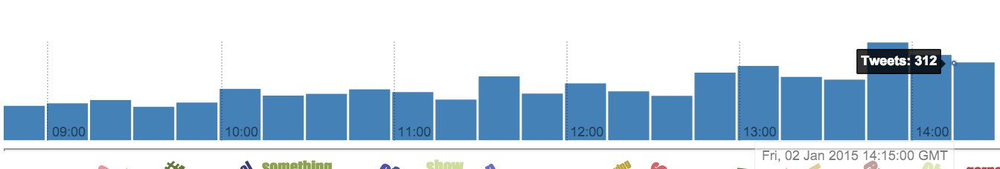

### Timeseries Data

The ````birdwatch.timeseries```` **[namespace](https://github.com/matthiasn/BirdWatch/blob/a9ef80998222e2f01853687da010f3be7af0c82c/Clojure-Websockets/MainApp/src/cljs/birdwatch/stats/timeseries.cljs)** is responsible for aggregating tweet counts per time interval in order to see how a search has developed over time. 

~~~
(ns birdwatch.stats.timeseries
  (:require [birdwatch.util :as util]))

(defn date-round
  "Returns function that rounds the provided seconds since epoch down to the
   nearest time interval; for example (date-round 60) creates a function that
   takes seconds t and rounds them to the nearest minute."
  [interval]
  (fn [t] (* interval (Math/floor (/ t interval)))))

(def m 60)
(def qhr (* 15 m))
(def hr (* 60 m))
(def qday (* 6 hr))
(def day (* 24 hr))

(defn grouping-interval
  "Determines duration of individual intervals (bars) depending on duration of
   timespan between newest and oldest."
  [newest oldest]
  (cond
   (> (- newest oldest) (* 20 day)) day  ;round by nearest day
   (> (- newest oldest) (* 5 day))  qday ;round by nearest quarter day
   (> (- newest oldest) (* 20 hr))  hr   ;round by nearest hour
   (> (- newest oldest) (* 4 hr))   qhr  ;round by nearest quarter hour
   :else                            m))  ;round by nearest minute

(defn empty-ts-map
  "Generates map with all rounded intervals between oldest and newest,
   initialized to a count of 0."
  [newest oldest interval]
  (let [rounder (date-round interval)
        values (range (rounder oldest) (rounder newest) interval)]
    (apply sorted-map-by < (flatten [(interpose 0 values) 0]))))

(defn count-into-map
  "Increments count for time interval."
  [ts-map k]
  (update-in ts-map [k] inc))

(defn tweet-ts
  "Retrieves seconds since epoch from tweet using moment.js."
  [t]
  (.unix (js/moment. (:created_at t))))

(defn ts-data
  "Performs time series analysis by counting tweets in even intervals."
  [state]
  (let [tweets-by-id ((util/tweets-by-order :tweets-map :by-id) state 100000)]
    (let [oldest (tweet-ts (last tweets-by-id))
          newest (tweet-ts (first tweets-by-id))
          interval (grouping-interval newest oldest)
          rounder (date-round interval)]
      (reduce count-into-map
              (empty-ts-map newest oldest interval)
              (map #(rounder (tweet-ts %)) tweets-by-id)))))
~~~

The data generated here is used in the ````birdwatch.charts.ts-chart```` timeseries chart.



In order to do that, tweets will have to be grouped into time intervals and then counted to see how many have occurred during each time interval.

First in the namespace, we have the ````date-round```` function, which is a helper for rounding dates to the nearest interval. Next, we define the possible time intervals _1m_, _15m_, _1h_, _6h_, _24h_:

~~~
(defn date-round
  "Returns function that rounds the provided seconds since epoch down to the
   nearest time interval; for example (date-round 60) creates a function that
   takes seconds t and rounds them to the nearest minute."
  [interval]
  (fn [t] (* interval (Math/floor (/ t interval)))))

(def m 60)
(def qhr (* 15 m))
(def hr (* 60 m))
(def qday (* 6 hr))
(def day (* 24 hr))
~~~

Pretty straightforward, nothing more than a higher-order function that returns a another function with the ````interval```` argument baked into the returned function. This returned function then multiplies ````interval```` with the ````Math/floor```` of dividing the argument ````t```` of the returned function by the ````interval```` provided when creating the function.

Then, we have the ````grouping-interval```` function:

~~~
(defn grouping-interval
  "Determines duration of individual intervals (bars) depending on duration of
   timespan between newest and oldest."
  [newest oldest]
  (cond
   (> (- newest oldest) (* 20 day)) day  ;round by nearest day
   (> (- newest oldest) (* 5 day))  qday ;round by nearest quarter day
   (> (- newest oldest) (* 20 hr))  hr   ;round by nearest hour
   (> (- newest oldest) (* 4 hr))   qhr  ;round by nearest quarter hour
   :else                            m))  ;round by nearest minute
~~~

Here, we figure out how long the duration of one bar is going to be, depending on the total time span covered by the tweets loaded. Next, there's ````empty-ts-map```` function:

~~~
(defn empty-ts-map
  "Generates map with all rounded intervals between oldest and newest,
   initialized to a count of 0."
  [newest oldest interval]
  (let [rounder (date-round interval)
        values (range (rounder oldest) (rounder newest) interval)]
    (apply sorted-map-by < (flatten [(interpose 0 values) 0]))))
~~~

The function above provides us with a map to count tweets into. Here's an example of how that looks like as a ````pprint```` output, (shortened to not take up a whole page):

~~~
{1420505580 0,
 1420505340 0,
 1420505100 0,
 1420506000 0,
 1420505400 0,
 1420505880 0,
 1420505520 0,
 1420506120 0,
 1420505460 0,
 1420506180 0,
 1420505760 0,
 1420504980 0}
~~~

Before we can do the actual timeseries mapping, we will need two helper functions:

~~~
(defn count-into-map
  "Increments count for time interval."
  [ts-map k]
  (update-in ts-map [k] inc))

(defn tweet-ts
  "Retrieves seconds since epoch from tweet using moment.js."
  [t]
  (.unix (js/moment. (:created_at t))))
~~~

The ````count-into-map```` function simply takes a map ````ts-map```` and increments the counter at the key ````k````. The ````tweet-ts```` function is nothing more than a lightweight wrapper around **[moment.js](http://momentjs.com)** for retrieving the milliseconds since **[epoch](http://en.wikipedia.org/wiki/Unix_time)**. 

With these in place we can now look at the ````ts-data```` function, which is the main workhorse in this namespace:

~~~
(defn ts-data
  "Performs time series analysis by counting tweets in even intervals."
  [state]
  (let [tweets-by-id ((util/tweets-by-order :tweets-map :by-id) state 100000)]
    (let [oldest (tweet-ts (last tweets-by-id))
          newest (tweet-ts (first tweets-by-id))
          interval (grouping-interval newest oldest)
          rounder (date-round interval)]
      (reduce count-into-map
              (empty-ts-map newest oldest interval)
              (map #(rounder (tweet-ts %)) tweets-by-id)))))
~~~

This function takes the ````state```` snapshot, gets ````tweets-by-id```` which, as the name implies, gets the tweets sorted by ID, which is equivalent to them sorted by time. From these, we determine the ````oldest```` and ````newest```` tweets, from which we determine the appropriate interval and construct the ````rounder```` function. With these, we can run ````reduce```` with ````count-into-map```` as the reducing function, the ````(empty-ts-map newest oldest interval)```` as the accumulator and ````(map #(rounder (tweet-ts %)) tweets-by-id)```` as the data structure to run over, which rounds each tweet in there to the correct interval so that it can be counted.

Here's a truncated output of this function as an example, after running the ````reduce```` over actual tweets:

~~~
{1420501500 66,
 1420501620 68,
 1420501680 72,
 1420501980 59,
 1420502820 58,
 1420502940 63,
 1420503360 93,
 1420505100 64,
 1420505340 73,
 1420505580 43,
 1420506000 38,
 1420506300 23}
~~~

Let's take it one step further and use this truncated sample data as the actual output of the ````ts-data```` instead of the ````reduce```` over data to see how this translates into a bar chart:


Okay, with this, we are well equipped to explore the code for the time series chart.