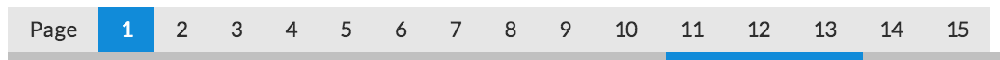

## User Interface - outdated

### React.js Concepts
**[React](http://facebook.github.io/react/)** is a revolutionary way to build user interfaces. Its model is particularly well suited for working with immutable data structures because it is based on rendering out the entire application state every single time something changes. Unlike other frameworks, it does not require a mutation of your application state itself. React will then render the state into a virtual DOM, always keep the previous version of the virtual DOM and run an efficient diffing algorithm between the two and only change the actual and slow DOM where it has found changes between the previous and the current virtual DOM during the diffing phase.

This may at first sound inefficient but it is actually very fast, making it trivial to achieve 60 frames per second in the browser in most cases. As far as I know, **[David Nolen](https://twitter.com/swannodette)** was the first who realized how well this model is suited for working with ClojureScript's immutable data structures. He then developed **[Om](https://github.com/swannodette/om)**, which he first announced in this **[blog post](http://swannodette.github.io/2013/12/17/the-future-of-javascript-mvcs/)**. Kudos to him for this discovery. At that time I was working on an **[AngularJS](http://www.amazon.com/AngularJS-UI-Development-Amit-Ghart-ebook/dp/B00OXVAK7A/ref=sr_1_1?ie=UTF8&qid=1420394659&sr=8-1)** book and reading his blog post made me realize that AngularJS might not be the way to go, at least not for me. I had already been exposed to functional programming principles enough to know the value of working with immutable values. Luckily, the publisher found a co-author as I didn't want to spend another couple of months with AngularJS.

I wrote the first version of the ClojureScript client using **Om**, but I always had the problem that I needed a rather large amount of context when coming back to the code for the user interface. I then discovered **[Reagent](https://github.com/reagent-project/reagent)**, which also uses **React.js** and is based on the same principles as Om. 

I found the required code for a Reagent component to be much more succinct and legible so that I made a complete switch. A good part of the reason here is that I like its **[Hiccup](https://github.com/weavejester/hiccup)** syntax.

Now when I come back to the UI code, I scratch my head a lot less than with the previous version. I shared the experience I read in this **[blog post](http://diogo149.github.io/2014/10/19/om-no/)**, which made me give Reagent a shot. I haven't regretted it. Reagent exposes a lot less incidental complexity than Om, and that just works better with my tiny brain.


### Reagent

For more information on Reagent I can also recommend this **[blog post](http://getprismatic.com/story/1405451329953)**, besides the decent enough documentation of the project itself.

I will not start with an introduction to Reagent here as the previously mentioned resources should have you covered. Instead, I will just explain the code, which you actually may find simple enough without consulting many other resources. If some of it looks too simple to be true, no worries, it really is not.

You need to know one thing when it comes to rendering the application state from one or more atoms, and that is that you need to use Reagent's ````atom```` implementation, which allows it to detect changes to this atom and re-render accordingly. From Reagent's **[source](https://github.com/reagent-project/reagent/blob/master/src/reagent/core.cljs#L173)**: _"Like clojure.core/atom, except that it keeps track of derefs.
Reagent components that derefs one of these are automatically
re-rendered."_. Seems to be working fine for me, I have not encountered any issues with this approach yet.


#### Simple Reagent Components

Let's start the exploration with the simpler components in the ````birdwatch.ui.elements```` **[namespace](https://github.com/matthiasn/BirdWatch/blob/574d2178be6f399086ad2a5ec35c200d252bf887/Clojure-Websockets/MainApp/src/cljs/birdwatch/ui/elements.cljs)**:

~~~
(ns birdwatch.ui.elements
  (:require [birdwatch.util :as util]
            [birdwatch.communicator :as comm]
            [birdwatch.state :as state]
            [birdwatch.ui.tweets :as ui-tweets]
            [reagent.core :as r]))

(enable-console-print!)

(defn count-view []
  [:span (:count @state/app)])

(defn users-count-view []
  (let [users (:users-count @state/app)]
    [:span "Connected: " [:strong users] (if (= users 1) " user" " users")]))

(defn total-count-view []
  [:span "Indexed: " [:strong (:total-tweet-count @state/app)] " tweets"])

(def sort-orders [[:by-id "latest"][:by-followers "followers"][:by-retweets "retweets"]
                  [:by-rt-since-startup "retweets2"][:by-reach "reach"][:by-favorites "favorites"]])

(defn sort-view []
  (let [curr-order (:sorted @state/app)]
    [:div
     [:button.pure-button.not-rounded.sort-button "Sort by"]
     (for [[k text] sort-orders :let [btn-class (if (= k curr-order) " pure-button-primary" " sort-button")]]
       ^{:key text} [:button.pure-button.not-rounded
                     {:class btn-class :on-click #(swap! state/app assoc :sorted k)} text])]))

(defn search-view []
  [:form.pure-form
   [:fieldset
    [:input {:type "text" :value (:search-text @state/app)
             :on-key-press #(when (== (.-keyCode %) 13) (comm/start-search))
             :on-change #(swap! state/app assoc :search-text (.. % -target -value))
             :placeholder "Example search: java (job OR jobs OR hiring)"}]
    [:button.pure-button.pure-button-primary {:on-click #(comm/start-search)}
     [:span {:class "glyphicon glyphicon-search"}]]]])

(defn pag-item [idx]
  [:button.pure-button.not-rounded.button-xsmall
   {:class (if (= idx (:page @state/app)) " pure-button-primary" "")
    :on-click #(swap! state/app assoc :page idx)} idx])

(defn pagination-view []
  [:div
   [:button.pure-button.not-rounded.button-xsmall "Page"]
   (for [idx (take 15 (range 1 (Math/floor (/ (:count @state/app) (:n @state/app)))))]
     ^{:key idx} [pag-item idx])])

(def views [[count-view "tweet-count"][search-view "search"][total-count-view "total-tweet-count"]
            [users-count-view "users-count"][sort-view "sort-buttons"][pagination-view "pagination"]
            [ui-tweets/tweets-view "tweet-frame"]])

(defn init-views []
  (doseq [[component id] views]
    (r/render-component [component] (util/by-id id))))
~~~

The first Reagent component above is also the simplest one, it only defines a simple ````:span```` in **[Hiccup syntax](https://github.com/weavejester/hiccup)**:

~~~
(defn count-view []
  [:span (:count @state/app)])
~~~

All this does is populate a ````<span>```` with the current value of the ````:count```` key in our application state which is updated whenever that value changes.

Using this component is also very easy. We need some HTML, with an ````id```` where the element can be rendered:

{lang=html}
~~~
<div id="count">Tweets: <span id="tweet-count"></span></div>
~~~

Then, we can tell **Reagent** to render the component in this ````<span>````:

~~~
(r/render-component [count-view] (util/by-id "tweet-count"))
~~~


You can see the result on the right side of the partial screenshot above.

The ````users-count-view```` component is only slightly more involved:

~~~
(defn users-count-view []
  (let [users (:users-count @state/app)]
    [:span "Connected: " [:strong users] (if (= users 1) " user" " users")]))
~~~

Here, we have some conditional logic so that if only one user is connected, we use "user" as a singular:


Otherwise, we use the plural "users":


After seeing the two components above, the ````total-count-view```` component should not contain any surprises:

~~~
(defn total-count-view []
  [:span "Indexed: " [:strong (:total-tweet-count @state/app)] " tweets"])
~~~

This renders the number of tweets indexed in total. As mentioned in the server-side chapter, the ````Persistence```` component sends a message with an updated total every so many seconds, which is then distributed to all connected clients.

The ````sort-view```` component is a little more involved. We need a couple of buttons for different sort orders, each of which needs a keyword that will be set as the application's current sort order and a label string. In order not to repeat ourselves, we use a vector named ````sort-orders```` for all the buttons, each of which we can represent as a two-item vector, with the key in the first position and the label string in the second position:

~~~
(def sort-orders [[:by-id "latest"][:by-followers "followers"][:by-retweets "retweets"]
                  [:by-rt-since-startup "retweets2"][:by-reach "reach"][:by-favorites "favorites"]])

(defn sort-view []
  (let [curr-order (:sorted @state/app)]
    [:div
     [:button.pure-button.not-rounded.sort-button "Sort by"]
     (for [[k text] sort-orders :let [btn-class (if (= k curr-order) " pure-button-primary" " sort-button")]]
       ^{:key text} [:button.pure-button.not-rounded
                     {:class btn-class :on-click #(swap! state/app assoc :sorted k)} text])]))
~~~

Then, in the ````sort-view```` component itself, we dereference our application state and use ````(:sorted @state/app)```` as ````curr-order```` in the ````let````-binding. With that, we can start constructing the markup generated by this component, starting with a ````:div```` and a first static button with the label ````"Sort By"````. Note that with Hiccup, we can simply assign classes to the button, like so:

~~~
[:button.pure-button.not-rounded.sort-button "Sort by"]
~~~

This assigns the classes ````pure-button````, ````not-rounded```` and ````sort-button```` to the button, resulting in this styling:


Next, we want to create additional buttons for every element in the ````sort-orders```` vector.

~~~
(for [[k text] sort-orders :let [btn-class (if (= k curr-order) " pure-button-primary" " sort-button")]]
  ^{:key text} [:button.pure-button.not-rounded
                 {:class btn-class :on-click #(swap! state/app assoc :sorted k)} text])
~~~

Above, ````for```` every item in ````sort-orders```` we destructure the vector as ````k```` and ````text```` and then determine if ````k```` equals ````curr-order````. If so, we set ````btn-class```` in the ````:let```` binding to ````" pure-button-primary"````, otherwise we set it to ````" sort-button"````. This controls the color. If the sort order that the button represents is active, we want the color to be light blue and otherwise light gray. With that, we can now create the individual button:

~~~
^{:key text} [:button.pure-button.not-rounded
               {:class btn-class :on-click #(swap! state/app assoc :sorted k)} text]
~~~

All buttons share the ````.pure-button.not-rounded```` classes. In addition we set the class in the properties map of the button component: ````:class btn-class````. In that map we also define an ````:on-click```` function: ````#(swap! state/app assoc :sorted k)````. This resets the current sort order to the key associated with the clicked button. Finally, we pass the ````text```` label to the button. Note that we will also set metadata on the component where we use the ````text```` of the component as the key: ````^{:key text}````. This is good practice for ReactJS whenever we render a list of something. Here, it wouldn't hurt much to omit it as the list is neither dynamic nor large, but it would still result in a warning on the console. 

Next, there's the ````search-view```` component:

~~~
(defn search-view []
  [:form.pure-form
   [:fieldset
    [:input {:type "text" :value (:search-text @state/app)
             :on-key-press #(when (== (.-keyCode %) 13) (comm/start-search))
             :on-change #(swap! state/app assoc :search-text (.. % -target -value))
             :placeholder "Example search: java (job OR jobs OR hiring)"}]
    [:button.pure-button.pure-button-primary {:on-click #(comm/start-search)}
     [:span {:class "glyphicon glyphicon-search"}]]]])
~~~

Here, a ````:form```` of class ````pure-form```` is rendered with a ````:fieldset```` inside. This then contains an ````:input```` field and a ````:button````. The ````:value```` of the ````:input```` field is always determined by the value of the ````:search-text```` key of the application state map. Then, when the user changes the content of the input field, the function used ````:on-change```` of the input changes the state to the new content of the field. Then, either on ````ENTER```` inside the field or a press of the button, ````comm/start-search```` is run. Not surprisingly, you can see the search view on the left here:


The last component in this namespace is ````pagination-view````:

~~~
(defn pag-item [idx]
  [:button.pure-button.not-rounded.button-xsmall
   {:class (if (= idx (:page @state/app)) " pure-button-primary" "")
    :on-click #(swap! state/app assoc :page idx)} idx])

(defn pagination-view []
  [:div
   [:button.pure-button.not-rounded.button-xsmall "Page"]
   (for [idx (take 15 (range 1 (Math/floor (/ (:count @state/app) (:n @state/app)))))]
     ^{:key idx} [pag-item idx])])
~~~

Before we dive into the code, here's how the ````pagination-view```` looks like when rendered:



Here, we first have a ````pag-item```` component for each page, which is used for switching the view to the particular page when clicked. In that case, the anonymous function literal ````#(swap! state/app assoc :page idx)```` is executed.

Within the ````pagination-view````, we then include one ````pag-item```` for each of the pages within the tweets loaded. This should be updated to use actual numbers from the application. But then, we would also need buttons for _first_ and _last_ if we don't want to render 500 pagination items or so. Pull request, anyone? Right now, we will simply use 15 or, if the actual number of pages is lower, that number.

Once again, a ````:key```` is assigned to each ````pag-item````. As mentioned, this is good practice when working with React. Don't adhere and at least you're reminded by a warning on the console.

Finally in this namespace, we have some code for initializing the Reagent components on application startup:

~~~
(def views [[count-view "tweet-count"][search-view "search"][total-count-view "total-tweet-count"]
            [users-count-view "users-count"][sort-view "sort-buttons"][pagination-view "pagination"]
            [ui-tweets/tweets-view "tweet-frame"]])

(defn init-views []
  (doseq [[component id] views]
    (r/render-component [component] (util/by-id id))))
~~~

First, we have the vector ````views```` which contains one vector per component, with the function defining it in the first position and the ID of the DOM element to render it into in the second position. 

Next, we have the ````init-views```` function which renders each component of the ````views```` vector inside the ````doseq````, where we destructure the individual vectors as ````[component id]```` and use them for calls to ````r/render-component````. This ````init-views```` function is called from the ````core```` namespace when the application starts.

