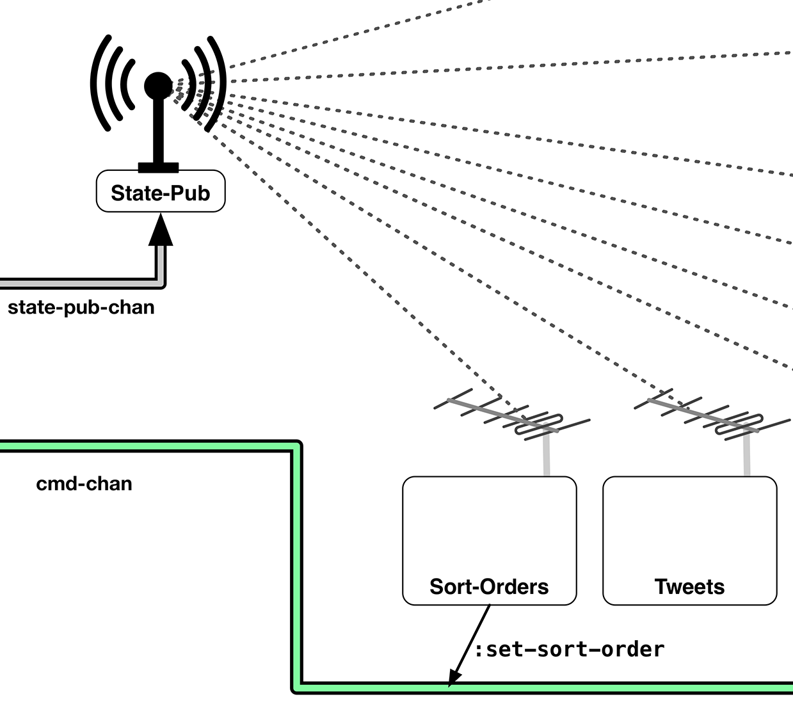
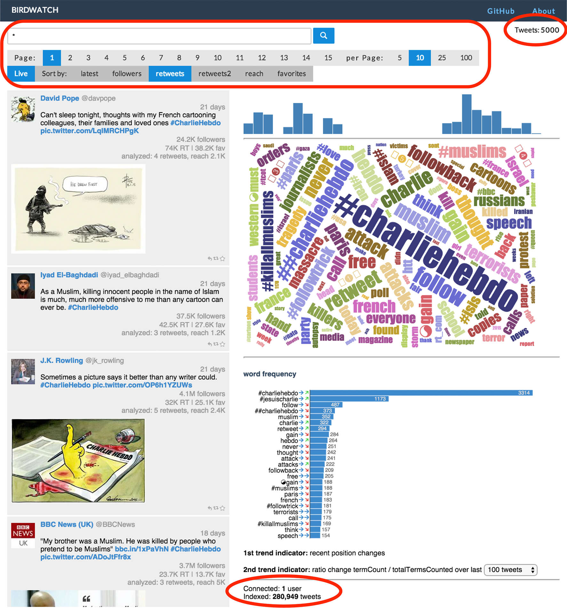

## User Interface

### React.js, Immutable Data and Reagent
**[React](http://facebook.github.io/react/)** is a revolutionary way to build user interfaces. Its model is particularly well suited for working with immutable data structures because it is based on rendering out the entire application state every single time something changes. Unlike other frameworks, it does not require a mutation of your application state itself. React will then render the state into a virtual DOM, always keep the previous version of the virtual DOM and run an efficient diffing algorithm between the two. It will only change the actual and slow DOM where it has found changes between the previous and the current virtual DOM during the diffing phase.

This may at first sound inefficient but it is actually very fast, making it trivial to achieve 60 frames per second in the browser in most cases. As far as I know, **[David Nolen](https://twitter.com/swannodette)** was the first who realized how well this model is suited for working with ClojureScript's immutable data structures. He then developed **[Om](https://github.com/swannodette/om)**, which he first announced in this **[blog post](http://swannodette.github.io/2013/12/17/the-future-of-javascript-mvcs/)**. Kudos to him for this discovery. At that time I was working on an **[AngularJS](http://www.amazon.com/AngularJS-UI-Development-Amit-Ghart-ebook/dp/B00OXVAK7A/ref=sr_1_1?ie=UTF8&qid=1420394659&sr=8-1)** book and reading his blog post made me realize that AngularJS is not the way to go, at least not for me. I had already been exposed to functional programming principles enough to know the value of working with immutable values. Luckily, the publisher found a co-author as I didn't want to spend another couple of months with AngularJS.

I wrote the first version of the ClojureScript client using **Om**, but I always had the problem that I needed a rather large amount of context when coming back to the code for the user interface. I then discovered **[Reagent](https://github.com/reagent-project/reagent)**, which also uses **React.js** and is based on the same principles as Om. 

I found the required code for a Reagent component to be much more succinct and legible so that I made a complete switch. A good part of the reason here is that I like its **[Hiccup](https://github.com/weavejester/hiccup)** syntax.

Now when I come back to the UI code, I scratch my head a lot less than with the previous version. I shared the experience I read in this **[blog post](http://diogo149.github.io/2014/10/19/om-no/)**, which made me give Reagent a shot. I haven't regretted it. Reagent exposes a lot less incidental complexity than Om, and that just works better with my tiny brain. For more information on Reagent I can also recommend this **[blog post](http://getprismatic.com/story/1405451329953)**, besides the decent enough documentation of the project itself.

I will not start with an introduction to Reagent here as the previously mentioned resources should have you covered. Instead, I will just explain the code, which you actually may find simple enough without consulting many other resources. If some of it looks too simple to be true, no worries, it really is not.

### Interacting with Application State from the UI
There is one major way in which I deviate from the Reagent samples and documentation and that is passing application state to Reagent. As I mentioned previously, I do not like to pass an atom around because it is all too simple to destroy it. When working with UI code, I simply don't want to be able to do that, nor do I want others working on the same codebase to be able to accidentally mutilate the application state from outside a tightly limited state owner.

Luckily, the solution to that is relatively simple. I already mentioned in the **State** chapter that there's a ````broadcast-state```` function that puts dereferenced application state changes on a channel, which are then broadcast to interest parties using a **core.async pub**.

All that any of the UI components has to do now is subscribe to this **pub** and ````reset!```` an atom local to the UI component with that new state. Reagent's ````atom```` implementation, which needs to be used here, allows Reagent to detect changes to this atom and re-render accordingly. From Reagent's **[source](https://github.com/reagent-project/reagent/blob/master/src/reagent/core.cljs#L173)**: _"Like clojure.core/atom, except that it keeps track of derefs. Reagent components that derefs one of these are automatically re-rendered."_.

Now using this atom locally is safe, whatever anyone decided to do with it does not affect the state of the application. In order to change the application, the UI component will have to send the state owner a message on the ````cmd-chan````.

Using this approach has an additional advantage. If the UI is a function of the data that involves complex statistical reasoning, we do not necessarily want to trigger a re-render every single time the application state changes as this can easily become too expensive. Instead, I would like to have a way to throttle how often an update occurs. We've already seen a part of the solution to that when we sent the dereferenced application state on the ````state-pub-chan````. There, we were using a ````sliding-buffer```` and we can use the same mechanism here again, with the addition of a ````timeout```` inside the ````go-loop```` receiving messages from subscribing to state changes. Let's have a look at this mechanism with a simple example:

~~~
(defn count-view [app] [:span (:count @app)])

(defn init-count-view
  "Initialize count view view and wire state"
  [state-pub]
  (let [app (atom {})
        state-chan (chan (sliding-buffer 1))]
    (go-loop []
             (let [[_ state-snapshot] (<! state-chan)]
               (reset! app state-snapshot)
               (<! (timeout 10))
               (recur)))
    (sub state-pub :app-state state-chan)
    (r/render-component [count-view app] (util/by-id "tweet-count"))))
~~~

First in this example, there's a Reagent component called ````count-view````. It only renders a simple ````:span```` with the value of the ````count```` key inside the application state. Next, there's the ````init-count-view```` function which subscribes to the ````state-pub````, creates a local atom, starts a ````go-loop```` that updates the local atom when changes occur and finally initializes the view with the local atom. Notice the usage of the ````sliding-buffer````. Once again, only the latest state change is kept. In addition to that, a ````timeout```` of 10 milliseconds occurs inside the ````go-loop````, which effectively limits the number of updates to a maximum of 100 per second. If more updates occur, the ````go-loop```` will be busy, causing the ````sliding-buffer```` to accept the latest update and drop older ones. Then, when the timeout is up, the ````go-loop```` will always have the newest state message at the time. In this simple case, the ````timeout```` may not be necessary at all, but it becomes more useful when we only want to update the UI every second or even less often when more expensive statistical reasoning needs to be performed before actually rendering the UI.

Here's the part of the architecture drawing that hopefully helps by illustrating the mechanism involved:



For completeness, in order to render this component into the DOM, we need some HTML, with an ````id```` where the element can be rendered:

{lang=html}
~~~
<div id="count">Tweets: <span id="tweet-count"></span></div>
~~~

The result of this can be seen on the right side of this screenshot:


### Simple Reagent Components
In the previous chapter, we've learned how to initialize UI elements while also subscribing to the ````state-pub````. This may seem a little excessive for some very small UI components, so I've decided to put all the small UI elements such as the ````search-view````, the ````pagination-view````, the ````sort-view````, the ````count-view ````, the ````total-count-view````, and the ````users-count-view```` together in a single namespace and let them share one function called ````init-views```` for initializing and wiring them altogether. Here's a screenshot with the elements circled in red that are rendered by the ````birdwatch.ui.elements```` namespace:



And here's how that looks like in **[code](https://github.com/matthiasn/BirdWatch/blob/277531c52e58b726f3cdb60898941d90b544b797/Clojure-Websockets/MainApp/src/cljs/birdwatch/ui/elements.cljs)**:

~~~
(ns birdwatch.ui.elements
  (:require-macros [cljs.core.async.macros :refer [go-loop]])
  (:require [birdwatch.util :as util]
            [cljs.core.async :as async :refer [put! pipe chan sub timeout sliding-buffer]]
            [reagent.core :as r :refer [atom]]))

(def cmd-chan (chan))
(defn- put-cmd [msg] (put! cmd-chan msg))

(defn- count-view [app] [:span (:count @app)])

(defn- users-count-view [app]
  (let [users (:users-count @app)]
    [:span "Connected: " [:strong users] (if (= users 1) " user" " users")]))

(defn- total-count-view [app]
  [:span "Indexed: " [:strong (:total-tweet-count @app)] " tweets"])

(def sort-orders [[:by-id "latest"][:by-followers "followers"]
                  [:by-retweets "retweets"][:by-rt-since-startup "retweets2"]
                  [:by-reach "reach"][:by-favorites "favorites"]])

(defn- btn-class? [p] (if p " pure-button-primary" " sort-button"))

(defn- sort-view [app]
  (let [curr-order (:sorted @app)]
    [:div
     [:button.pure-button.not-rounded
      {:class (btn-class? (:live @app)) :on-click #(put-cmd [:toggle-live])} "Live"]
     [:button.pure-button.not-rounded.sort-button "Sort by:"]
     (for [[k text] sort-orders :let [btn-class (btn-class? (= k curr-order))]]
       ^{:key text} [:button.pure-button.not-rounded
                     {:class btn-class :on-click #(put-cmd [:set-sort-order k])} text])]))

(defn- search-view [app]
  [:form.pure-form
   [:fieldset
    [:input {:type "text" :value (:search-text @app)
             :on-key-press #(when (== (.-keyCode %) 13) (put-cmd [:start-search]))
             :on-change #(put-cmd [:set-search-text (.. % -target -value)])
             :placeholder "Example search: java (job OR jobs OR hiring)"}]
    [:button.pure-button.pure-button-primary {:on-click #(put-cmd [:start-search])}
     [:span {:class "glyphicon glyphicon-search"}]]]])

(defn- pag-item [idx app]
  [:button.pure-button.not-rounded.button-xsmall
   {:class (when (= idx (:page @app)) " pure-button-primary")
    :on-click #(put-cmd [:set-current-page idx])} idx])

(defn- pag-size-item [n app]
  [:button.pure-button.not-rounded.button-xsmall
   {:class (when (= n (:n @app)) " pure-button-primary")
    :on-click #(put-cmd [:set-page-size n])} n])

(defn- pagination-view [app]
  [:div
   [:button.pure-button.not-rounded.button-xsmall [:strong "Page:"]]
   (for [idx (take 15 (range 1 (Math/floor (/ (:count @app) (:n @app)))))]
     ^{:key idx} [pag-item idx app])
   [:button.pure-button.not-rounded.button-xsmall [:strong "per Page:"]]
   (for [n [5 10 25 100]]
     ^{:key (str "pag-size" n)} [pag-size-item n app])])

(def views [[count-view "tweet-count"][total-count-view "total-tweet-count"]
            [search-view "search"][users-count-view "users-count"]
            [sort-view "sort-buttons"][pagination-view "pagination"]])

(defn init-views
  "Initialize all views contained in the vector above and connect channel for
   outgoing command messages (e.g. for altering state)"
  [state-pub cmd-out-chan]
  (let [app (atom {})
        state-chan (chan (sliding-buffer 1))]
    (pipe cmd-chan cmd-out-chan)
    (go-loop []
             (let [[_ state-snapshot] (<! state-chan)]
               (reset! app state-snapshot)
               (<! (timeout 10))
               (recur)))
    (sub state-pub :app-state state-chan)
    (doseq [[component id] views] (r/render-component [component app] (util/by-id id)))))
~~~

Okay, let's start in the beginning, shall we? First of all, there are the imports. When looking at those, you will notice that this namespace only depends on a single other namespace from this application, ````birdwatch.util````. This utility namespace only contains a couple of utility functions, all of which are pure, so that's fine in terms of encapsulation. Then, we create a local ````cmd-chan````:

~~~
(def cmd-chan (chan))
(defn- put-cmd [msg] (put! cmd-chan msg))

(defn- count-view [app] [:span (:count @app)])
~~~

We could just as well pass the ````cmd-chan```` from the arguments to the ````init-views```` function around, but I found this approach a little simpler here where not all components need the ````cmd-chan````. Next, there's the ````put-cmd```` utility function which simply shortens the amount of effort required to put something on the local channel. We will later have to ````pipe```` this local channel into the application-wide command channel, but we'll get to that. Next, there's the ````count-view```` function. We've already seen this one in the simple example in the last chapter.

Next, there is the ````users-count-view```` component which is only slightly more involved:

~~~
(defn users-count-view [app]
  (let [users (:users-count @app)]
    [:span "Connected: " [:strong users] (if (= users 1) " user" " users")]))
~~~

Here, we have some conditional logic so that if only one user is connected, we use "user" as a singular:


Otherwise, we use the plural "users":


After seeing the two components above, the ````total-count-view```` component should not contain any surprises:

~~~
(defn total-count-view [app]
  [:span "Indexed: " [:strong (:total-tweet-count @app)] " tweets"])
~~~

This renders the number of tweets indexed in total. As mentioned in the server-side chapter, the ````Persistence```` component sends a message with an updated total every so many seconds, which is then distributed to all connected clients.

The ````sort-view```` component is a little more involved. We need a couple of buttons for different sort orders, each of which needs a keyword that will be set as the application's current sort order and a label string. In order not to repeat ourselves, we use a vector named ````sort-orders```` for all the buttons, each of which we can represent as a two-item vector, with the key in the first position and the label string in the second position:

~~~
(def sort-orders [[:by-id "latest"][:by-followers "followers"]
                  [:by-retweets "retweets"][:by-rt-since-startup "retweets2"]
                  [:by-reach "reach"][:by-favorites "favorites"]])

(defn- btn-class? [p] (if p " pure-button-primary" " sort-button"))

(defn- sort-view [app]
  (let [curr-order (:sorted @app)]
    [:div
     [:button.pure-button.not-rounded
      {:class (btn-class? (:live @app)) :on-click #(put-cmd [:toggle-live])} "Live"]
     [:button.pure-button.not-rounded.sort-button "Sort by:"]
     (for [[k text] sort-orders :let [btn-class (btn-class? (= k curr-order))]]
       ^{:key text} [:button.pure-button.not-rounded
                     {:class btn-class :on-click #(put-cmd [:set-sort-order k])} text])]))
~~~

Then, in the ````sort-view```` component itself, we dereference the local state and use ````(:sorted @app)```` as ````curr-order```` in the ````let````-binding. With that, we can start constructing the markup generated by this component, starting with a ````:div````. This ````:div```` then contains a couple of buttons, starting with the **Live** button. 

Clicking this "Live" button toggles if the tweets view gets updated or not. Oftentimes, updates happen too frequently to read anything otherwise, particularly when sorting tweets by time, when every new tweet will push the previous ones down in the list. When the key inside the application state is set to false, the tweets component will simply not update, which is trivial to realize through the mechanism of sending state updates on a ````pub````. We will see that later when talking about the tweets component. Here, all we need to concern ourselves with is to send a message to the state component when the button is pressed.

Next, there's a static button with the label ````"Sort By"````. Note that with Hiccup, we can simply assign classes to the button, like so:

~~~
[:button.pure-button.not-rounded.sort-button "Sort by"]
~~~

This assigns the classes ````pure-button````, ````not-rounded```` and ````sort-button```` to the button, resulting in this styling:


Next, we want to create additional buttons for every element in the ````sort-orders```` vector.

~~~
(for [[k text] sort-orders :let [btn-class (btn-class? (= k curr-order))]]
  ^{:key text} [:button.pure-button.not-rounded
                {:class btn-class :on-click #(put-cmd [:set-sort-order k])} text])
~~~

Above, ````for```` every item in ````sort-orders```` we destructure the vector as ````k```` (a keyword representing the sort order) and ````text```` and then determine if ````k```` equals ````curr-order```` by calling the helper function ````btn-class?````:

~~~
(defn- btn-class? [p] (if p " pure-button-primary" " sort-button"))
~~~

This will set the ````btn-class```` in the ````:let```` binding to ````" pure-button-primary"```` if the predicate is fulfilled (k equals curr-order), otherwise it will set it to ````" sort-button"````. This controls the color through the associated CSS. If the sort order that the button represents is active, we want the color to be light blue and otherwise light gray. With that, we can now create the individual button:

~~~
^{:key text} [:button.pure-button.not-rounded
              {:class btn-class :on-click #(put-cmd [:set-sort-order k])} text])
~~~

All buttons share the ````.pure-button.not-rounded```` classes. In addition we set the class in the properties map of the button component: ````:class btn-class````. In that map we also define an ````:on-click```` function: ````#(put-cmd [:set-sort-order k])} text])````. This sends a command message of type ´´´´:set-sort-order´´´´ to the State component with key associated with the clicked button. 

Finally, we pass the ````text```` label to the button. Note that we will also set metadata on the component where we use the ````text```` of the component as the key: ````^{:key text}````. This is good practice for ReactJS whenever we render a list of something. Here, it wouldn't hurt much to omit it as the list is neither dynamic nor large, but it would still result in a warning on the console. 

Next, there's the ````search-view```` component:

~~~
(defn- search-view [app]
  [:form.pure-form
   [:fieldset
    [:input {:type "text" :value (:search-text @app)
             :on-key-press #(when (== (.-keyCode %) 13) (put-cmd [:start-search]))
             :on-change #(put-cmd [:set-search-text (.. % -target -value)])
             :placeholder "Example search: java (job OR jobs OR hiring)"}]
    [:button.pure-button.pure-button-primary {:on-click #(put-cmd [:start-search])}
     [:span {:class "glyphicon glyphicon-search"}]]]])
~~~

Here, a ````:form```` of class ````pure-form```` is rendered with a ````:fieldset```` inside. This then contains an ````:input```` field and a ````:button````. The ````:value```` of the ````:input```` field is always determined by the value of the ````:search-text```` key of the application state map. Then, when the user changes the content of the input field, the ````:on-change```` function is called, which sends a command message of type ````:set-search-text```` to the State component: ````#(put-cmd [:set-search-text (.. % -target -value)])```` with the value of the input field.

Then, either on ````ENTER```` inside the field or a press of the button, ````#(put-cmd [:start-search])```` is run, which sends a command message of type ````:start-search```` to the State component, with no further parameters. Not surprisingly, you can see the search view on the left here:


The last component in this namespace is ````pagination-view````:

~~~
(defn- pag-item [idx app]
  [:button.pure-button.not-rounded.button-xsmall
   {:class (when (= idx (:page @app)) " pure-button-primary")
    :on-click #(put-cmd [:set-current-page idx])} idx])

(defn- pag-size-item [n app]
  [:button.pure-button.not-rounded.button-xsmall
   {:class (when (= n (:n @app)) " pure-button-primary")
    :on-click #(put-cmd [:set-page-size n])} n])

(defn- pagination-view [app]
  [:div
   [:button.pure-button.not-rounded.button-xsmall [:strong "Page:"]]
   (for [idx (take 15 (range 1 (Math/floor (/ (:count @app) (:n @app)))))]
     ^{:key idx} [pag-item idx app])
   [:button.pure-button.not-rounded.button-xsmall [:strong "per Page:"]]
   (for [n [5 10 25 100]]
     ^{:key (str "pag-size" n)} [pag-size-item n app])])
~~~

Before we dive into the code, here's how the ````pagination-view```` looks like when rendered:


Here, we first have a ````pag-item```` component for each page, which is used for switching the view to the particular page when clicked. In that case, a message of type ````:set-current-page```` with the index ````idx```` of the clicked button is put onto the ````cmd-chan````: ````[:set-current-page idx])````.

Next, we have the same kind of button is used for different page sizes for the tweet view as you saw on the right in the screenshot of the ````pagination-view```` above. Only that this time, the message sets the page size: ````[:set-page-size n]````.

Within the ````pagination-view````, we then include one ````pag-item```` for each of the pages within the tweets loaded. This should be updated to use actual numbers from the application. But then, we would also need buttons for _first_ and _last_ if we don't want to render 500 pagination items or so. Pull request, anyone? Right now, we will simply use 15 or, if the actual number of pages is lower, that number.

Once again, a ````:key```` is assigned to each ````pag-item````. As mentioned, this is good practice when working with React. Don't adhere and at least you're reminded by a warning on the console.

Below, we repeat the process for the ````pag-size````, which we also use as a string for the prefix to the React key. Here, we simply use 4 different page size options: ````[5 10 25 100]````.

Finally in this namespace, we have some code for initializing the Reagent components on application startup:

~~~
(def views [[count-view "tweet-count"][total-count-view "total-tweet-count"]
            [search-view "search"][users-count-view "users-count"]
            [sort-view "sort-buttons"][pagination-view "pagination"]])

(defn init-views
  "Initialize all views contained in the vector above and connect channel for
   outgoing command messages (e.g. for altering state)"
  [state-pub cmd-out-chan]
  (let [app (atom {})
        state-chan (chan (sliding-buffer 1))]
    (pipe cmd-chan cmd-out-chan)
    (go-loop []
             (let [[_ state-snapshot] (<! state-chan)]
               (reset! app state-snapshot)
               (<! (timeout 10))
               (recur)))
    (sub state-pub :app-state state-chan)
    (doseq [[component id] views] (r/render-component [component app] (util/by-id id)))))
~~~

First, we have the vector ````views```` which contains one vector per component, with the function defining it in the first position and the ID of the DOM element to render it into in the second position. 

Next, we have the ````init-views```` function. You will recognize the mechanism for subscribing to state changes we discussed in the last chapter. In addition, we pipe the local ````cmd-chan```` into the ````cmd-cmd-chan```` that the function receives as an argument: ````(pipe cmd-chan cmd-out-chan)````.

Once the connection to the rest of the application is established, each component inside the ````views```` vector is rendered / mounted into the DOM inside the ````doseq````, where we destructure the individual vectors as ````[component id]```` and use them for calls to ````r/render-component````. This ````init-views```` function is then called from the ````core```` namespace when the application starts as we've already seen in a previous chapter.
