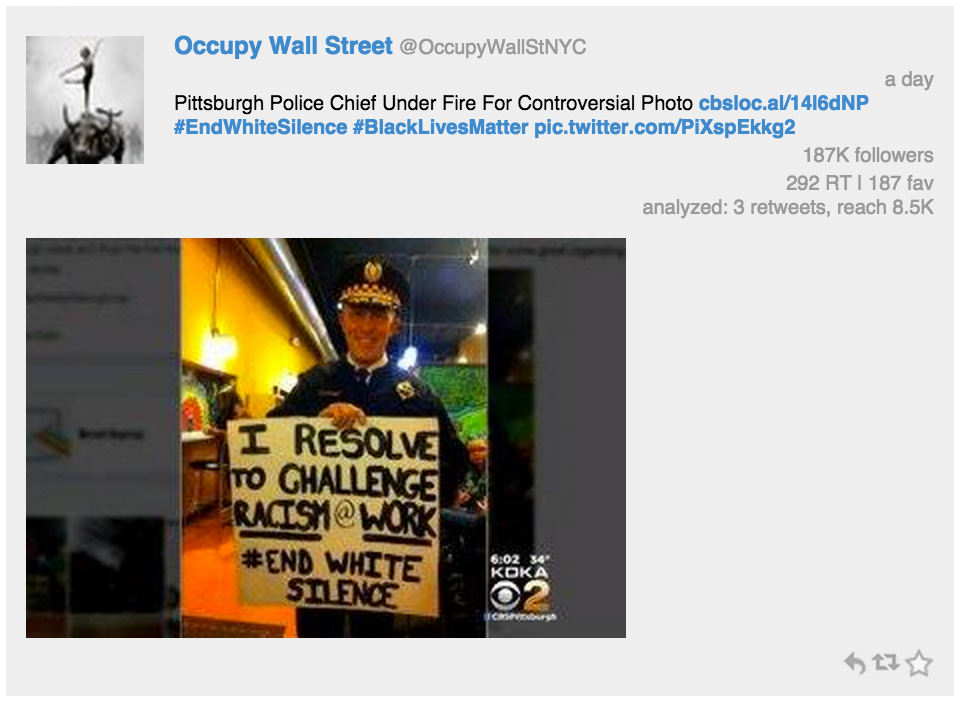

### Reagent Components for Tweets

Next, let's have a look at the ````birdwatch.ui.tweets```` **[namespace](https://github.com/matthiasn/BirdWatch/blob/d59897863fccc22b092880c34ff57c8e604c3d9d/Clojure-Websockets/MainApp/src/cljs/birdwatch/ui/tweets.cljs)**:

~~~
(ns birdwatch.ui.tweets
  (:require-macros [cljs.core.async.macros :refer [go-loop]])
  (:require [birdwatch.ui.util :as util]
            [cljs.core.async :as async :refer [put! chan sub <! timeout sliding-buffer]]
            [reagent.core :as r :refer [atom]]))

(defn twitter-intent [tweet intent icon]
  [:a {:href (str "https://twitter.com/intent/" intent (:id_str tweet))}
   [:img {:src (str "/images/" icon)}]])

(defn twitter-intents [tweet]
  [:div.intent
   [twitter-intent tweet "tweet?in_reply_to=" "reply.png"]
   [twitter-intent tweet "retweet?tweet_id=" "retweet.png"]
   [twitter-intent tweet "favorite?tweet_id=" "favorite.png"]])

(defn missing-tweet [tweet cmd-chan]
  (let [id-str (:id_str tweet)]
    (put! cmd-chan [:retrieve-missing id-str])
    [:div.tweet "loading... " (:id_str tweet)]))

(defn tweet-text [tweet user state]
  [:div.tweettext
   [:div {:dangerouslySetInnerHTML #js {:__html (:html-text tweet)}}]
   [:div.pull-left.timeInterval (str (util/number-format (:followers_count user)) " followers")]
   [:div.pull-right.timeInterval (str (util/rt-count tweet state) (util/fav-count tweet state))
    [:br] (util/rt-count-since-startup tweet state)]])

(defn image-view [media]
  [:div.tweet-image
   [:a {:href (:url (get media 0)) :target "_blank"}
    [:img.pure-img-responsive {:src (str (:media_url (get media 0)) ":small")}]]])

(defn tweet-view [raw-tweet state]
  (let [tweet ((memoize util/format-tweet) raw-tweet)
        user (:user tweet)
        screen-name (:screen_name user)
        href (str "http://www.twitter.com/" screen-name)]
    [:div.tweet
     [:span [:a {:href href :target "_blank"} [:img.thumbnail{:src (:profile_image_url user)}]]]
     [:a {:href href :target "_blank"} [:span.username {:src (:profile_image_url user)} (:name user)]]
     [:span.username_screen (str " @" screen-name)]
     [:div.pull-right.timeInterval (util/from-now (:created_at tweet))]
     [tweet-text tweet user state]
     (when-let [media (:media (:entities tweet))] (pos? (count media)) [image-view media])
     [twitter-intents tweet]]))

(defn tweets-view [app tweets cmd-chan]
  (let [state @app]
    [:div (for [t @tweets] (if (:user t)
                             ^{:key (:id_str t)} [tweet-view t state]
                             ^{:key (:id_str t)} [missing-tweet t cmd-chan]))]))

(defn mount-tweets
  "Mount tweet component, keep local state, update when new state comes in on channel."
  [state-pub cmd-chan]
  (let [app (atom {})
        tweets (atom [])
        state-chan (chan (sliding-buffer 1))]
    (go-loop []
             (let [[_ state] (<! state-chan)
                   order (:sorted state)
                   n (:n state)
                   page (dec (:page state))]
               (when (:live state) (reset! app state))
               (reset! tweets (util/tweets-by-order order @app n page))
               (<! (timeout 20)))
             (recur))
    (sub state-pub :app-state state-chan)
    (r/render-component [tweets-view app tweets cmd-chan] (util/by-id "tweet-frame"))))
~~~

The first component here is ````twitter-intent````:

~~~
(defn twitter-intent [tweet intent icon]
  [:a {:href (str "https://twitter.com/intent/" intent (:id_str tweet))}
   [:img {:src (str "/images/" icon)}]])
~~~

This renders a link to Twitter for the specified intent (e.g. retweet) with the correct icon and for the specified tweet. When clicking on this link, you can for example retweet a tweet. Here's how ````twitter-intent```` is used:

~~~
(defn twitter-intents [tweet]
  [:div.intent
   [twitter-intent tweet "tweet?in_reply_to=" "reply.png"]
   [twitter-intent tweet "retweet?tweet_id=" "retweet.png"]
   [twitter-intent tweet "favorite?tweet_id=" "favorite.png"]])
~~~

In the ````twitter-intents```` component, we create a ````div```` with three ````twitter-intent```` components, one for each possible intent. Here's how that looks like when rendered:


~~~
(defn missing-tweet [tweet cmd-chan]
  (let [id-str (:id_str tweet)]
    (put! cmd-chan [:retrieve-missing id-str])
    [:div.tweet "loading... " (:id_str tweet)]))
~~~

The ````missing-tweet```` component is rendered for a short while if a tweet is not found locally. Not only does it show a text that the tweet is loading, it also ````put!````s a message on the channel requesting the tweet from the server. Then, once the server delivers the tweet back, the actual tweet instead of this placeholder is rendered immediately. This component is not really used at the moment but it should become useful soon.

The ````tweet-text```` component is responsible for rendering the tweet text plus the followers, the retweet and favorite count as well as the count of how often the tweet has been retweeted within the tweets currently loaded in the application.

~~~
(defn tweet-text [tweet user state]
  [:div.tweettext
   [:div {:dangerouslySetInnerHTML #js {:__html (:html-text tweet)}}]
   [:div.pull-left.timeInterval (str (util/number-format (:followers_count user)) " followers")]
   [:div.pull-right.timeInterval (str (util/rt-count tweet state) (util/fav-count tweet state))
    [:br] (util/rt-count-since-startup tweet state)]])
~~~

The ````tweet-text```` component also takes the ````state```` argument, which is the locally cached application state that is reset every so often with updates it gets by subscribing to the ````state-pub````.

There's one surprise here. Inside the first child ````div````, ````:dangerouslySetInnerHTML```` is used, which is React's way of rendering already formatted HTML inside a component. The tweet text, which contains links, has already been formatted as HTML in a previous processing step, and here we simply use that HTML string.

Here's the CSS used in the component above:

{lang="CSS"}
~~~
.tweettext {
    padding-left: 10px;
    padding-bottom: 10px;
    font-size: 10px;
    overflow: auto;
    min-height: 50px;
}
.timeInterval {
    padding-top: 2px;
    font-size: 10px;
    color:#999;
    text-align: right;
}
~~~

The ````.timeInterval```` naming is probably not ideal, but I'm just re-using it from the time interval in the ````tweet-view```` component we will look at below.

Next, we have the ````image-view```` component:

~~~
(defn image-view [media]
  [:div.tweet-image
   [:a {:href (:url (get media 0)) :target "_blank"}
    [:img.pure-img-responsive {:src (str (:media_url (get media 0)) ":small")}]]])
~~~

This is really straightforward, it just creates a ````div```` of class ````tweet-image```` that contains a link that opens in a new tab. This link also contains an image with the source URL set to load the image from Twitter. Here's the CSS for the ````tweet-image```` class:

{lang="CSS"}
~~~
.tweet-image {
    max-width: 100%;
}
~~~

With these components in place we can now look at the representation of a tweet, which looks like this:



Here's the same in code:

~~~
(defn tweet-view [raw-tweet state]
  (let [tweet ((memoize util/format-tweet) raw-tweet)
        user (:user tweet)
        screen-name (:screen_name user)
        href (str "http://www.twitter.com/" screen-name)]
    [:div.tweet
     [:span [:a {:href href :target "_blank"} [:img.thumbnail{:src (:profile_image_url user)}]]]
     [:a {:href href :target "_blank"} [:span.username {:src (:profile_image_url user)} (:name user)]]
     [:span.username_screen (str " @" screen-name)]
     [:div.pull-right.timeInterval (util/from-now (:created_at tweet))]
     [tweet-text tweet user state]
     (when-let [media (:media (:entities tweet))] (pos? (count media)) [image-view media])
     [twitter-intents tweet]]))
~~~

This component takes ````raw-tweet```` and also the entire local ```state```` and renders the tweet by calling ````util/format-tweet```` with it. Note how the result is ````memoize````d. This caches previous calls to the same, referentially transparent function. I'm not sure if **[memoize](https://clojuredocs.org/clojure.core/memoize)** really improves performance in this context, but since it's so simple to do, why not. A couple of other values are taken from the tweet map and with that, a ````:div```` is rendered with the components you would expect when you look at the image above. No big surprises there, except maybe for only rendering the image view when there is media to render. Otherwise, the ````when-let```` would simply evaluate to ````nil```` and thus be ignored.

With the ````tweet-view```` component in place, we can now render a list of them in the ````tweets-view```` component:

~~~
(defn tweets-view [app tweets cmd-chan]
  (let [state @app]
    [:div (for [t @tweets] (if (:user t)
                             ^{:key (:id_str t)} [tweet-view t state]
                             ^{:key (:id_str t)} [missing-tweet t cmd-chan]))]))
~~~

In this component, we dereference the application state as ````app````, derive the tweets to be rendered as ````tweets```` and then render a tweet for each entry. If the tweet is not available locally, we render a ````missing-tweet```` component, otherwise we render a ````tweet-view```` component. In each case, we set a ````:key```` as metadata on the component. This allows the underlying React to be more efficient by being able to reuse components instead of having to throw away the DOM node and render a new one. You can probably already guess how the list rendering looks like. If not, you can find it again in the screenshots of the next chapter.

Finally, the tweets view needs to be rendered and mounted, which happens inside the ````mount-tweets```` function:

~~~
(defn mount-tweets
  "Mount tweet component, keep local state, update when new state comes in on channel."
  [state-pub cmd-chan]
  (let [app (atom {})
        tweets (atom [])
        state-chan (chan (sliding-buffer 1))]
    (go-loop []
             (let [[_ state] (<! state-chan)
                   order (:sorted state)
                   n (:n state)
                   page (dec (:page state))]
               (when (:live state) (reset! app state))
               (reset! tweets (util/tweets-by-order order @app n page))
               (<! (timeout 20)))
             (recur))
    (sub state-pub :app-state state-chan)
    (r/render-component [tweets-view app tweets cmd-chan] (util/by-id "tweet-frame"))))
~~~


