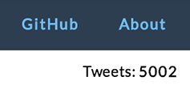

## User Interface

### React.js Concepts

### Reagent (or potentially freactive)


Let's start with the simpler elements in the ````birdwatch.ui.elements```` **[namespace](https://github.com/matthiasn/BirdWatch/blob/574d2178be6f399086ad2a5ec35c200d252bf887/Clojure-Websockets/MainApp/src/cljs/birdwatch/ui/elements.cljs)**:

~~~
(ns birdwatch.ui.elements
  (:require [birdwatch.util :as util]
            [birdwatch.communicator :as comm]
            [birdwatch.state :as state]
            [birdwatch.ui.tweets :as ui-tweets]
            [reagent.core :as r]))

(enable-console-print!)

(defn count-view []
  [:span (:count @state/app)])

(defn users-count-view []
  (let [users (:users-count @state/app)]
    [:span "Connected: " [:strong users] (if (= users 1) " user" " users")]))

(defn total-count-view []
  [:span "Indexed: " [:strong (:total-tweet-count @state/app)] " tweets"])

(def sort-orders [[:by-id "latest"][:by-followers "followers"][:by-retweets "retweets"]
                  [:by-rt-since-startup "retweets2"][:by-reach "reach"][:by-favorites "favorites"]])

(defn sort-view []
  (let [curr-order (:sorted @state/app)]
    [:div
     [:button.pure-button.not-rounded.sort-button "Sort by"]
     (for [[k text] sort-orders :let [btn-class (if (= k curr-order) " pure-button-primary" " sort-button")]]
       ^{:key text} [:button.pure-button.not-rounded
                     {:class btn-class :on-click #(swap! state/app assoc :sorted k)} text])]))

(defn search-view []
  [:form.pure-form
   [:fieldset
    [:input {:type "text" :value (:search-text @state/app)
             :on-key-press #(when (== (.-keyCode %) 13) (comm/start-search))
             :on-change #(swap! state/app assoc :search-text (.. % -target -value))
             :placeholder "Example search: java (job OR jobs OR hiring)"}]
    [:button.pure-button.pure-button-primary {:on-click #(comm/start-search)}
     [:span {:class "glyphicon glyphicon-search"}]]]])

(defn pag-item [idx]
  [:button.pure-button.not-rounded.button-xsmall
   {:class (if (= idx (:page @state/app)) " pure-button-primary" "")
    :on-click #(swap! state/app assoc :page idx)} idx])

(defn pagination-view []
  [:div
   [:button.pure-button.not-rounded.button-xsmall "Page"]
   (for [idx (take 15 (range 1 (Math/floor (/ (:count @state/app) (:n @state/app)))))]
     ^{:key idx} [pag-item idx])])

(def views [[count-view "tweet-count"][search-view "search"][total-count-view "total-tweet-count"]
            [users-count-view "users-count"][sort-view "sort-buttons"][pagination-view "pagination"]
            [ui-tweets/tweets-view "tweet-frame"]])

(defn init-views []
  (doseq [[component id] views]
    (r/render-component [component] (util/by-id id))))
~~~

The first **reagent** component above is also the simplest one: 

~~~
(defn count-view []
  [:span (:count @state/app)])
~~~

All this does is populate a ````<span>```` with the current value of the ````:count```` key in our application state, updated whenever that value changes.



Using this component is also very easy. We need some HTML like this, with an ````id```` where the element can be rendered:

{lang=html}
~~~
<div id="count">Tweets: <span id="tweet-count"></span></div>
~~~

Then, we can tell **reagent** to render the component in this ````<span>````:

~~~
(r/render-component [count-view] (util/by-id "tweet-count"))
~~~


Next, let's have a look at the ````birdwatch.ui.tweets```` **[namespace](https://github.com/matthiasn/BirdWatch/blob/574d2178be6f399086ad2a5ec35c200d252bf887/Clojure-Websockets/MainApp/src/cljs/birdwatch/ui/tweets.cljs)**:

~~~
(ns birdwatch.ui.tweets
  (:require [birdwatch.util :as util]
            [birdwatch.channels :as c]
            [birdwatch.communicator :as comm]
            [birdwatch.state :as state]
            [cljs.core.async :as async :refer [put!]]
            [reagent.core :as r]))

(enable-console-print!)

(defn twitter-intent [tweet intent icon]
  [:a {:href (str "https://twitter.com/intent/" intent (:id_str tweet))}
   [:img {:src (str "/images/" icon)}]])

(defn twitter-intents [tweet]
  [:div.intent
   [twitter-intent tweet "tweet?in_reply_to=" "reply.png"]
   [twitter-intent tweet "retweet?tweet_id=" "retweet.png"]
   [twitter-intent tweet "favorite?tweet_id=" "favorite.png"]])

(defn missing-tweet [tweet]
  (put! c/tweet-missing-chan (:id_str tweet))
  (print "retrieving tweet" (:id_str tweet))
  [:div.tweet "loading..." (:id_str tweet)])

(defn tweet-text [tweet user]
  [:div.tweettext
   [:div {:dangerouslySetInnerHTML #js {:__html (:html-text tweet)}}]
   [:div.pull-left.timeInterval (str (util/number-format (:followers_count user)) " followers")]
   [:div.pull-right.timeInterval (str (util/rt-count tweet) (util/fav-count tweet))
    [:br] (util/rt-count-since-startup tweet)]])

(defn image-view [media]
   [:div.tweet-image
        [:a {:href (:url (get media 0)) :target "_blank"}
         [:img.pure-img-responsive {:src (str (:media_url (get media 0)) ":small")}]]])

(defn tweet-view [raw-tweet]
  (let [tweet (util/format-tweet raw-tweet)
        user (:user tweet)
        screen-name (:screen_name user)
        href (str "http://www.twitter.com/" screen-name)]
    [:div.tweet
     [:span [:a {:href href :target "_blank"} [:img.thumbnail{:src (:profile_image_url user)}]]]
     [:a {:href href :target "_blank"} [:span.username {:src (:profile_image_url user)} (:name user)]]
     [:span.username_screen (str " @" screen-name)]
     [:div.pull-right.timeInterval (util/from-now (:created_at tweet))]
     [tweet-text tweet user]
     (when-let [media (:media (:entities tweet))] (pos? (count media)) [image-view media])
     [twitter-intents tweet]])) ; generate placeholder while fetching tweet

(defn tweets-view []
  (let [app @state/app
        tweets (util/tweets-by-order2 (:sorted app) app (:n app) (dec (:page app)))]
    [:div (for [t tweets] (if (:user t)
                            ^{:key (:id_str t)} [tweet-view t]
                            ^{:key (:id_str t)} [missing-tweet t]))]))
~~~


### Pure.css


