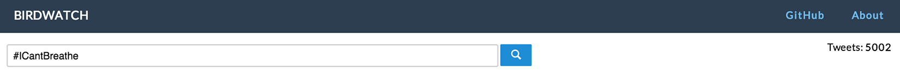
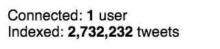
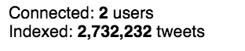
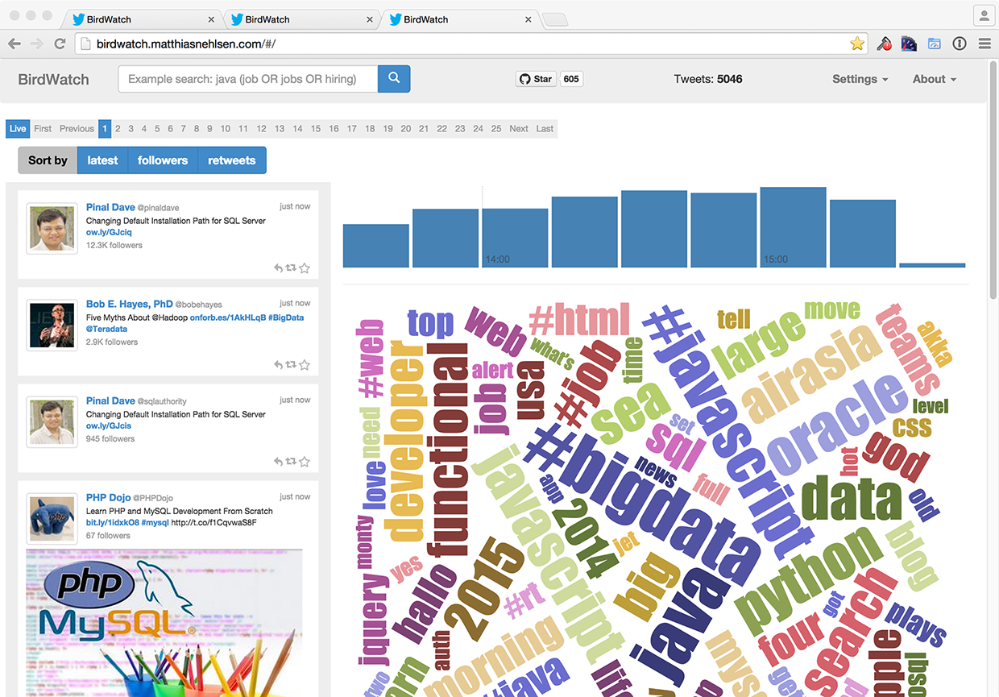
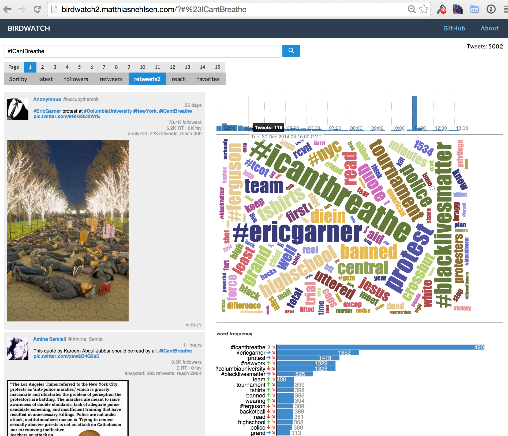
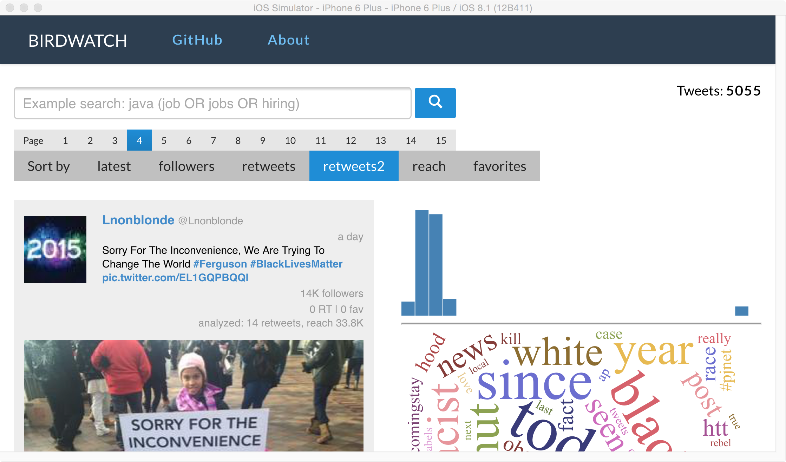

## User Interface

### React.js Concepts
**[React](http://facebook.github.io/react/)** is a revolutionary way to build user interfaces. It's model is particularly well suited for working with immutable data structures as is based on rendering out the entire application state every single time something changes, without requiring to mutate the application state itself. React will then render the state into a virtual DOM, keep the previous version of the virtual DOM and run an efficient diffing algorithm between the two and only change the actual and slow DOM where it has found changes between the previous and the current virtual DOM during the diffing phase. 

This may at first sound inefficient but it is actually very fast, making it trivial to achieve 60 frames per second in the browser in most cases. **[David Nolen](https://twitter.com/swannodette)** was the first to my knowledge who realized how well this model is suited for working with ClojureScript's immutable data structures. He then developed **[Om](https://github.com/swannodette/om)** which he first announced in this **[blog post](http://swannodette.github.io/2013/12/17/the-future-of-javascript-mvcs/)**. Kudos to him for this discovery. At that time I was working on an **[AngularJS](http://www.amazon.com/AngularJS-UI-Development-Amit-Ghart-ebook/dp/B00OXVAK7A/ref=sr_1_1?ie=UTF8&qid=1420394659&sr=8-1)** book and reading his blog post made me realize that AngularJS might not be the way to go, at least not for me. I had already been exposed to functional programming principles enough to know the value of working with immutable values. Luckily, the publisher found a co-author as I didn't want to spend another couple of months with AngularJS any longer.

I wrote the first version of the ClojureScript client using **Om**, but I always had the problem that I would need a rather large amount of context when coming back to the code for the user interface. I then discovered **[Reagent](https://github.com/reagent-project/reagent)**, which is also using **React.js** and is based on the same principles as Om. I just found the required code for a component much more terse and legible at the same time with its **[Hiccup](https://github.com/weavejester/hiccup)** syntax that I made a complete switch. I have not regretted that. Now I come back to the UI code and I scratch my head a lot less than with the previous version. I share this experience I read in this **[blog post](http://diogo149.github.io/2014/10/19/om-no/)**, which made me give Reagent a shot. I haven't regretted it.


### Reagent

For more information on Reagent, I can also recommend this **[blog post](http://getprismatic.com/story/1405451329953)**, besides the decent-enough documentation of the project itself.

I will not start with an introduction to Reagent here, the previously mentioned resources should have you covered. Instead, I will just explain the code, which you actually may find simple enough to learn Reagent from the code itself.

#### Simple Reagent Components
Let's start the exploration with the simpler components in the ````birdwatch.ui.elements```` **[namespace](https://github.com/matthiasn/BirdWatch/blob/574d2178be6f399086ad2a5ec35c200d252bf887/Clojure-Websockets/MainApp/src/cljs/birdwatch/ui/elements.cljs)**:

~~~
(ns birdwatch.ui.elements
  (:require [birdwatch.util :as util]
            [birdwatch.communicator :as comm]
            [birdwatch.state :as state]
            [birdwatch.ui.tweets :as ui-tweets]
            [reagent.core :as r]))

(enable-console-print!)

(defn count-view []
  [:span (:count @state/app)])

(defn users-count-view []
  (let [users (:users-count @state/app)]
    [:span "Connected: " [:strong users] (if (= users 1) " user" " users")]))

(defn total-count-view []
  [:span "Indexed: " [:strong (:total-tweet-count @state/app)] " tweets"])

(def sort-orders [[:by-id "latest"][:by-followers "followers"][:by-retweets "retweets"]
                  [:by-rt-since-startup "retweets2"][:by-reach "reach"][:by-favorites "favorites"]])

(defn sort-view []
  (let [curr-order (:sorted @state/app)]
    [:div
     [:button.pure-button.not-rounded.sort-button "Sort by"]
     (for [[k text] sort-orders :let [btn-class (if (= k curr-order) " pure-button-primary" " sort-button")]]
       ^{:key text} [:button.pure-button.not-rounded
                     {:class btn-class :on-click #(swap! state/app assoc :sorted k)} text])]))

(defn search-view []
  [:form.pure-form
   [:fieldset
    [:input {:type "text" :value (:search-text @state/app)
             :on-key-press #(when (== (.-keyCode %) 13) (comm/start-search))
             :on-change #(swap! state/app assoc :search-text (.. % -target -value))
             :placeholder "Example search: java (job OR jobs OR hiring)"}]
    [:button.pure-button.pure-button-primary {:on-click #(comm/start-search)}
     [:span {:class "glyphicon glyphicon-search"}]]]])

(defn pag-item [idx]
  [:button.pure-button.not-rounded.button-xsmall
   {:class (if (= idx (:page @state/app)) " pure-button-primary" "")
    :on-click #(swap! state/app assoc :page idx)} idx])

(defn pagination-view []
  [:div
   [:button.pure-button.not-rounded.button-xsmall "Page"]
   (for [idx (take 15 (range 1 (Math/floor (/ (:count @state/app) (:n @state/app)))))]
     ^{:key idx} [pag-item idx])])

(def views [[count-view "tweet-count"][search-view "search"][total-count-view "total-tweet-count"]
            [users-count-view "users-count"][sort-view "sort-buttons"][pagination-view "pagination"]
            [ui-tweets/tweets-view "tweet-frame"]])

(defn init-views []
  (doseq [[component id] views]
    (r/render-component [component] (util/by-id id))))
~~~

The first **reagent** component above is also the simplest one, it only defines a simple ````:span```` in **[Hiccup syntax](https://github.com/weavejester/hiccup)**:

~~~
(defn count-view []
  [:span (:count @state/app)])
~~~

All this does is populate a ````<span>```` with the current value of the ````:count```` key in our application state which is updated whenever that value changes.

Using this component is also very easy. We need some HTML, with an ````id```` where the element can be rendered:

{lang=html}
~~~
<div id="count">Tweets: <span id="tweet-count"></span></div>
~~~

Then, we can tell **reagent** to render the component in this ````<span>````:

~~~
(r/render-component [count-view] (util/by-id "tweet-count"))
~~~



You can see the result on the right side of the partial screenshot above.

The ````users-count-view```` component is only slightly more involved:

~~~
(defn users-count-view []
  (let [users (:users-count @state/app)]
    [:span "Connected: " [:strong users] (if (= users 1) " user" " users")]))
~~~

Here, we have some conditional logic so that if only one user is connected, we use "user" as a singular:



Otherwise, we use the plural "users":



After seeing the two components above, the ````total-count-view```` component should not contain any surprises:

~~~
(defn total-count-view []
  [:span "Indexed: " [:strong (:total-tweet-count @state/app)] " tweets"])
~~~

This renders the number of tweets indexed in total. As mentioned in the server-side chapter, the ````Persistence```` component sends a message with an updated total every so many seconds, which is then distributed to all connected clients.

The ````sort-view```` component is a little more involved. We need a couple of buttons for different sort orders, each of which needs a keyword that will be set as the application's current sort order and a label string. In order not to repeat ourselves, we can create a vector named ````sort-orders```` for all the buttons, each of which we can represent as a two-item vector, with the key in the first position and the label string in the second position:

~~~
(def sort-orders [[:by-id "latest"][:by-followers "followers"][:by-retweets "retweets"]
                  [:by-rt-since-startup "retweets2"][:by-reach "reach"][:by-favorites "favorites"]])

(defn sort-view []
  (let [curr-order (:sorted @state/app)]
    [:div
     [:button.pure-button.not-rounded.sort-button "Sort by"]
     (for [[k text] sort-orders :let [btn-class (if (= k curr-order) " pure-button-primary" " sort-button")]]
       ^{:key text} [:button.pure-button.not-rounded
                     {:class btn-class :on-click #(swap! state/app assoc :sorted k)} text])]))
~~~

Then, in the ````sort-view```` component itself, we dereference our application state and use ````(:sorted @state/app)```` as ````curr-order```` in the ````let````-binding. With that, we can start constructing the markup generated by this component, starting with a ````:div```` and a first static button with the label ````"Sort By"````. Note that with Hiccup, we can simply assign classes to the button, like so:

~~~
[:button.pure-button.not-rounded.sort-button "Sort by"]
~~~


Next, we want to create additional buttons for every element in the ````sort-orders```` vector.

~~~
(for [[k text] sort-orders :let [btn-class (if (= k curr-order) " pure-button-primary" " sort-button")]]
  ^{:key text} [:button.pure-button.not-rounded
                 {:class btn-class :on-click #(swap! state/app assoc :sorted k)} text])
~~~

Above, ````for```` every item in ````sort-orders```` we destructure the vector as ````k```` and ````text```` and then determine if ````k```` equals ````curr-order````. If so, we set ````btn-class```` in the ````:let```` binding to ````" pure-button-primary"````, otherwise we set it to ````" sort-button"````. This controls the color. If the sort order that the button represents is active, we want the color to be light blue and otherwise light gray. With that, we can now create the individual button:

~~~
^{:key text} [:button.pure-button.not-rounded
               {:class btn-class :on-click #(swap! state/app assoc :sorted k)} text]
~~~

All buttons share the ````.pure-button.not-rounded```` classes. In addition we set the class in the properties map of the button component: ````:class btn-class````. In that map we also define an ````:on-click```` function: ````#(swap! state/app assoc :sorted k)````. This resets the current sort order to the key associated with the clicked button. Finally, we pass the ````text```` label to the button. Note that we will also set metadata on the component where we use the ````text```` of the component as the ````:key````: ^{:key text}. This is good practice for ReactJS whenever we render a list of something. Here, it wouldn't hurt as the list is not dynamic, but it would still result in a warning on the console. 

#### Reagent Components for Tweets

Next, let's have a look at the ````birdwatch.ui.tweets```` **[namespace](https://github.com/matthiasn/BirdWatch/blob/d35684c599c169faa38daf0043a8d6f05848c4a9/Clojure-Websockets/MainApp/src/cljs/birdwatch/ui/tweets.cljs)**:

~~~
(ns birdwatch.ui.tweets
  (:require [birdwatch.util :as util]
            [birdwatch.channels :as c]
            [birdwatch.communicator :as comm]
            [birdwatch.state :as state]
            [cljs.core.async :as async :refer [put!]]
            [reagent.core :as r]))

(enable-console-print!)

(defn twitter-intent [tweet intent icon]
  [:a {:href (str "https://twitter.com/intent/" intent (:id_str tweet))}
   [:img {:src (str "/images/" icon)}]])

(defn twitter-intents [tweet]
  [:div.intent
   [twitter-intent tweet "tweet?in_reply_to=" "reply.png"]
   [twitter-intent tweet "retweet?tweet_id=" "retweet.png"]
   [twitter-intent tweet "favorite?tweet_id=" "favorite.png"]])

(defn missing-tweet [tweet]
  (put! c/tweet-missing-chan (:id_str tweet))
  (print "retrieving tweet" (:id_str tweet))
  [:div.tweet "loading..." (:id_str tweet)])

(defn tweet-text [tweet user]
  [:div.tweettext
   [:div {:dangerouslySetInnerHTML #js {:__html (:html-text tweet)}}]
   [:div.pull-left.timeInterval (str (util/number-format (:followers_count user)) " followers")]
   [:div.pull-right.timeInterval (str (util/rt-count tweet) (util/fav-count tweet))
    [:br] (util/rt-count-since-startup tweet)]])

(defn image-view [media]
  [:div.tweet-image
   [:a {:href (:url (get media 0)) :target "_blank"}
    [:img.pure-img-responsive {:src (str (:media_url (get media 0)) ":small")}]]])

(defn tweet-view [raw-tweet]
  (let [tweet ((memoize util/format-tweet) raw-tweet)
        user (:user tweet)
        screen-name (:screen_name user)
        href (str "http://www.twitter.com/" screen-name)]
    [:div.tweet
     [:span [:a {:href href :target "_blank"} [:img.thumbnail{:src (:profile_image_url user)}]]]
     [:a {:href href :target "_blank"} [:span.username {:src (:profile_image_url user)} (:name user)]]
     [:span.username_screen (str " @" screen-name)]
     [:div.pull-right.timeInterval (util/from-now (:created_at tweet))]
     [tweet-text tweet user]
     (when-let [media (:media (:entities tweet))] (pos? (count media)) [image-view media])
     [twitter-intents tweet]]))

(defn tweets-view []
  (let [app @state/app
        tweets (util/tweets-by-order2 (:sorted app) app (:n app) (dec (:page app)))]
    [:div (for [t tweets] (if (:user t)
                            ^{:key (:id_str t)} [tweet-view t]
                            ^{:key (:id_str t)} [missing-tweet t]))]))
~~~

The first component here is ````twitter-intent````:

~~~
(defn twitter-intent [tweet intent icon]
  [:a {:href (str "https://twitter.com/intent/" intent (:id_str tweet))}
   [:img {:src (str "/images/" icon)}]])
~~~

This renders a link to Twitter for the specified intent (e.g. retweet) with the correct icon and for the specified tweet. When clicking on this link, you can for example retweet a tweet. Here's how ````twitter-intent```` is used:

~~~
(defn twitter-intents [tweet]
  [:div.intent
   [twitter-intent tweet "tweet?in_reply_to=" "reply.png"]
   [twitter-intent tweet "retweet?tweet_id=" "retweet.png"]
   [twitter-intent tweet "favorite?tweet_id=" "favorite.png"]])
~~~

In the ````twitter-intents```` component, we create a ````div```` with three ````twitter-intent```` components, one for each possible intent. Here's how that looks like when rendered:


The ````missing-tweet```` is not currently used, so there's no need to cover it right now.

The ````tweet-text```` component is responsible for rendering the tweet text plus the followers, retweet and favorite count plus the count how often the tweet has been retweeted within the tweets currently loaded in the application.

~~~
(defn tweet-text [tweet user]
  [:div.tweettext
   [:div {:dangerouslySetInnerHTML #js {:__html (:html-text tweet)}}]
   [:div.pull-left.timeInterval (str (util/number-format (:followers_count user)) " followers")]
   [:div.pull-right.timeInterval (str (util/rt-count tweet) (util/fav-count tweet))
    [:br] (util/rt-count-since-startup tweet)]])
~~~

There's one surprise in here. Inside the first child ````div````, ````:dangerouslySetInnerHTML```` is used, which is React's way of rendering already formatted HTML inside a component. The tweet text, which contains links, has already been formatted as HTML in a previous processing step, and here we simply use that HTML string.

Here's the CSS used in the component above:

{lang="CSS"}
~~~
.tweettext {
    padding-left: 10px;
    padding-bottom: 10px;
    font-size: 10px;
    overflow: auto;
    min-height: 50px;
}
.timeInterval {
    padding-top: 2px;
    font-size: 10px;
    color:#999;
    text-align: right;
}
~~~

The ````.timeInterval```` naming is probably not ideal, but I'm just re-using it from the time interval in the ````tweet-view```` component we will look at below.

Next, we have the ````image-view```` component:

~~~
(defn image-view [media]
   [:div.tweet-image
        [:a {:href (:url (get media 0)) :target "_blank"}
         [:img.pure-img-responsive {:src (str (:media_url (get media 0)) ":small")}]]])
~~~

This is really straight-forward, it just creates a ````div```` of class ````tweet-image```` that contains a link that opens in a new tab and that contains an image with the source URL set to load the image from Twitter. Here's the CSS for the ````tweet-image```` class:

{lang="CSS"}
~~~
.tweet-image {
    max-width: 100%;
}
~~~

With these components in place, we can now look at the representation of a tweet, which looks like this:


Here's the same in code:

~~~
(defn tweet-view [raw-tweet]
  (let [tweet ((memoize util/format-tweet) raw-tweet)
        user (:user tweet)
        screen-name (:screen_name user)
        href (str "http://www.twitter.com/" screen-name)]
    [:div.tweet
     [:span [:a {:href href :target "_blank"} [:img.thumbnail{:src (:profile_image_url user)}]]]
     [:a {:href href :target "_blank"} [:span.username {:src (:profile_image_url user)} (:name user)]]
     [:span.username_screen (str " @" screen-name)]
     [:div.pull-right.timeInterval (util/from-now (:created_at tweet))]
     [tweet-text tweet user]
     (when-let [media (:media (:entities tweet))] (pos? (count media)) [image-view media])
     [twitter-intents tweet]]))
~~~

This component takes ````raw-tweet```` and formats it by calling ````util/format-tweet```` with it. Notice how the result is ````memoize````d. This caches previous calls to the same, referentially transparent function. I'm not sure if **[memoize](https://clojuredocs.org/clojure.core/memoize)** adds much in this context, but since it's so simple to do, why not. A couple of other values are taken from the tweet map and with that, a ````:div```` is rendered, with the components you would expect when you look at the image above. No big surprises there, except maybe for only rendering the image view when there is media to render. Otherwise, the ````when-let```` would simply evaluate to ````nil```` and thus ignored.

With the ````tweet-view```` component in place, we can now render a list of them in the the ````tweets-view```` component:

~~~
(defn tweets-view []
  (let [app @state/app
        tweets (util/tweets-by-order2 (:sorted app) app (:n app) (dec (:page app)))]
    [:div (for [t tweets] (if (:user t)
                            ^{:key (:id_str t)} [tweet-view t]
                            ^{:key (:id_str t)} [missing-tweet t]))]))
~~~

In this component, we dereference the application state as ````app````, derive the tweets to be rendered as ````tweets```` and then render a tweet for each entry. In the case that the tweet is not available locally, we render a ````missing-tweet```` component, otherwise we render a ````tweet-view```` component. In each case, we set a ````:key```` as metadata on the component. This allows the underlying React to be more efficient by being able to reuse components instead of having to throw away the DOM node and render a new one.

### Pure.css

Earlier versions of this application used **[Bootstrap](http://getbootstrap.com)** as the CSS framework, including earlier versions of the Clojure / ClojureScript implementation. But after about a year, I really couldn't stand the Bootstrap look any longer. Sure, I could have changed stuff to make it look less like Bootstrap, but then why use Bootstrap in the first place. Here's how that old version looked like:



Bootstrap has served me alright over the last two years or so, but it was time for something simpler.

So I had a look for newer CSS frameworks and I found **[Pure](http://purecss.io)**. Pure is much more lightweight than Bootstrap, it requires a much smaller download and the grid model is also much easier to use than Bootstrap. Here's how the new version looks like:



I think this looks fresher than the old version. At the same time it also works much better on small mobile screens, without much customization. For example in the iOS Simulator for the iPhone 6 Plus, it looks like this:



Now it not only looks better, the HTML needed to generate this is also a lot simpler. Let's have a quick look at the HTML:

{lang="HTML"}
~~~
<body>
    <div class="header">
        <div id="demo-horizontal-menu" class="home-menu pure-menu pure-menu-open pure-menu-horizontal pure-menu-fixed">
            <a class="pure-menu-heading" href="">Birdwatch</a>
            <ul>
                <li><a href="https://github.com/matthiasn/Birdwatch" target="_blank">GitHub</a></li>
                <li><a href="https://leanpub.com/building-a-system-in-clojure" target="_blank">About</a></li>
            </ul>
        </div>
    </div>

    <div class="content-wrapper">
        <div class="l-box">
            <div id="count">Tweets: <span id="tweet-count"></span></div>
            <div id="search"></div>
            <div id="pagination"></div>
            <div id="sort-buttons"></div>
        </div>
        <div class="pure-g">
            <div class="pure-u-1 pure-u-sm-1-2 pure-u-lg-5-12 l-box">
                <div id="tweet-frame"></div>
            </div>
            <div class="pure-u-1 pure-u-sm-1-2 pure-u-lg-7-12 l-box">
                <div id="timeseries1" class="timeseries"></div>
                <hr />
                <div id="wordCloud" class="cloud" ></div>
                <hr />
                <h5>word frequency</h5>
                <div id="wordcount-barchart" class="barchart" ></div>
                <hr />
                <div id="users-count"></div>
                <div id="total-tweet-count"></div>
            </div>
        </div>
    </div>
    <!-- Scripts omitted -->
</body>
~~~

I like ***[Pure](http://purecss.io)** for the simplicity of its grid model. Although this is not a book about HTML and CSS, let's still walk through the HTML as it comes in handy when you want to design a web application.

**TODO**: explanation of the grid model.