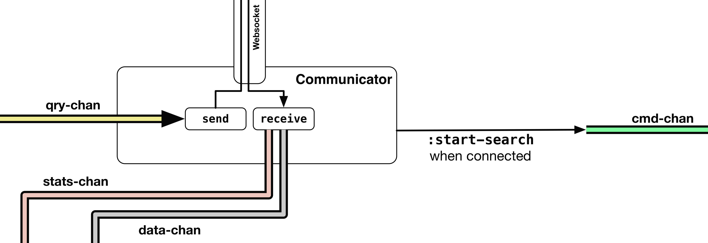

## WebSocket Communication 

The ````birdwatch.communicator```` namespace handles the interaction with the server-side application through the use of a WebSocket connection provided by the **[sente](https://github.com/ptaoussanis/sente)** library.

Conceptually, the bi-directional WebSocket connection is somewhat similar to two **core.async** channels, one for sending and one for receiving. Since there are no different channels for different message types, all messages on the WebSocket connection need to be marked with their type. This is done by wrapping the payload in a vector where the message type is represented by a **[namespaced keyword](https://clojuredocs.org/clojure.core/keyword)** in the first position and the payload in the second position. 

With this convention it is really easy to pattern match using **[core.match](https://github.com/clojure/core.match)** as we will see below. It is just as easy to add new message types. In fact, this convention of a vector with two items in it, where the first one is a namespaced keyword that denotes the payload type and a second item with the payload is so useful because of pattern matching that we will be using it in other parts of the application as well.

This component interacts with the rest of the application through four channels, ````cmd-chan````, ````data-chan````, ````stats-chan````, and ````qry-chan````:



Here's the entire **[namespace](https://github.com/matthiasn/BirdWatch/blob/54a03b1a5d1324075ca4e75451a2bc752a2ab9e3/Clojure-Websockets/MainApp/src/cljs/birdwatch/communicator.cljs)**:

~~~
(ns birdwatch.communicator
  (:require-macros [cljs.core.async.macros :refer [go-loop]])
  (:require [cljs.core.match :refer-macros [match]]
            [taoensso.sente  :as sente  :refer (cb-success?)]
            [taoensso.sente.packers.transit :as sente-transit]
            [cljs.core.async :as async :refer [<! chan put!]]))

(def packer
  "Defines our packing (serialization) format for client<->server comms."
  (sente-transit/get-flexi-packer :json))

(defn make-handler
  "Create handler function for messages from WebSocket connection, wire channels and the
   start-function to call when the socket is established."
  [cmd-chan data-chan stats-chan]
  (fn [{:keys [event]}]
    (match event
           [:chsk/state {:first-open? true}] (do
                                               (print "WS connected")
                                               (put! cmd-chan [:start-search]))
           [:chsk/recv  payload]
           (let [[msg-type msg] payload]
             (case (keyword (namespace msg-type))
               :tweet   (put! data-chan payload)
               :stats   (put! stats-chan payload)
               :default (print "unmatched message" payload)))
           :else (print "Unmatched event: %s" event))))

(defn query-loop
  "Take command / query message off of channel, enrich payload with :uid of current
   WebSocket connection and send to server. Channel is injected when loop is started."
  [channel send-fn chsk-state]
  (go-loop []
           (let [[cmd-type payload] (<! channel)]
             (send-fn [cmd-type (assoc payload :uid (:uid @chsk-state))])
             (recur))))

(defn start-communicator
  "Start communicator by wiring channels."
  [cmd-chan data-chan stats-chan qry-chan]
  (let [ws (sente/make-channel-socket! "/chsk" {:packer packer :type :auto})
        {:keys [ch-recv send-fn state]} ws
        handler (make-handler cmd-chan data-chan stats-chan)]
    (sente/start-chsk-router! ch-recv handler)
    (query-loop qry-chan send-fn state)))
~~~

Let's go through this def by def, function by function.

~~~
(def packer
  "Defines our packing (serialization) format for client<->server comms."
  (sente-transit/get-flexi-packer :json))
~~~

This defines the packer for sente, we're using **[transit](http://blog.cognitect.com/blog/2014/7/22/transit)** here. 

Next, we have the ````make-handler```` function, which, as the name suggests, creates a handler function for handling incoming messages on the WebSocket connection. The returned handler function then already knows the channels to put messages onto, as these were specified in the initial call to the ````make-handler```` function that constructed the handler function.

~~~
(defn make-handler
  "Create handler function for messages from WebSocket connection, wire channels and the
   start-function to call when the socket is established."
  [cmd-chan data-chan stats-chan]
  (fn [{:keys [event]}]
    (match event
           [:chsk/state {:first-open? true}] (do
                                               (print "WS connected")
                                               (put! cmd-chan [:start-search]))
           [:chsk/recv  payload]
           (let [[msg-type msg] payload]
             (case (keyword (namespace msg-type))
               :tweet   (put! data-chan payload)
               :stats   (put! stats-chan payload)
               :default (print "unmatched message" payload)))
           :else (print "Unmatched event: %s" event))))
~~~

The event received by the handler function above is pattern matched using ````core.match````, where we always have a vector with two elements. The first match is triggered when ````event```` contains ````:chsk/state```` with ````:first-open?```` set to ````true````, which happens when the connection to the server has been established. In that case, ````"WS connected"```` is printed on the browser console and a ````[:start-search]```` message is put onto the ````cmd-chan```` in order to start a search.

Next, when a vector is received that contains ````:chsk/recv```` in the first position, we further destructure the payload, which also contains a two-item vector ````(let [[msg-type msg] payload]````. In the next line, we use ````case```` to match on the namespace of the namespaced keyword in ````msg-type````. If the namespace of the message type is ````:tweet````, the message is put on the ````data-chan````, if it is ````stats````, the message is put onto ````stats-chan```` and otherwise the payload is printed with a warning that the event could not be matched.

Next, we have the ````query-loop```` function. This function starts a ````go-loop```` that takes messages from the specified channel and then uses the specified send-fn to send an item to the server.

~~~
(defn query-loop
  "Take command / query message off of channel, enrich payload with :uid of current
   WebSocket connection and send to server. Channel is injected when loop is started."
  [channel send-fn chsk-state]
  (go-loop []
           (let [[cmd-type payload] (<! channel)]
             (send-fn [cmd-type (assoc payload :uid (:uid @chsk-state))])
             (recur))))
~~~

Not surprisingly, this function also expects items on the channel to be two-item vectors, as we can see in the destructuring when taking an item off the channel: ````(let [[cmd-type payload] (<! channel)]````. The function also takes ````chsk-state````, which is the atom associated with the sente connection to the server. Here, the ````:uid```` from the map held in ````chsk-state```` is used so that the server has information about the client ID and can thus return responses to the correct client. 

Finally, we have the ````start-communicator```` function. This function fires up the WebSocket connection, calls the ````make-handler```` function and starts the ````query-loop````.

~~~
(defn start-communicator
  "Start communicator by wiring channels."
  [cmd-chan data-chan stats-chan qry-chan]
  (let [ws (sente/make-channel-socket! "/chsk" {:packer packer :type :auto})
        {:keys [ch-recv send-fn state]} ws
        handler (make-handler cmd-chan data-chan stats-chan)]
    (sente/start-chsk-router! ch-recv handler)
    (query-loop qry-chan send-fn state)))
~~~

This function takes the four channels we saw in the architectural drawing above and wires them accordingly. Before that can happen, ````sente/make-channel-socket!```` is called with a route for the connection and the packer. Obviously, the route needs to match the one used on the server side. This function returns a map, from which we require three keys ````{:keys [ch-recv send-fn state]}````. 

Then, the handler is created. ````data-chan```` and ````stats-chan```` are used by the handler for forwarding received messages. The ````cmd-chan```` allows the handler to trigger a new search when the connection to the client is up, as we saw when we discussed the handler above. 

With the ````handler```` and ````ch-recv```` from the map that was returned by ````sente/make-channel-socket!````, we can now start the router by calling ````(sente/start-chsk-router! ch-recv handler)````.

Finally, ````qry-chan```` is used when calling the ````query-loop```` function.

This is all there is to the **Communicator** component. Most notably, any state is contained inside an atom that lives inside the let-binding of the ````start-communicator```` function and is not reachable from the outside. This may not seem terribly important here but we will see that this is valuable when discussing the application state in the **State** component. Also, this namespace does not depend on any other namespace inside our application and interacts entirely through channels that are passed in when the ````start-communicator```` function is called.
