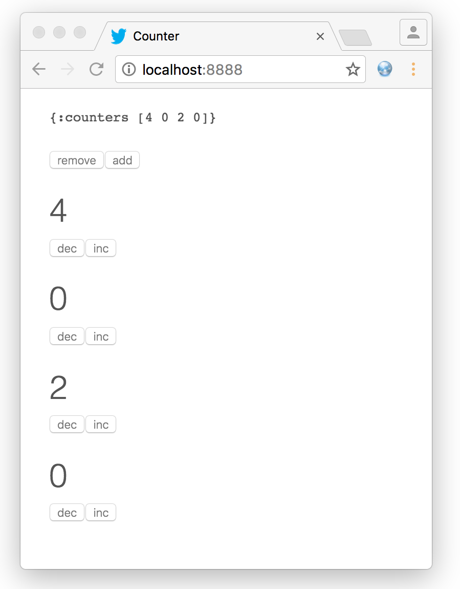
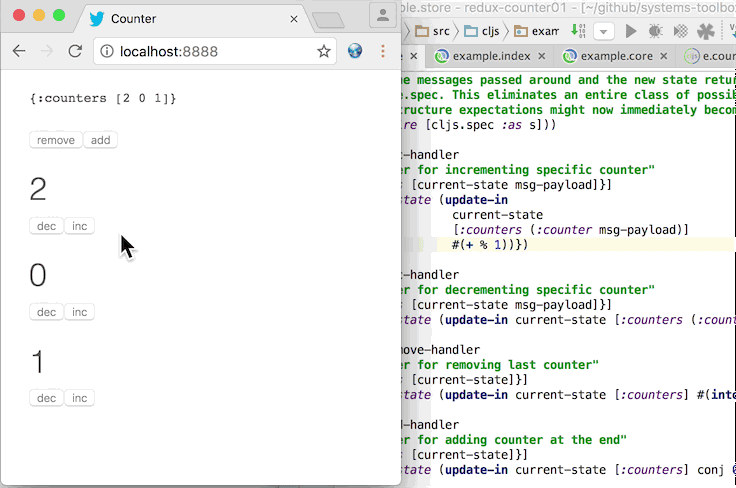

# Example application: Counter

In **Clojure** (and **ClojureScript**), we like to use **[persistent data structures](https://en.wikipedia.org/wiki/Persistent_data_structure)** because they are **[immutable](https://en.wikipedia.org/wiki/Immutable_object)**. Immutable data structures are great, because they make a program easier to reason about, and they make an entire class of potential bugs disappear: with immutable values, there is no possibility for **accidentally mutating** something. If you haven't seen Rich Hickey's talk **"The Value of Values"**, you should watch it now, or read the **[transcript](https://github.com/matthiasn/talk-transcripts/blob/4f17b730a370cf454266c90525ea5ff0d1f38098/Hickey_Rich/ValueOfValues.md)**, and then continue with this chapter.

Okay, now you're familiar with Rich Hickey's thoughts on immutable data. Hopefully, we're now on the same page about their value. Ideally, when building a **UI**, we would want to create functions that take some **immutable** data and return some **HTML**. On the server side, that's exactly how you would have done it for years. With something like **[Hiccup](https://github.com/weavejester/hiccup)**, you can build such functions easily. However, this doesn't easily transfer to the **ClojureScript** world. Server-side rendering means having to reload the page when anything changes and long gone are the days in which that was sufficient. We can no longer expect that users will happily refresh a page and wait, wait, **wait**.

Rather, nowadays, we want to build highly **interactive** web applications that feel like **desktop applications** or **mobile apps**, rather than the typical thing of the early web, where you submit a form and wait for some page to appear, seconds later.

Ideally, we should be able to do the same thing on the client as we do on the server. Pass some data to a function, get some DOM subtree back, and move on. But for a long time there was no decent solution for this problem, which presumably has to do with the **[DOM](https://en.wikipedia.org/wiki/Document_Object_Model)** being this highly mutable construct, which UI frameworks such as **[AngularJS 1.x](https://angularjs.org/)** use directly for attaching data and functionality. I tried to use AngularJS with **ClojureScript** a long time ago, and it just doesn't seem to work properly, in a way I'd call predictable.

Then, along came **[React](https://facebook.github.io/react/)**, which changed everything. It allows us to write pure functions that we can feed immutable data, and that will build an entire DOM subtree out of the data every single time. Then, when a change in the data is detected, the render function is called again, generating the entire output. **React** will then do some diffing between the previous version and the latest version, in a virtual DOM, and deal with the messy DOM mutation to enact the detected changes in the "real" DOM. This approach may sound like a lot of work, but in reality, it's super fast, faster than anything we'd have to worry about in most cases.

Then there are ClojureScript libraries that make React available to us **Clojure(Script)** developers. The one that was available first was **[Om](https://github.com/omcljs/om)**. I prefer writing user interfaces in **Hiccup**, because I find this notation very terse and succinct, and it also makes for something that's particularly easy to test, but more about that another time. Luckily, there's **[Reagent](https://reagent-project.github.io/)**, which provides just that: a way to use **Hiccup** on the client, with React.

With Reagent, you can then start building applications, right from where its tutorials leave you. The promise there is that all you need to do is share a Reagent atom between the different parts of your application. Hmm, sounds simple enough, but every time I tried to build an evolving system around it, I ended up writing something that quickly became hard to maintain. Like, repeatedly. And pull-my-hair-out hard.

It turns out that those problems have nothing to do with Reagent. Rather, they were dealing with the same kinds of problems at **Facebook**, where React originated (via Instagram), so they came up with the **[Flux pattern](https://facebook.github.io/flux/)**.

**Flux** deals with structuring the application in a way that all state mutation happens in a single place, rather than ad-hoc where UI functions have write access to data. The latter is just terribly hard to maintain and difficult to debug, and that's my experience when using Reagent also - which, after all, is only a thin wrapper on top of React.

Flux is an approach, not a library. However, there's **[Redux](https://github.com/reactjs/redux)**. Redux is called a **predictable state container**. What's that? Well, basically a place where your data lives, and also the only place where that data changes. Every other part of the application only has read access. It's very helpful when you want to reason about an application. Without a structured approach to state management, I often find my mental complexity budget stretched beyond the point of breaking. As in, pulling my hair out because of not finding bugs that should not have existed in the first place.

As it turns out, the **[systems-toolbox library](https://github.com/matthiasn/systems-toolbox)** allows for the same kind of approach suggested by Redux. There's a predictable state container, which is interacted with via **immutable messages** only, for example when clicking a button. Then, there are other components that observe the state in that container and get notified when it changes. These can for example then render an updated user interface. I found this to a be a helpful way for structuring applications, and I've written a handful in this pattern so far, probably most notably the latest incarnation of **[BirdWatch](https://github.com/matthiasn/BirdWatch)**.

That application wouldn't make for a gentle introduction so let's instead start with something very simple. In the Redux tutorials, there's an **[example with a counter]()**, where clicks on increment and decrement buttons change app state, which then again is re-rendered by React. Let's do the same thing in ClojureScript, using the **systems-toolbox** and **[systems-toolbox-ui](https://github.com/matthiasn/systems-toolbox-ui)** libraries.



We start with three counters, which each can be incremented or decremented using a button, and we can also add or remove counters. Simple, right? You could certainly do the same with just Reagent and an atom, but in my experience, that doesn't scale when things get more complex than this. Let's instead keep state and UI separate and see what that looks like.

Let me briefly introduce the systems-toolbox model now. There's a **component**. A component is an entity that has a lifecycle. It has some state, and it reacts to messages. It then also has some **observable state**, which other parts of the application can look at, read-only.

In this example, there's the store component, let's just look at the code:

````
(ns example.store
  "In this namespace, the app state is managed. One can only interact with the state by sending
  immutable messages. Each such message is then handled by a handler function. These handler functions
  here are pure functions, they receive message and previous state and return the new state.

  Both the messages passed around and the new state returned by the handlers are validated using
  clojure.spec. This eliminates an entire class of possible bugs, where failing to comply with
  data structure expectations might now immediately become obvious."
  (:require [cljs.spec :as s]))

(defn inc-handler
  "Handler for incrementing specific counter"
  [{:keys [current-state msg-payload]}]
  {:new-state (update-in current-state [:counters (:counter msg-payload)] inc)})

(defn dec-handler
  "Handler for decrementing specific counter"
  [{:keys [current-state msg-payload]}]
  {:new-state (update-in current-state [:counters (:counter msg-payload)] dec)})

(defn remove-handler
  "Handler for removing last counter"
  [{:keys [current-state]}]
  {:new-state (update-in current-state [:counters] #(into [] (butlast %)))})

(defn add-handler
  "Handler for adding counter at the end"
  [{:keys [current-state]}]
  {:new-state (update-in current-state [:counters] conj 0)})

(defn state-fn
  "Returns clean initial component state atom"
  [_put-fn]
  {:state (atom {:counters [2 0 1]})})

;; validate messages using clojure.spec
(s/def :redux-ex1/counter #(and (integer? %) (>= % 0)))
(s/def :cnt/inc (s/keys :req-un [:redux-ex1/counter]))
(s/def :cnt/dec (s/keys :req-un [:redux-ex1/counter]))

;; validate component state using clojure.spec
(s/def :redux-ex1/counters (s/coll-of integer? []))
(s/def :redux-ex1/store-spec (s/keys :req-un [:redux-ex1/counters]))

(defn cmp-map
  [cmp-id]
  {:cmp-id      cmp-id
   :state-fn    state-fn
   :state-spec  :redux-ex1/store-spec
   :handler-map {:cnt/inc    inc-handler
                 :cnt/dec    dec-handler
                 :cnt/remove remove-handler
                 :cnt/add    add-handler}})

````

Above, you can see that there are four handlers, for four different message types: `:cnt/inc`, `:cnt/dec`, `:cnt/add` and `:cnt/remove`.

Then, there's application state. The initial state is returned by the `state-fn`:

`{:counters [2 0 1]}`

Each of these three counters has an initial value, which can be changed by clicking the respective buttons. That's all there is to the app state. Each handler takes the `current-state` argument and returns the `:new-state` in the respective key in the returned **map**.

Then, as a recent addition to the library, there is also **validation** provided by the excellent **[clojure.spec](https://clojure.org/about/spec)**, which for me changes everything in **Clojure** for the better. With it, we can specify precisely how both messages passed around and returned state changes are supposed to look like, and fail otherwise. This validation gives you the best of both worlds. You get the sanity check from a typed world, only better in some regards, and without all the clutter.

Next, let's have an eye on a UI component that makes use of this state to render something, and finally, look at how messages get passed back and forth between those components.

The UI functions are super simple. There are only three functions here, `counter-view`, `counters-view`, and `cmp-map`:

````
(ns example.counter-ui
  (:require [matthiasn.systems-toolbox-ui.reagent :as r]
            [matthiasn.systems-toolbox-ui.helpers :as h]))

(defn counter-view
  "Renders individual counter view, with buttons for increasing or decreasing the value."
  [idx v put-fn]
  [:div
   [:h1 v]
   [:button {:on-click #(put-fn [:cnt/dec {:counter idx}])} "dec"]
   [:button {:on-click #(put-fn [:cnt/inc {:counter idx}])} "inc"]])

(defn counters-view
  "Renders counters view which observes the state held by the state component.
  Contains two buttons for adding or removing counters, plus a counter-view
  for every element in the observed state."
  [{:keys [current-state put-fn]}]
  (let [indexed (map-indexed vector (:counters current-state))]
    [:div.counters
     [h/pp-div current-state]
     [:button {:on-click #(put-fn [:cnt/remove])} "remove"]
     [:button {:on-click #(put-fn [:cnt/add])} "add"]
     (for [[idx v] indexed]
            ^{:key idx} [counter-view idx v put-fn])]))

(defn cmp-map
  [cmp-id]
  (r/cmp-map {:cmp-id  cmp-id
              :view-fn counters-view
              :dom-id  "counter"}))
````

The `cmp-map` function returns a configuration map that systems-toolbox needs to start a component of this kind. In this case, that's a component that renders a small piece of UI into the element with the specified element ID in the DOM. There, it specifies that the counters-view function should be called to turn data into a piece of user interface.

This `counters-view` then gets passed the `current-state` and turns that into a tree structure of DOM elements, with add and remove buttons once, and then a `counter-view` for each indexed element in the counters in the `current-state`. Then, note that there's the `put-fn`, which we can call when the component is supposed to send something, so in this case when the respective button is clicked. Note that the index is used to identify which of the (initially three) counters to increment or decrement.

That's all there is to the UI component. Now let's look at how those components are wired together, in the `core` namespace. There's the `switchboard`, which you can think of like this:


Someone connects a wire, and you can start talking. Only that here, the wires are **uni-directional**. Under the hood, there are **[core.async](https://github.com/clojure/core.async)** channels connected to each other, but you don't need to worry about that for now.

Let's have a look at the code:

````
(ns example.core
  (:require [example.store :as store]
            [example.counter-ui :as cnt]
            [matthiasn.systems-toolbox.switchboard :as sb]))

(enable-console-print!)

(defonce switchboard (sb/component :client/switchboard))

(defn init
  []
  (sb/send-mult-cmd
    switchboard
    [[:cmd/init-comp (cnt/cmp-map :client/cnt-cmp)]
     [:cmd/init-comp (store/cmp-map :client/store-cmp)]
     [:cmd/route {:from :client/cnt-cmp :to :client/store-cmp}]
     [:cmd/observe-state {:from :client/store-cmp :to :client/cnt-cmp}]]))

(init)
````

First, the **switchboard** is created. Then, we send a message to the switchboard, with a vector containing multiple commands. We start with initializing the `:client/cnt-cmp` and `:client/store-cmp` components, which are responsible for UI and state management, respectively. The order here is not relevant, as these components don't need to know about each other anyway.

Then, we **route** messages from the UI component to the store component by using `:cmd/route`. Routing means that a connection is made for all messages for which there is a handler, so here `:cnt/inc`, `:cnt/dec`, `:cnt/add` and `:cnt/remove`, as we've seen in the `:handler-map` earlier.  With this, whenever we use the `put-fn` inside the UI and send a message of any of these types, the store will receive it.

So far so good. Next, we need the UI to observe the state of the store component, which happens when sending the `:cmd/observe-state` message. Whenever the state of the`:client/store-cmp` changes, the UI will now have a copy of the change in it's `local` atom.

That's all there is to it. Now, this example has been quite simple. However, you can build much more complex applications in the same style. Very recently, this approach has become much more viable thanks to **[clojure.spec](https://clojure.org/about/spec)**, which is a great addition to my development toolbox. You should use it in your projects, too. If you have not heard the latest **[Cognicast](http://blog.cognitect.com/cognicast/)** where Rich Hickey talks about it, you should do that right now.

Note that not only does **clojure.spec** allow us to validate our app-specific data structures - it is also used dynamically in the switchboard when wiring components, so that validation takes application state into account. This dynamic validation is powerful, and would be difficult to achieve with a type system. Whenever there's another `cmp-id` that the switchboard has initialized, the set of possible values is updated, so that once it comes to `route` and `observe-state`, only valid component ids can be used. Try changing a component ID and you'll see an error message that is surprisingly not terrible for Clojure. Yeah, I don't like typical error messages in Clojure, and anything that makes the situation better is much appreciated.

Oh, I should also note **[Figwheel](https://github.com/bhauman/lein-figwheel)**. Applications built with the **systems-toolbox** are compatible with figwheel, with a page reload on every code change, while preserving application state. The reload mechanism is very useful during development, especially when you have some login. It's tedious without, where you have to recreate the app state after reloading the page so that you can judge the little change you made. Not so here, you make the change, and the page reloads automatically, while retaining the application state.



Also, this is incredibly useful when doing **CSS** changes. Usually, you'd probably do tiny changes in the developer tools until you have achieved the desired effect. But with Figwheel, the page will also reload while retaining app state, typically without any jumpiness.

Have a look and try it out for yourself. For that, I'd like you to clone the repository and run the application as follows:

`lein run`

And in an additional terminal:

`lein figwheel`

And now go to the store and change what happens when clicking the `inc` button. Where before, the value would be incremented by one, we could now have it increment by 11, like this:

````
(defn inc-handler
  "Handler for incrementing specific counter"
  [{:keys [current-state msg-payload]}]
  {:new-state (update-in current-state [:counters (:counter msg-payload)] #(+ % 11))})
````

After saving `store.cljs`, you'll briefly notice the figwheel logo overlayed on top of the page, and next, you click the button and increment the previous counter value, only that now you'll add 11 or whatever else you chose as the number there in your changed `inc-handler` function.

You can probably imagine how useful that can be when you build anything more complex. And over the next couple of chapters, I will show you different examples of more complex applications using the same pattern, only then composing more complex behavior out of the same predictable handler functions. By the way, these handler functions are easily testable because they are pure, acting on immutable data and returning new values, rather than mutating some existing state. We'll get to that in a later chapter.

Now check out the example application, play around with it, and let me know what you think. The **[systems-toolbox](https://github.com/matthiasn/systems-toolbox)** has helped me build these applications so far:

* **[BirdWatch](https://github.com/matthiasn/BirdWatch)**
* **[iWasWhere](https://github.com/matthiasn/iWasWhere)**
* a client project
* **[trailing mousepointer example](https://github.com/matthiasn/systems-toolbox/tree/master/examples/trailing-mouse-pointer)**
* **[redux counter example]()**

It may help you build your application, too.

**P.S.** I needed some integration test for the **[systems-toolbox-ui](https://github.com/matthiasn/systems-toolbox-ui)** library, something running in an actual browser. So I wrote some tests running the example discussed above, clicking the buttons, and then asserting that they change as expected. You can run those tests and see for yourself, the instructions are **[here](https://github.com/matthiasn/systems-toolbox-ui)**.