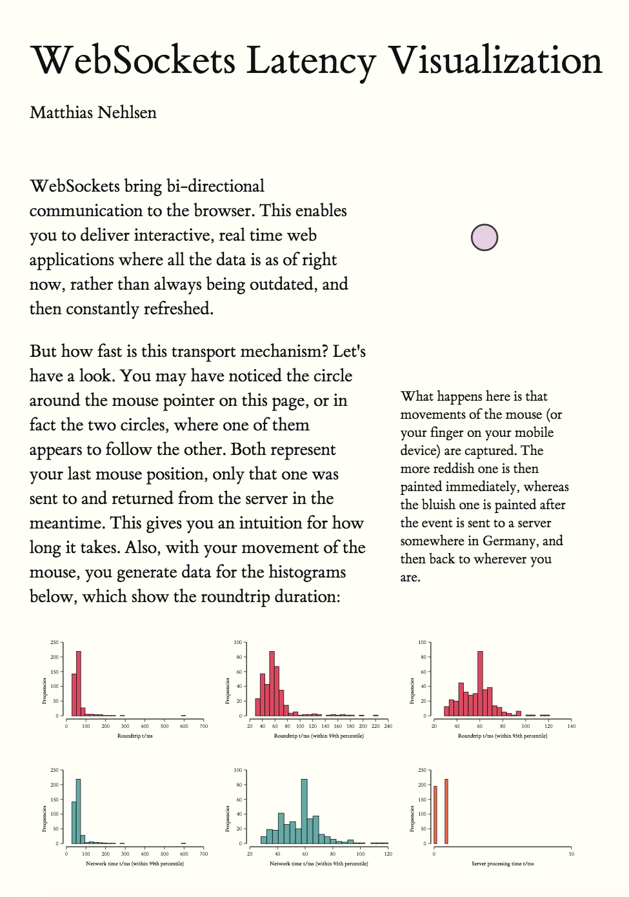
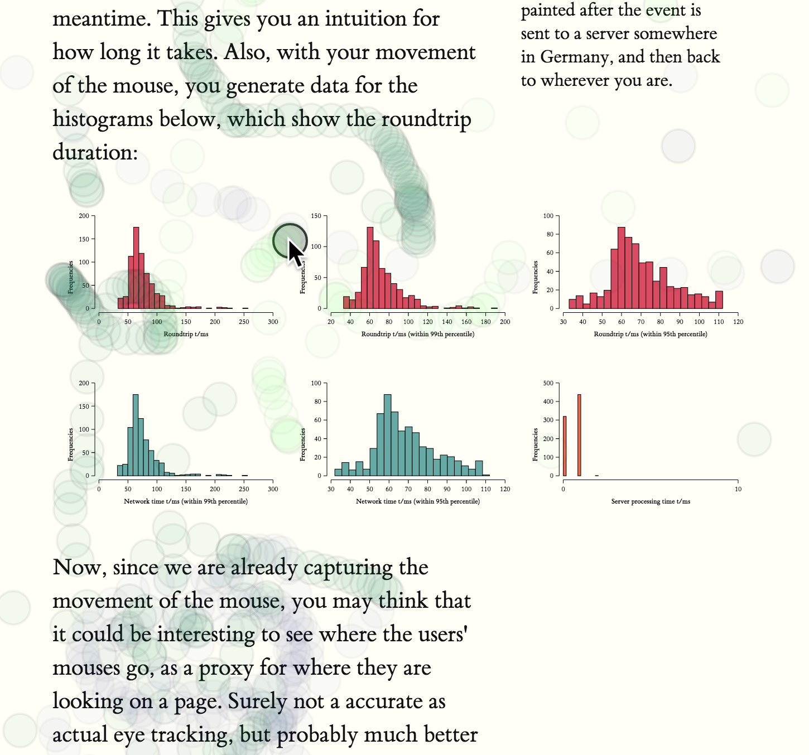

# WebSocket Latency Visualization Example

Communication between backend and web applications via **[WebSockets](https://developer.mozilla.org/en-US/docs/Web/API/WebSockets_API)** is an integral part of delivering a rich user experience. With that addition, it is much easier to push new information to the user at any given time, without having to resort to constant polling. 

But how fast IS that communication? Let's find out. The next sample application for the **[systems-toolbox](https://github.com/matthiasn/systems-toolbox)** deals with just that, visualizing the latency for messages sent from client to server and back.

Check out the live demo **[here](http://systems-toolbox.matthiasnehlsen.com/)**, it'll give you some additional information about the application. There was a previous version of this example, but with **[clojure.spec](https://clojure.org/about/spec)** out, it was a good time to revisit this application and have it fully validated.

By the way, **[clojure.spec](https://clojure.org/about/spec)** came at a **crucial time** for me. This kind of validation was really missing in the systems-toolbox, and that made me question the whole approach after fighting with annoying bugs in my latest application, **[iWasWhere](https://github.com/matthiasn/iWasWhere)** (which I'll introduce in a subsequent chapter). But now with clojure.spec, the entire class of those annoying bugs is gone for good. In a matter of a little over a week, I upgraded all my applications plus the systems-toolbox libraries to use clojure.spec and I'm now more convinced about the approach than ever. You really **can** build applications this way, and **stay sane** at the same time.

We'll look into validation in this chapter, too. But let's get started with the application itself. Here, we have a couple of different components:

On the client:

* there's a component that shows the position of the mouse, both locally and for the message coming back from the server
* there's the store, which holds the client-side state
* there's a UI component for visualizing the round trip times as histograms
* there's a UI component that shows some information about the app
* in addition, there are components for visualizing message flow, and for showing some JVM stats

On the server:

* there's the store, which keeps a counter of all messages passed through since application startup, and returns the message with the mouse position to the client where it originated, plus, upon request, a history of mouse positions from all connected clients
* then, there's also a component for gathering some stats about the JVM, which are broadcast to all connected clients

On both sides, there are **[Sente](https://github.com/ptaoussanis/sente)** components for establishing **bi-directional communication** between client and server. These ready-to-use components are provided by the **[systems-toolbox-sente](https://github.com/matthiasn/systems-toolbox-sente)** library, and you can use them in your projects, too, with a simple import and no more than a handful of lines of code.

The store component on the client, which holds the client-side state, is then observed by the histogram, the mouse moves and the info components; these three render something based on what's in the state that they observe.

The communication between these components is comparable to what was introduced in the previous chapter. What's new here is the `sente-cmp`. Let's have a brief look what **[WebSockets](https://developer.mozilla.org/en-US/docs/Web/API/WebSockets_API)** are. They give us a way for establising a very low latency **bi-directional** connection between client and server. It's not HTTP but instead its own protocol. WebSockets are well supported from IE 10 on, and in all other recent browsers. Some critics say that they may be problematic because firewalls and reverse proxies might have to be reconfigured. Well, that might indeed problematic if (and only if) your OPS people are incompetent. But most likely they are not, so it's only a matter of communication (and some upfront planning) to get this potential hurdle out of the way.

Other than that potential issue with your firewall, there appears to be no downside to using **WebSockets**, and plenty of upsides. You absolutely need to be able to send messages from server to client at any time if you want to build a modern, responsive UI. Sure, you could also use **[Server-sent Events (SSE)](https://en.wikipedia.org/wiki/Server-sent_events)** for the server -> client direction, and send messages from client to server the way you'd normally do: via REST calls, for each message. That may work; it may also be too expensive if you want to send messages often. For the use case in this very example, with the mouse positions, the user experience would likely be quite poor.

WebSockets are also nice because you get an ordering guarantee, which would be much harder with REST calls. Another aspect not to underestimate is that with REST calls, you need to think about authentication on every single request, where you do it once for a WebSockets connection.

Anyway, let's look at some code, starting with where the messages originate in our example, the `ui-mouse-moves` component and its respective **[namespace](https://github.com/matthiasn/systems-toolbox/blob/master/examples/trailing-mouse-pointer/src/cljs/example/ui_mouse_moves.cljs)**:

~~~
(ns example.ui-mouse-moves
  (:require [matthiasn.systems-toolbox-ui.reagent :as r]
            [matthiasn.systems-toolbox-ui.helpers :refer [by-id]]))

;; some SVG defaults
(def circle-defaults {:fill "rgba(255,0,0,0.1)
" :stroke "rgba(0,0,0,0.5)"
                      :stroke-width 2 :r 15})
(def text-default {:stroke "none" :fill "black" :style {:font-size 12}})
(def text-bold (merge text-default {:style {:font-weight :bold :font-size 12}}))

(defn mouse-hist-view
  "Render SVG group with filled circles from a vector of mouse positions in state."
  [state state-key stroke fill]
  (let [positions (map-indexed vector (state-key state))]
    (when (seq positions)
      [:g {:opacity 0.5}
       (for [[idx pos] positions]
         ^{:key (str "circle" state-key idx)}
         [:circle {:stroke       stroke
                   :stroke-width 2
                   :r            15
                   :cx           (:x pos)
                   :cy           (:y pos)
                   :fill         fill}])])))

(defn trailing-circles
  "Displays two transparent circles. The position of the circles comes from the most recent
  messages, one sent locally and the other with a roundtrip to the server in between.  This
  makes it easier to visually detect any delays."
  [state]
  (let [local-pos (:local state)
        from-server (:from-server state)]
    [:g
     [:circle (merge circle-defaults {:cx (:x local-pos)
                                      :cy (:y local-pos)})]
     [:circle (merge circle-defaults {:cx (:x from-server)
                                      :cy (:y from-server)
                                      :fill "rgba(0,0,255,0.1)"})]]))

(defn mouse-view
  "Renders SVG with both local mouse position and the last one returned from the server,
  in an area that covers the entire visible page."
  [{:keys [observed local]}]
  (let [state-snapshot @observed
        mouse-div (by-id "mouse")
        update-dim #(do (swap! local assoc :width (- (.-offsetWidth mouse-div) 2))
                        (swap! local assoc :height (aget js/document "body" "scrollHeight")))]
    (update-dim)
    (aset js/window "onresize" update-dim)
    [:div
     [:svg {:width  (:width @local)
            :height (:height @local)}
      (trailing-circles state-snapshot)
      (when (-> state-snapshot :show-all :local)
        [mouse-hist-view state-snapshot :local-hist "rgba(0,0,0,0.06)" "rgba(0,255,0,0.05)"])
      (when (-> state-snapshot :show-all :server)
        [mouse-hist-view state-snapshot :server-hist "rgba(0,0,0,0.06)" "rgba(0,0,128,0.05)"])]]))

(defn init-fn
  "Listen to onmousemove events for entire page, emit message when fired.
  These events are then sent to the server for measuring the round-trip time,
  and also recorded in the local application state for showing the local mouse
  position."
  [{:keys [put-fn]}]
  (aset js/window "onmousemove"
        #(put-fn [:mouse/pos {:x (.-pageX %) :y (.-pageY %)}]))
  (aset js/window "ontouchmove"
        (fn [ev]
          (let [t (aget (.-targetTouches ev) 0)]
            (put-fn [:mouse/pos {:x (.-pageX t) :y (.-pageY t)}])
            #_(.preventDefault ev)))))

(defn cmp-map
  "Configuration map for systems-toolbox-ui component."
  [cmp-id]
  (r/cmp-map {:cmp-id  cmp-id
              :view-fn mouse-view
              :dom-id  "mouse"
              :init-fn init-fn
              :cfg     {:msgs-on-firehose true}}))
~~~

Here, we have a UI component that covers the entire page. This is facilitated by the following **CSS**:

~~~
#mouse {
    position: absolute;
    top: 0;
    width: 100%;
    pointer-events: none;
    z-index: 10;
    margin-left: -12.5%;
}
~~~

Note that we want this transparent element on top, covering the rest of the page, which is what the `z-index` does. Also, we want `pointer-events` to reach the elements below, for example for clicking links or buttons, so we them to `none`.

Then, in the `init-fn`, we set `ontouchmove` and `ontouchmove` event handlers, which get called when these events are fired anywhere on the page. We could also more specifically handle these events in the component's div, but then the `pointer-events` would not be available for elements below the `mouse-view` element, such as for clicking a button. Then, whenever an event is fired, a messaged is sent with the mouse position. This message will be received by the client side store directly, and also via the server side, where it'll be enriched with some additional data.

Then, the rendering of the **[SVG](https://www.w3.org/Graphics/SVG/)** covering the entire page is done in the `mouse-view` function, which adapts the size of the element when `onresize` element fires. Here, the `trailing-circles` function is called, which renders the two circles. This is trivial to achieve with Reagent. You can see that we just create a group with two circles, each with a distinct position based on the last known message. Fast movements will then reveal latency, as you'll see how the messages coming back from the server lag behind. Then, there are two calls to the `mouse-hist-view` function, which renders either a local history or the last moves of all clients, as you'll hopefully have seen when playing around with the live demo of the application. If not, here's what that looks like:

In the screenshot above, you can see green circles for the mouse moves captured locally, and charcoal ones for those from all clients.

Let's go through the **[namespace](https://github.com/matthiasn/systems-toolbox/blob/master/examples/trailing-mouse-pointer/src/cljs/example/ui_mouse_moves.cljs)**, function by function, starting from the bottom:

~~~
(defn cmp-map
  "Configuration map for systems-toolbox-ui component."
  [cmp-id]
  (r/cmp-map {:cmp-id  cmp-id
              :view-fn mouse-view
              :dom-id  "mouse"
              :init-fn init-fn
              :cfg     {:msgs-on-firehose true}}))      
~~~

The `cmp-map` function creates the component map, which is like a blueprint that tells the switchboard how to fire up the component. The **UI** part is done by calling `r/cmp-map`, which is the main function in the **systems-toolbox-ui** library. Once the returned map is sent to the switchboard, a component will be initialized that renders the `mouse-view` function into the **DOM element** with the `"mouse"` ID.

Then, there's the `init-fn`:

~~~
(defn init-fn
  "Listen to onmousemove events for entire page, emit message when fired.
  These events are then sent to the server for measuring the round-trip time,
  and also recorded in the local application state for showing the local mouse
  position."
  [{:keys [put-fn]}]
  (aset js/window "onmousemove"
        #(put-fn [:mouse/pos {:x (.-pageX %) :y (.-pageY %)}]))
  (aset js/window "ontouchmove"
        (fn [ev]
          (let [t (aget (.-targetTouches ev) 0)]
            (put-fn [:mouse/pos {:x (.-pageX t) :y (.-pageY t)}])
            #_(.preventDefault ev)))))
~~~

This function takes care of registering handler functions for all mouse movements (and also touch movement, for that matter) for the entire window. By doing that here on the window, we can get away with the `mouse-view` element not getting any mouse movement events, which is required for still reacting to clicks in elements that are in fact covered by it, since it spans the entire page. When such an event is encountered, a `:mouse/pos` message is sent, which then happens to be received by both the `:client/store-cmp` and the `:server/pos-cmp`. Not that this component needs to be concerned with that in any way though - there's proper decoupling between them.

You can see how those messages are supposed to look like in the respective **specs**:

~~~
(s/def :ex/x pos-int?)
(s/def :ex/y pos-int?)

(s/def :mouse/pos
  (s/keys :req-un [:ex/x :ex/y]))
~~~

If you still haven't heard Rich Hickey talk about **[clojure.spec](http://clojure.org/about/spec)**, you really need to do that now. **clojure.spec** has many useful properties. Among them is that you'll know immediately if you've broken your application with some recent change, as the system would throw an error immediately, rather than drag that problem along and blow up in your face somewhere else, where you'll have a hard time figuring out where it originated. What's also very useful is that when you come back to some code you wrote some time ago and want to know what a message is supposed to look like, you don't have to print it out and infer what the rules may be. No, instead you just look at the piece of code that's run when validating the message, it'll tell you all nitty-gritty details of what the expectations are. Much nicer.

Next, let's have a look at the `mouse-view` function, which is responsible for rendering the UI component:

~~~
(defn mouse-view
  "Renders SVG with both local mouse position and the last one returned from the server,
  in an area that covers the entire visible page."
  [{:keys [observed local]}]
  (let [state-snapshot @observed
        mouse-div (by-id "mouse")
        update-dim #(do (swap! local assoc :width (- (.-offsetWidth mouse-div) 2))
                        (swap! local assoc :height (aget js/document "body" "scrollHeight")))]
    (update-dim)
    (aset js/window "onresize" update-dim)
    [:div
     [:svg {:width  (:width @local)
            :height (:height @local)}
      (trailing-circles state-snapshot)
      (when (-> state-snapshot :show-all :local)
        [mouse-hist-view state-snapshot :local-hist "rgba(0,0,0,0.06)" "rgba(0,255,0,0.05)"])
      (when (-> state-snapshot :show-all :server)
        [mouse-hist-view state-snapshot :server-hist "rgba(0,0,0,0.06)" "rgba(0,0,128,0.05)"])]]))
~~~

Note that this component gets passed a map with the `observed` and `local` keys. The `observed` key is an atom which holds the state of the component it observes. Here, this is always the latest snapshot of the `store-cmp`. The `local` atom contains some local state, such as the width of the SVG for resizing. Note that we're detecting the width on every call to the function, and also in the `onresize` callback of `js/window`. This ensures that the square mouse div fills the parent element, while working with the correct pixel coordinate system. One could instead also work with a viewBox, like this: `{:width "100%" :viewBox "0 0 1000 1000"}`. However, that would not work correctly in this case as the mouse position would not be aligned with the circles here.

Next, we have the `trailing-circles` function:

~~~
(defn trailing-circles
  "Displays two transparent circles. The position of the circles comes from the most recent
  messages, one sent locally and the other with a roundtrip to the server in between.  This
  makes it easier to visually detect any delays."
  [state]
  (let [local-pos (:local state)
        from-server (:from-server state)]
    [:g
     [:circle (merge circle-defaults {:cx (:x local-pos)
                                      :cy (:y local-pos)})]
     [:circle (merge circle-defaults {:cx (:x from-server)
                                      :cy (:y from-server)
                                      :fill "rgba(0,0,255,0.1)"})]]))
~~~

This one renders an SVG group with the two circles inside. Then, there are some defaults for the different elements, which can be merged with more specific maps as desired:

~~~
(def circle-defaults {:fill "rgba(255,0,0,0.1)" :stroke "black" :stroke-width 2 :r 15})
(def text-default {:stroke "none" :fill "black" :style {:font-size 12}})
(def text-bold (merge text-default {:style {:font-weight :bold :font-size 12}}))
~~~

Finally, there's the `mouse-hist-view` function:

~~~
(defn mouse-hist-view
  "Render SVG group with filled circles from a vector of mouse positions in state."
  [state state-key stroke fill]
  (let [positions (map-indexed vector (state-key state))]
    (when (seq positions)
      [:g {:opacity 0.5}
       (for [[idx pos] positions]
         ^{:key (str "circle" state-key idx)}
         [:circle {:stroke       stroke
                   :stroke-width 2
                   :r            15
                   :cx           (:x pos)
                   :cy           (:y pos)
                   :fill         fill}])])))
~~~

Here, the history of mouse movements is rendered, either for your local mouse movements, or the last 1000 from all users. You've seen how that looks like in the screenshot above.

That's it for the rendering of the mouse element. Next, let's discuss the server side, before looking into the wiring of the components. It's really short, this is the entire **[example.pointer](https://github.com/matthiasn/systems-toolbox/blob/master/examples/trailing-mouse-pointer/src/cljc/example/pointer.cljc)** namespace:

~~~
(ns example.pointer
  "This component receives messages, keeps a counter, decorates them with the state of the
  counter, and sends them back. Here, this provides a way to measure roundtrip time from the UI,
  as timestamps are recorded as the message flows through the system.
  Also records a recent history of mouse positions for all clients, which the component provides
  to clients upon request.")

(defn process-mouse-pos
  "Handler function for received mouse positions, increments counter and returns mouse position
  to sender."
  [{:keys [current-state msg-meta msg-payload]}]
  (let [new-state (-> current-state
                      (update-in [:count] inc)
                      (update-in [:mouse-moves] #(vec (take-last 1000 (conj % msg-payload)))))]
    {:new-state new-state
     :emit-msg (with-meta [:mouse/pos (assoc msg-payload :count (:count new-state))] msg-meta)}))

(defn get-mouse-hist
  "Gets the recent mouse position history from server."
  [{:keys [current-state msg-meta]}]
  {:emit-msg (with-meta [:mouse/hist (:mouse-moves current-state)] msg-meta)})

(defn cmp-map
  [cmp-id]
  {:cmp-id      cmp-id
   :state-fn    (fn [_] {:state (atom {:count 0 :mouse-moves []})})
   :handler-map {:mouse/pos      process-mouse-pos
                 :mouse/get-hist get-mouse-hist}})
~~~

At the bottom, you see the `cmp-map`, which again is the map specifiying the component that the switchboard will then instantiate. Inside, there's the `:state-fn`, which does nothing but create the initial state inside an atom. Then, there's the `:handler-map`, which here handles the two message types `:cmd/mouse-pos` and `:mouse/get-hist`.

The `process-mouse-pos` handler function then gets the `current-state`, the `msg-payload`, and the `msg-meta` inside the map it gets passed as a single argument, and returns both the `:new-state` and a message to emit, which is the same message it received, only now enriched by the `:count` from this component's state. Note that we are reusing the `msg-meta` from the original message, as this metadata also contains the `:sente-id` of the originating client, which is required to route the message back to the correct client. There's more information on the metadata, we'll get to that later.

Next, the messages need to get from the UI component to the server, and back to the client. Here's how that looks like:

[message flow drawing]

For establishing these connections, let's have a look at the `core` namespaces on both server and client, starting with the **[client](https://github.com/matthiasn/systems-toolbox/blob/master/examples/trailing-mouse-pointer/src/cljs/example/core.cljs)**:

~~~
(ns example.core
  (:require [example.spec]
            [example.store :as store]
            [example.ui-histograms :as hist]
            [example.ui-mouse-moves :as mouse]
            [example.ui-info :as info]
            [example.conf :as conf]
            [matthiasn.systems-toolbox-ui.charts.observer :as obs]
            [matthiasn.systems-toolbox.switchboard :as sb]
            [matthiasn.systems-toolbox-sente.client :as sente]
            [matthiasn.systems-toolbox-metrics.jvmstats :as jvmstats]))

(enable-console-print!)

(defonce switchboard (sb/component :client/switchboard))

(defn init! []
  (sb/send-mult-cmd
    switchboard
    [;; First, instantiate components
     [:cmd/init-comp
      #{(sente/cmp-map :client/ws-cmp {:relay-types #{:mouse/pos :mouse/get-hist} :msgs-on-firehose true})
        (mouse/cmp-map :client/mouse-cmp)
        (info/cmp-map  :client/info-cmp)
        (store/cmp-map :client/store-cmp)
        (hist/cmp-map  :client/histogram-cmp)
        (jvmstats/cmp-map :client/jvmstats-cmp {:dom-id "jvm-stats-frame" :msgs-on-firehose true})
        (obs/cmp-map   :client/observer-cmp conf/observer-cfg-map)}]

     ;; Then, messages of a given type are wired from one component to another
     [:cmd/route {:from :client/mouse-cmp
                  :to #{:client/store-cmp :client/ws-cmp}}]
     [:cmd/route {:from :client/ws-cmp
                  :to #{:client/store-cmp :client/jvmstats-cmp}}]
     [:cmd/route {:from :client/info-cmp
                  :to #{:client/store-cmp :client/ws-cmp}}]
     [:cmd/observe-state {:from :client/store-cmp
                          :to #{:client/mouse-cmp :client/histogram-cmp :client/info-cmp}}]

     ;; Finally, wire firehose with all messages into the observer component
     [:cmd/attach-to-firehose :client/observer-cmp]]))

(init!)
~~~

First, as usual, we create a `switchboard`. Then, we send messages to the switchboard, with the blueprints for the components we need initialized. For the core functionality discussed so far, only four of them are important: `:client/ws-cmp`, `:client/mouse-cmp`, `:client/info-cmp`, and `:client/store-cmp`.

