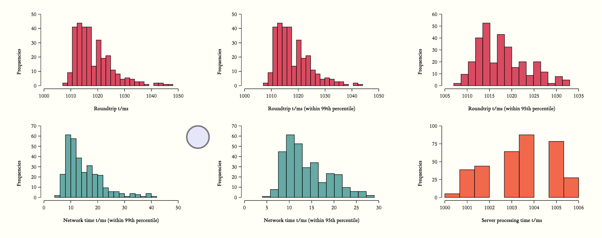

## matthiasn.systems-toolbox-ui.charts.histogram

The most interesting stuff for rendering the histograms happens in the **[matthiasn.systems-toolbox-ui.charts.histogram](https://github.com/matthiasn/systems-toolbox-ui/blob/master/src/cljs/matthiasn/systems_toolbox_ui/charts/histogram.cljs)** namespace. Feel free to skip it if you don't particularly care about constructing **[Scalable Vector Graphics](https://en.wikipedia.org/wiki/Scalable_Vector_Graphics)**. Also, this is not an introduction to SVG, as that's not the focus of this book, so I will only describe the construction of SVGs with **Reagent**, not what an **SVG** is. If you've never worked with Scalable Vector Graphics,
maybe this **[tutorial](https://developer.mozilla.org/en-US/docs/Web/SVG/Tutorial/Introduction)** will give you a gentler introduction. 

Okay, with that being said, let's dive into the code:

~~~
(ns matthiasn.systems-toolbox-ui.charts.histogram
  "Functions for building a histogram, rendered as SVG using Reagent and React."
  (:require [matthiasn.systems-toolbox-ui.charts.math :as m]))

(def text-default {:stroke "none" :fill "black" :style {:font-size 12}})
(def text-bold (merge text-default {:style {:font-weight :bold :font-size 12}}))
(def x-axis-label (merge text-default {:text-anchor :middle}))
(def y-axis-label (merge text-default {:text-anchor :end}))

(defn path
  "Renders path with the given path description attribute."
  [d]
  [:path {:fill         :black
          :stroke       :black
          :stroke-width 1
          :d            d}])

(defn histogram-y-axis
  "Draws y-axis for histogram."
  [x y h mx y-label]
  (let [incr (m/default-increment-fn mx)
        rng (range 0 (inc (m/round-up mx incr)) incr)
        scale (/ h (dec (count rng)))]
    [:g
     [path (str "M" x " " y "l 0 " (* h -1) " z")]
     (for [n rng]
       ^{:key (str "yt" n)}
       [path (str "M" x " " (- y (* (/ n incr) scale)) "l -" 6 " 0")])
     (for [n rng]
       ^{:key (str "yl" n)}
       [:text (merge y-axis-label {:x (- x 10)
                                   :y (- y (* (/ n incr) scale) -4)}) n])
     [:text (let [x-coord (- x 45)
                  y-coord (- y (/ h 3))
                  rotate (str "rotate(270 " x-coord " " y-coord ")")]
              (merge x-axis-label text-bold {:x         x-coord
                                             :y         y-coord
                                             :transform rotate})) y-label]]))

(defn histogram-x-axis
  "Draws x-axis for histogram."
  [x y mn mx w scale increment x-label]
  (let [rng (range mn (inc mx) increment)]
    [:g
     [path (str "M" x " " y "l" w " 0 z")]
     (for [n rng]
       ^{:key (str "xt" n)}
       [path (str "M" (+ x (* (- n mn) scale)) " " y "l 0 " 6)])
     (for [n rng]
       ^{:key (str "xl" n)}
       [:text (merge x-axis-label {:x (+ x (* (- n mn) scale))
                                   :y (+ y 20)}) n])
     [:text (merge x-axis-label text-bold {:x (+ x (/ w 2))
                                           :y (+ y 48)}) x-label]]))

(defn insufficient-data
  "Renders warning when data insufficient."
  [x y w text]
  [:text {:x           (+ x (/ w 2))
          :y           (- y 50)
          :stroke      "none"
          :fill        "#DDD"
          :text-anchor :middle
          :style       {:font-weight :bold :font-size 24}} text])

(defn histogram-view-fn
  "Renders a histogram. Only takes care of the presentational aspects, the calculations are
   done in the histogram-calc function in matthiasn.systems-toolbox-ui.charts.math."
  [{:keys [x y w h x-label y-label color min-bins warning] :as args}]
  (let [{:keys [mn mn2 mx2 rng increment bins binned-freq binned-freq-mx]} (m/histogram-calc args)
        x-scale (/ w (- mx2 mn2))
        y-scale (/ (- h 20) binned-freq-mx)
        bar-width (/ (* rng x-scale) bins)]
    [:g
     (if (>= bins min-bins)
       (for [[v f] binned-freq]
         ^{:key (str "bf" x "-" y "-" v "-" f)}
         [:rect {:x      (+ x (* (- mn mn2) x-scale) (* v bar-width))
                 :y      (- y (* f y-scale))
                 :fill   color :stroke "black"
                 :width  bar-width
                 :height (* f y-scale)}])
       [insufficient-data x y w warning])
     [histogram-x-axis x (+ y 7) mn2 mx2 w x-scale increment x-label]
     [histogram-y-axis (- x 7) y h (or binned-freq-mx 5) y-label]]))

(defn histogram-view
  "Renders an individual histogram for the given data, dimension, label and color, with a
   reasonable size inside a viewBox, which will then scale smoothly into any div you put it in."
  [data label color]
  [:svg {:width   "100%"
         :viewBox "0 0 400 250"}
   (histogram-view-fn {:data     data
                       :x        80
                       :y        180
                       :w        300
                       :h        160
                       :x-label  label
                       :y-label  "Frequencies"
                       :warning  "insufficient data"
                       :color    color
                       :bin-cf   0.8
                       :min-bins 5
                       :max-bins 25})])
~~~

Okay, that was a bit involved. But hey, to use a histogram in your project, all you need is to import this namespace, and then use a one-liner to plot your histogram (and more chart types to come - feel free to contribute).

After skim reading the namespace, are you still interested in constructing charts? Good, then let's go through function by function:

~~~
(defn histogram-view
  "Renders an individual histogram for the given data, dimension, label and color, with a
   reasonable size inside a viewBox, which will then scale smoothly into any div you put it in."
  [data label color]
  [:svg {:width   "100%"
         :viewBox "0 0 400 250"}
   (histogram-view-fn {:data     data
                       :x        80
                       :y        180
                       :w        300
                       :h        160
                       :x-label  label
                       :y-label  "Frequencies"
                       :warning  "insufficient data"
                       :color    color
                       :bin-cf   0.8
                       :min-bins 5
                       :max-bins 25})])
~~~

The `histogram-view` function simply creates a container `:svg` element, which scales into its parent element through the `:width "100%"` setting. Also note the `:viewBox "0 0 400 250"`, which allows us to work with a useful coordinate system that's independent of the size of the rendered element. Finally, we pass some data to the `histogram-view-fn`, which we'll look into next.

~~~
(defn histogram-view-fn
  "Renders a histogram. Only takes care of the presentational aspects, the calculations are
   done in the histogram-calc function in matthiasn.systems-toolbox-ui.charts.math."
  [{:keys [x y w h x-label y-label color min-bins warning] :as args}]
  (let [{:keys [mn mn2 mx2 rng increment bins binned-freq binned-freq-mx]} (m/histogram-calc args)
        x-scale (/ w (- mx2 mn2))
        y-scale (/ (- h 20) binned-freq-mx)
        bar-width (/ (* rng x-scale) bins)]
    [:g
     (if (>= bins min-bins)
       (for [[v f] binned-freq]
         ^{:key (str "bf" x "-" y "-" v "-" f)}
         [:rect {:x      (+ x (* (- mn mn2) x-scale) (* v bar-width))
                 :y      (- y (* f y-scale))
                 :fill   color :stroke "black"
                 :width  bar-width
                 :height (* f y-scale)}])
       [insufficient-data x y w warning])
     [histogram-x-axis x (+ y 7) mn2 mx2 w x-scale increment x-label]
     [histogram-y-axis (- x 7) y h (or binned-freq-mx 5) y-label]]))
~~~

Above, we render an **[SVG g element](https://developer.mozilla.org/en/docs/Web/SVG/Element/g)**, which contains the histogram. Before we can render the bars of the histogram, we need to calculate a few things from the provided data, which happens in the first line in the `let` binding:

`{:keys [mn mn2 mx2 rng increment bins binned-freq binned-freq-mx]} (m/histogram-calc args)`

We will look into the calculations in the next section. For the dicussion here, we only need to know what each one does. `mn` is the minimum value in the data. `m2` is the minimum rounded down to the next increment, as it's not always useful to start the x-axis from zero. Let me show you an example:

Here, all our values are between 1000 and 1050 milliseconds. The histogram would be fairly useless if the x-axis started at zero because the bars would be so thin that we probably couldn't even see them, let alone tell apart.

I> We will look at creating the delay of 1000ms for each message in a subsequent chapter when discussing the **systems-toolbox** messaging model.

Next, we have `rng`, which is the distance between the minimum and the maximum value. Then, there's the `increment`. This is the distance between the ticks on the x-axis, such as `10`, `25`, or also `500`, depending on the range of the provided `data`. `bins` is the number of bins in the histogram, each of which will be represented as a bar. `binned-freq` is contains the frequencies per bin. Finally, `binned-freq-mx` is the maximum frequency in any of the bins, which is used to determine the scale on the y-axis.

With those values, we can calculate the `x-scale` and `y-scale`, which will be used to translate positions into the given coordinate system. Finally, we can determine the width of each bar, by dividing the product of `rng` and `x-scale` through the number of `bins`.

With those calculations completed, we can render the histogram into a `:g` element. Here, the bars are only displayed if there are enough bins. Otherwise, we display `"insufficient data"`. The number of bins is configured in the `:min-bins` key of the argument map. When called from the `histogram-view`, I've chosen a minimum of five bins. This value is entirely arbitrary but seems to work fairly well. Less than five bins look stupid and don't provide much meaningful information either.

If the data is deemed sufficient, we render a vertical bar as a `:rect` for each bin. This rendering happens in a **[for-comprehension](https://clojuredocs.org/clojure.core/for)**, as you've already seen in the previous chapter. Of importance here is the `:key` on each elements' metadata. While we would get by without, **React** needs this key to work more efficiently by reusing elements in the next render cycle. Without assigning the keys, the browser needs to do more work and React prints long and ugly warnings in the browser's console.

Then, we render the **x-axis** by calling `histogram-x-axis`, and the **y-axis** in `histogram-y-axis`.

The functions for rendering the axes are fairly straightforward. Here's the `histogram-x-axis` function:

~~~
(defn histogram-x-axis
  "Draws x-axis for histogram."
  [x y mn mx w scale increment x-label]
  (let [rng (range mn (inc mx) increment)]
    [:g
     [path (str "M" x " " y "l" w " 0 z")]
     (for [n rng]
       ^{:key (str "xt" n)}
       [path (str "M" (+ x (* (- n mn) scale)) " " y "l 0 " 6)])
     (for [n rng]
       ^{:key (str "xl" n)}
       [:text (merge x-axis-label {:x (+ x (* (- n mn) scale))
                                   :y (+ y 20)}) n])
     [:text (merge x-axis-label text-bold {:x (+ x (/ w 2))
                                           :y (+ y 48)}) x-label]]))
~~~

The mechanism here will probably look fairly familiar by now:

* there's a group inside the `:g` element
* next, there's the axis itself, rendered by the `path` function
* there's a `for`-comprehension for the ticks on the axis, which also use the `path` function
* there's another `for`-comprehension for the axis labels (the numbers associated with a tick)
* finally, there's a label, which in our example application here would, for example, be `"Roundtrip t/ms"`

Both `for`-comprehensions make use of the range `rng`, which is a sequence from `mn` to one larger than `mx`, with the step size `increment`. All these values depend on the data and are computed individually, as we will see in the next section.

Here's the aforementioned `path` function, which is only a thin wrapper over `:path`, with a few defaults, so we save some typing later on:

~~~
(defn path
  "Renders path with the given path description attribute."
  [d]
  [:path {:fill         :black
          :stroke       :black
          :stroke-width 1
          :d            d}])
~~~

The `histogram-y-axis` is somewhat similar, only that here we can calculate more in the function, as we don't need `scale` or `rng` in the calculation of the bins:

~~~
(defn histogram-y-axis
  "Draws y-axis for histogram."
  [x y h mx y-label]
  (let [incr (m/default-increment-fn mx)
        rng (range 0 (inc (m/round-up mx incr)) incr)
        scale (/ h (dec (count rng)))]
    [:g
     [path (str "M" x " " y "l 0 " (* h -1) " z")]
     (for [n rng]
       ^{:key (str "yt" n)}
       [path (str "M" x " " (- y (* (/ n incr) scale)) "l -" 6 " 0")])
     (for [n rng]
       ^{:key (str "yl" n)}
       [:text (merge y-axis-label {:x (- x 10)
                                   :y (- y (* (/ n incr) scale) -4)}) n])
     [:text (let [x-coord (- x 45)
                  y-coord (- y (/ h 3))
                  rotate (str "rotate(270 " x-coord " " y-coord ")")]
              (merge x-axis-label text-bold {:x         x-coord
                                             :y         y-coord
                                             :transform rotate})) y-label]]))
~~~

Other than calculating the `rng` and `scale` locally inside the `let`-binding, the function is pretty much the same as the `histogram-y-axis` function, with the other difference that the paths and labels are rotated, as obviously, the y-axis is vertical. If you want to learn more about **SVG** paths, I'd recommend either one of the tutorials out there, or to just modify the values and see how that affects the histogram. For that, I would copy the code over into the sample app and use **Figwheel** for immediate feedback. Otherwise, you'd have to publish the library locally after each change, and then recompile the sample application, which takes away all the fun. Tight feedback loops are important.

This is all for the rendering of the histogram. In the next chapter, I'll guide you through the math behind the calculations used here.

If you want to use a histogram in your application and are happy with the defaults, you can simply call the `histogram-view` function. Or, if you want more fine-grained control, you can copy this function and use the values you desire. Or, you can, of course, use this whole thing as an inspiration and come up with your own chart. In that case, please consider submitting a PR, others might benefit from that, too.

Questions? Send me an email; I'm happy to help. <matthias.nehlsen@gmail.com>