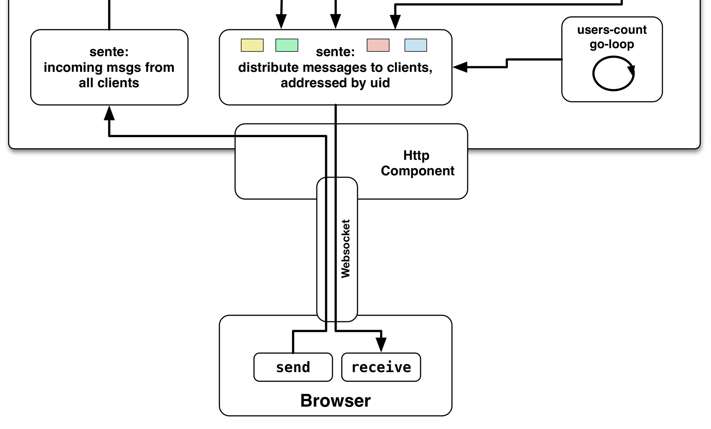

## Http Component

The ````HttpServer```` component handles the network part of the interaction with the web clients whereas the ````Communicator```` component mentioned in the last chapter handles the interaction between client connections and the rest of the application.



The ````Communicator```` component is a dependency of the ````HttpServer```` and gets passed when the application starts. Let's dive right into the **[code](https://github.com/matthiasn/BirdWatch/blob/574d2178be6f399086ad2a5ec35c200d252bf887/Clojure-Websockets/MainApp/src/clj/birdwatch/http/component.clj)**:

~~~
(ns birdwatch.http.component
  (:gen-class)
  (:require
   [clojure.tools.logging :as log]
   [org.httpkit.server :as http-kit-server]
   [ring.middleware.defaults]
   [ring.util.response :refer [resource-response response content-type]]
   [compojure.core     :as comp :refer (defroutes GET POST)]
   [compojure.route    :as route]
   [com.stuartsierra.component :as component]))

(def ring-defaults-config (assoc-in ring.middleware.defaults/site-defaults [:security :anti-forgery]
                                    {:read-token (fn [req] (-> req :params :csrf-token))}))

(defn- static-html [file-name] (content-type (resource-response file-name {:root "public"}) "text/html"))

(defrecord Httpserver [conf comm server]
  component/Lifecycle
  (start [component] (log/info "Starting HTTP Component")
         (defroutes my-routes  ; created during start so that the correct communicator instance is used
           (GET  "/"    [] (static-html "index.html"))
           (GET  "/dev" [] (static-html "index-dev.html"))
           (GET  "/chsk" req ((:ajax-get-or-ws-handshake-fn comm) req))
           (POST "/chsk" req ((:ajax-post-fn comm) req))
           (route/resources "/") ; Static files, e.g. /js/build/birdwatch-opt.js (our cljs target)
           (route/not-found "Page not found"))
         (let [my-ring-handler   (ring.middleware.defaults/wrap-defaults my-routes ring-defaults-config)
               server (http-kit-server/run-server my-ring-handler {:port (:port conf)})
               uri (format "http://localhost:%s/" (:local-port (meta server)))]
           (log/info "Http-kit server is running at" uri)
           (assoc component :server server)))
  (stop [component] (log/info "Stopping HTTP Server")
        (server :timeout 100)
        (assoc component :server nil)))

(defn new-http-server [conf] (map->Httpserver {:conf conf}))
~~~

The component code is mostly taken from the **[sente example](https://github.com/ptaoussanis/sente/blob/master/example-project/src/example/my_app.cljx)**. I've only adapted it to fit into the component lifecycle so that the server is shut down when the component stops.
