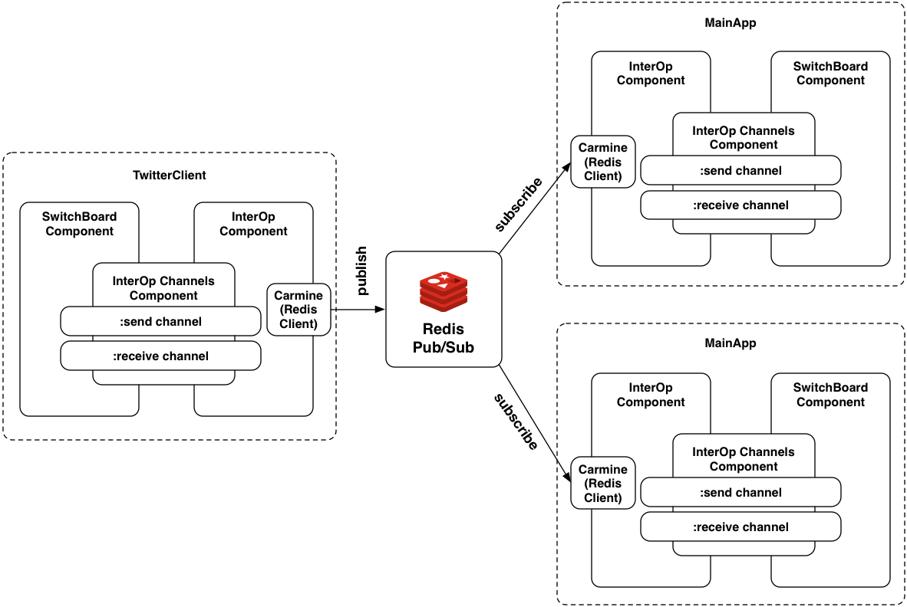

## MainApp - InterOp Component

This component takes care of receiving data from another JVM. As a quick reminder, this application subscribes to a **[Redis Pub/Sub](http://redis.io/topics/pubsub)**:



The code is comparable to the ````InterOp```` component on the other side, only that on this **[side](https://github.com/matthiasn/BirdWatch/blob/43a9c09493257b9c9b5e9e5644df5f67085feb84/Clojure-Websockets/MainApp/src/clj/birdwatch/interop/component.clj)** we don't publish but subscribe:

~~~
(ns birdwatch.interop.component
  (:gen-class)
  (:require
   [birdwatch.interop.redis :as red]
   [clojure.tools.logging :as log]
   [clojure.pprint :as pp]
   [com.stuartsierra.component :as component]
   [clojure.core.async :as async :refer [chan]]))

;;; The interop component allows sending and receiving messages via Redis Pub/Sub.
;;; It has both a :send and a :receive channel and can be used on both sides of the Pub/Sub.
(defrecord Interop [conf channels listener]
  component/Lifecycle
  (start [component] (log/info "Starting Interop Component")
         (let [conn {:pool {} :spec {:host (:redis-host conf) :port (:redis-port conf)}}
               listener (red/subscribe-topic (:receive channels) conn "matches")]
           (assoc component :conn conn :listener listener)))
  (stop  [component] (log/info "Stopping Interop Component")
         (red/unsubscribe listener)
         (red/close listener)
         (assoc component :conn nil :listener nil)))

(defn new-interop [conf] (map->Interop {:conf conf}))

(defrecord Interop-Channels []
  component/Lifecycle
  (start [component] (log/info "Starting Interop Channels Component")
         (assoc component :send (chan) :receive (chan)))
  (stop  [component] (log/info "Stop Interop Channels Component")
         (assoc component :send nil :receive nil)))

(defn new-interop-channels [] (map->Interop-Channels {}))
~~~

No big surprises here. Just like for the publisher side, there's the configuration map. Next, we subscribe to a topic and hold on to the returned listener so that we can unsubscribe from the topic and close it later. All of these functions can be found in the ````redis```` **[namespace](https://github.com/matthiasn/BirdWatch/blob/43a9c09493257b9c9b5e9e5644df5f67085feb84/Clojure-Websockets/MainApp/src/clj/birdwatch/interop/redis.clj)**, which is the same as on the other side of the pub/sub:

~~~
(ns birdwatch.interop.redis
  (:gen-class)
  (:require
   [clojure.tools.logging :as log]
   [clojure.pprint :as pp]
   [clojure.core.match :as match :refer (match)]
   [com.matthiasnehlsen.inspect :as inspect :refer [inspect]]
   [taoensso.carmine :as car :refer (wcar)]
   [clojure.core.async :as async :refer [<! put! go-loop]]))

(defn run-send-loop
  "loop for sending items by publishing them on a Redis pub topic"
  [send-chan conn topic]
  (go-loop [] (let [msg (<! send-chan)]
                (car/wcar conn (car/publish topic msg))
                (recur))))

(defn- msg-handler-fn
  "create handler function for messages from Redis Pub/Sub"
  [receive-chan]
  (fn [[msg-type topic payload]]
    (when (= msg-type "message")
      (inspect :redis/receive payload)
      (put! receive-chan payload))))

(defn subscribe-topic
  "subscribe to topic, put items on specified channel"
  [receive-chan conn topic]
  (car/with-new-pubsub-listener
    (:spec conn)
    {"matches" (msg-handler-fn receive-chan)}
    (car/subscribe topic)))

(defn unsubscribe
  "unsubscribe listener from all topics"
  [listener]
  (car/with-open-listener listener (car/unsubscribe)))

(defn close
  "close listener"
  [listener]
  (car/close-listener listener))
~~~

The only difference between both sides of the **pub/sub** is which functions we use. One could also implement bidirectional communication between two components by utilizing all of these functions. Maybe something that could be moved into a library at some point when having a clearer understanding of realworld requirements.
