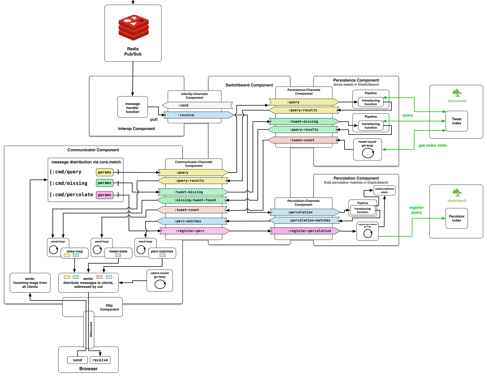

# Server-side: MainApp

## Architectural Overview

This application handles the interaction with the web clients. It receives tweets via subscribing to a Redis Pub/Sub and distributes them to the connected clients when there's a match between the query of a client and a new incoming tweet. 

There can be multiple instances of this application, allowing the entire system to be horizontally scalable.

