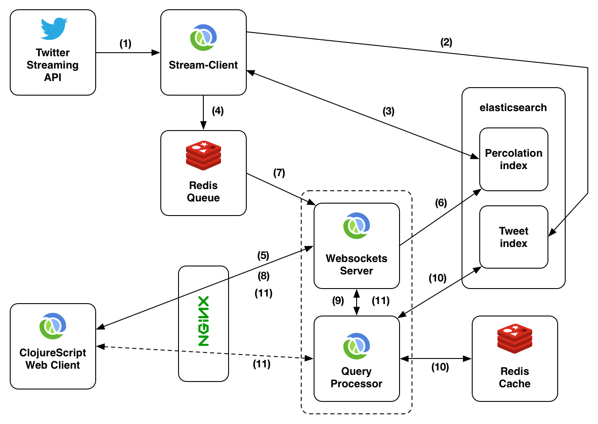

## Redesign

The redesign ideas were originally published as a blog post on **[matthiasnehlsen.com](http://matthiasnehlsen.com/blog/2014/10/30/Building-Systems-in-Clojure-3/)**. The content will be adapted to fit the book format better.

I recently did a lot of transcript proofreading concerning enlightening talk for my **[talk-transcripts project](https://github.com/matthiasn/talk-transcripts)**. The most recent one was **[Design, Composition and Performance](https://github.com/matthiasn/talk-transcripts/blob/master/Hickey_Rich/DesignCompositionPerformance.md)**, the tenth transcript of a talk by **[Rich Hickey](https://twitter.com/richhickey)**. That one in particular got me thinking that there are quite a few ideas I want to adopt in **[BirdWatch](https://github.com/matthiasn/BirdWatch)**, the application about which I started writing this series of articles. That calls for some **redesign**, so it’s probably time to make up my mind what exactly it is that I am trying to solve with this application.

So here’s the idea:

* We have a stream of information and we are interested in a subset of that information, which we can match on via **full-text search** and **ranges**. The searches are anything that **[ElasticSearch](http://www.elasticsearch.com)** / **[Lucene](http://lucene.apache.org)** can match on.
* Furthermore, we are interested in **live results** plus a certain period of time back into the **recent** past. For now, we are using tweets from the **[Twitter Streaming API](https://dev.twitter.com/streaming/overview)**, but the source could be anything, such as other social media data. Sensor data could also be really interesting. Live means new matches are added to the displayed results within about a second.
* The results are supposed to be shown in a browser, including on **mobile devices**. The number of items reasoned about should **not be limited by** the available **memory** of the browser[^1].
* My immediate goal is to be able to reason about the **last one million tweets** for a certain topic. Also, it should be possible to serve **many concurrent ad-hoc queries**, like hundreds or more different ones.

I am not quite sure yet how all these requirements can be brought together, but I am going to find out and I am inviting you to join me and discuss all aspects of the application with me.

What comes to mind immediately when regurgitating the requirements above is **[Storm](https://storm.apache.org)** and the **[Lambda Architecture](http://lambda-architecture.net)**. First I thought, great, such a search could be realized as a **bolt** in Storm. But then I realized, and please correct me if I’m wrong, that topologies are fixed once they are running. This limits the flexibility to add and tear down additional live searches. I am afraid that keeping a few stand-by bolts to assign to queries dynamically would not be flexible enough.

So instead I suggest doing the **final aggregation** (the reduce phase) on the browser side in a **ClojureScript** application. On the server side, partial results are aggregated for shorter time periods. These partial results can be generated in a cluster of nodes whilst the client is fed with live data immediately. Let's have a look at a drawing before I walk you through the individual steps:

The redesign also involves splitting the application into two or three different applications. Let's go through the interactions of the entire system step by step:

1. Tweets are received from the Twitter Streaming API in chunks of (oftentimes incomplete) JSON. A **stateful transducer** is used to reassemble the JSON and parse chunks into Clojure maps. This aspect of the application has already been described in **[this recent article](http://matthiasnehlsen.com/blog/2014/10/06/Building-Systems-in-Clojure-2/)** and will not be affected by the redesign.

2. Tweets are stored in **[ElasticSearch](http://www.elasticsearch.com)** in their respective index. If the received tweet contains a retweet, the retweet status will be used to update an existing item (e.g. the RT count).

3. The newly received tweet is presented to ElasticSearch's **[percolation index](http://www.elasticsearch.org/guide/en/elasticsearch/reference/current/search-percolate.html)** in order to find clients interested in this tweet. It is kind of a reverse matching where the new item is matched against **existing searches**.

4. Together with information on matched queries the tweet is published using **[Redis's Pub/Sub](http://redis.io/topics/pubsub)** feature. Potentially, the search ID of the matches could be used to publish to different topics[^2]. This constitutes the border of the first Clojure application.

5. The second Clojure application, which serves the client-side ClojureScript application as well, receives a new search via a **WebSocket** connection.

6. It then **registers** the query in ElasticSearch's **percolation** index.

7. Next, the socket connection **subscribes** to the search ID's topic in Redis's **Pub/Sub** feature.

8. From now on matches to the client's search will be delivered immediately to the client-side ClojureScript application.

9. This next step may or may not live in the same JVM - I haven't decided yet. So the idea is to **aggregate data on the server side** and only deliver the aggregated data structures back to the client side. For example, this could be a few hundred aggregates over increments of five minutes each. These increments can easily be made addressable (and cacheable): let's say it is 1:17pm. Then, we have a last and incomplete increment from 1:15pm that will be added upon in the browser whereas all previous ones are complete and fixed. By treating the complete ones as **immutable**, we can cache them and forego unnecessary and expensive requests to ElasticSearch. Since these immutable previous chunks can be addressed individually, it may make sense to deliver them through REST endpoints instead of via the WebSocket connection (the dashed line)[^3].

10. We've already established that previous chunks can be cached. **[Redis](http://redis.io)** seems like a great match utilizing the **[EXPIRE feature](http://redis.io/commands/expire)**. So Redis would be queried for the presence of a certain chunk first. If it exists, it will be delivered right away. If not, ElasticSearch will be queried and the result will be delivered and stored in Redis for the next couple of hours or so in order to avoid unnecessary load on the ElasticSearch cluster.

11. Finally, the aggregate is delivered to the client. This could either be through the WebSocket connection or through **[REST](http://en.wikipedia.org/wiki/Representational_state_transfer)** (the dashed line).

So far, this is just an idea of where the application might go. I can't wait to get started with implementing the changes; this should be a lot of fun. Completely **decoupling** the processes between a Twitter client and the client-serving part allows restarting the latter **without disconnecting** from the Streaming API. The decoupling also is much better for **scaling**. There's only one connection to the Streaming API at any one time, but there's no reason why it shouldn't be possible to serve more clients than any one JVM/box could handle.

[^1]: Right now with all tweets loaded onto the client, the maximum for a desktop browser is somewhere in the range of a **few tens of thousands** of tweets before the application slows down noticably.

[^2]: I'm undecided about this one. On one hand, it is strikingly simple to have a topic per search ID, which is a hash of the query itself. But on the other hand, this likely involves **book-keeping** of the subscriptions on the consuming side, where the subscription would have to be removed once the client disconnects. Maybe it is simpler to just serialize a set of IDs with the tweet and publish that on a single topic.

[^3]: Using REST makes the communication somewhat more complex, but I still think it would make sense to move this aspect of the application into separate JVM. The **GC characteristics** of aggregating large amounts of data in spikes are vastly different from the (near-) realtime aspects of the WebSocket delivery of new tweets. For the aggregation, it would not matter much for the user experience if there was a **stop-the-world** garbage collection pause of even a few seconds, but I don't want that to happen for the streaming data.
