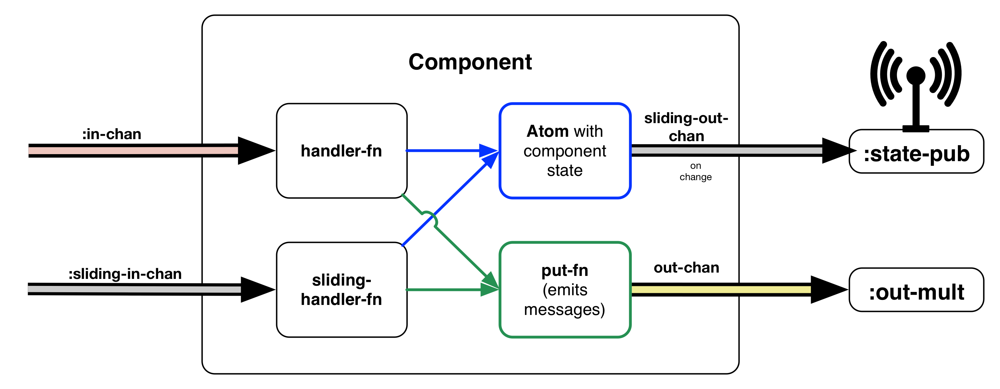

# The systems-toolbox library

## Introduction

Maybe you have read the previous chapters carefully, or maybe you just skimmed through. Either is fine as long as you noticed the **repetitiveness** in the code. If not, maybe it helps to squint when looking at the code. Don't get me wrong, I'm not saying the code is entirely bad or anything, and I believe one could write an application this way and get along okay. The **[BirdWatch](https://github.com/matthiasn/BirdWatch)** application, for example, was running like this for many months, much to my satisfaction. There was just way too much boilerplate. 

Writing about the architecture made the abundance of boilerplate painfully obvious as I noticed that I was describing the same things over and again. Writing repetitive code once is one thing, but writing ABOUT repetitive code is something entirely different. It's a good exercise, however. Try writing about some project and its architecture. If something annoys you, you may well be onto something.

So when going through this exercise, I made up my mind that I didn't want to repeat myself as much when building somewhat complex systems. Not in any of my toy projects and for sure not in commercial projects, either. But how could one extract the commonality between different parts of the system?

At the same time when I started looking at refactoring my applications, I had started looking at the world through the lens of **[Systems Thinking](https://en.wikipedia.org/wiki/Systems_thinking)**. There is something very compelling about seeing the world as a mesh of systems that potentially interact in one way or another. Coming from that perspective, I was wondering if I could apply that kind of thinking to software architecture where an application forms a system that consists of subsystems.

Such a subsystem could, for example, be the persistence layer that handles saving data to some storage. Or it could be the HTTP server. Or a UI component. Whatever, any entity that has definable borders and that serves a recognizable purpose can be such a subsystem.

So what is the commonality between such subsystems or components? By the way, I will use the terms _subsystem_ and _component_ interchangeably. Let me start with a brief rant about **[Object-Oriented Programming](https://en.wikipedia.org/wiki/Object-oriented_programming)**. There's one thing I never got, and that's the fanfare about encapsulation. We typically argue that encapsulation is important for protecting the mutable state of an object from accidental mutilation. Fair enough, if you buy into the idea of uncontained mutability. But coming from functional programming and wearing Clojure-colored glasses, I don't think application state should ever live inside any entity that allows direct and uncontrolled mutation from anywhere. Instead, immutable data structures are ALWAYS the better choice when trying to relay information in any way. But as long as those data structures are immutable, why should you and I not see every detail there is to see? If there's no harm in doing so, why not, right? Plus, additional information never hurt anyone when trying to reason about a system.

So with the above in mind, I'd like each subsystem to be fully observable. To be able to do useful stuff, such a subsystem would need to be able to retain some state, which I want to be able to inspect at any point during runtime. Such subsystem would also need the means to communicate with the rest of the world, in particular other parts of the overarching system via message passing, but, at the edges of the system as a whole, also with the outside world.

When it comes to relaying information, I found **[Communicating Sequential Processes (CSP)](https://en.wikipedia.org/wiki/Communicating_sequential_processes)** to be a very useful abstraction. However, directly modeling an application by utilizing **[core.async](https://github.com/clojure/core.async)**, Clojure's incarnation of CSP, always seemed a little tedious to me. Say you had a few different gadgets in a home automation system, such as the central heating, flow meters, thermometers, and remotely controlled thermostats, how do you map their interaction mentally? Do you think in terms of, this connects to that in some way to achieve a meaningful purpose, or do you mentally lay out the actual plumbing or the network devices, wires or airwaves? I didn't think so, other than that you may want to know about the general properties of the connections involved.

I felt the same way about **[core.async](https://github.com/clojure/core.async)**. It's a very useful library, but the previous architecture of BirdWatch forced me to look at the actual plumbing where I only wanted to think about different subsystems and their actions and connections.

Now let's look at **subsystems** one more time. Any given component interacts with the outside world in two different ways. First, there's direct communication, where there's the expectation that the recipient of a message acts the way it wants to a given message. You know, like when you're sending your tax declaration to the appropriate authorities, such as the IRS. You expect a response. You better don't have specific expectations about how long it'll take, but at some point, you will get a response, and you will then (hopefully) know how to handle the message. In essence, that's asynchronous message passing. With this kind of message passing, there's a general expectation that the message enacts something, whatever that something is. Or, if no other subsystem is wired to react to such a message, we can expect nothing to happen, other than that message would leave some observable trace.

And then there's another kind of information passing altogether. Here, it's all about observability. When the thermometer on my balcony measures the temperature and displays it, it has no notion of wanting to enact anything in the real world. The only reason for the display lies in the observability of the reading. I as the observer then usually only care about the latest reading. The remaining readings will simply evaporate as the reflected photons collide with a brick wall or whatever. Heisenberg's uncertainty principle aside, I don't want to worry conceptually about the effects of my observation on the reading. At the same time, I will only take into account as many readings as I can process.

Let's see what this means for a piece of software. In the BirdWatch application, there is a state or store component on the client side. This component knows how to handle incoming messages, such as new tweets, and how to alter its internal state after applying some business logic to the previous state while taking the incoming messages into consideration. And then, there are multiple UI components that render the current application state. They don't need write access to the application state; instead, they only render what they can observe. At the same time, only the latest instance of such an immutable state snapshot ever needs to be taken into account, as all previous ones are stale information by the time there's a newer snapshot.

Looking at the BirdWatch application again, the ````state component```` receives new messages, including chunks with the last 5000 tweets or whatever you choose. The state component, which handles such chunk messages, mutates its internal state atom like 50-60,000 within less than 5 seconds after application startup. There's no reason to drain the battery by rendering every single one of the emitted snapshots into a virtual DOM representation and then have **[React](https://facebook.github.io/react/)** detect the changes by diffing every such representation. Instead, all that needs to happen is rendering the newest snapshot 60 times per second to achieve a satisfactory user experience that appears to be running smoothly.

More broadly speaking, any component will have some internal state. This component will broadcast any mutation of its state atom by emitting an immutable snapshot of the latest state. Any consumer of such snapshots then only subscribes to as many as it can process, with the guarantee to always get the latest version whenever it is ready to consume a new snapshot. Core.async's **[sliding buffer](https://clojure.github.io/core.async/#clojure.core.async/sliding-buffer)** is the building block that enables this behavior. It is a buffer of a defined size that will always make room for new messages by discarding the oldest unconsumed messages.

When dealing with state snapshots, we can even create one such buffer of _size one_ that only holds the latest snapshot message. Components then emit snapshots of their internal state, without blocking unnecessarily when unknown recipients aren't ready for consumption. Such a mechanism is not something I should have to rewrite every single time; rather, the library should come with an abstraction for building such components, without writing repetitive boilerplate.

Potential observers can then subscribe to such state snapshots, all while again being guarded by another such sliding buffer against becoming overly busy with processing outdated snapshots.

Let's look at a possible design of a subsystem. Each component can, first of all, keep its state in an ````atom````. The specifics of the initial state differ, so this is something we will have to pass to a component/subsystem "factory" function. The component will then automatically publish changes to this atom on a channel in the form of snapshots. Then, there's another outgoing channel for messages that we intend another component to process or rather the world to see. Components do not have to interact with this channel directly. Instead, we can pass the component a function named ````put-fn```` that it can then call whenever it has a message to emit.



On the input side of a component, we once again have two different channels. One of them is for handling messages that require processing every time. The other is for observing messages such as state snapshots, where only ever the last version is of interest. In either case, the existence of such channels as a means of taking information in is common to all components, whatever their purpose. For the differences in behavior, we only need to specify handler functions for the message types we want handled. These handlers take a map with the state ````atom```` and the ````put-fn```` (among others) so they can change the component state and emit messages when required. Giving those handlers access to the application state is safe thanks to **[Software Transactional Memory](http://clojure.org/refs)**, in case you worried about concurrency just now.

On the output side, there are the channels mentioned above, one for sending messages with some intent, and another one for emitting state snapshots. Publishing such snapshots is not something you have to worry about, it is taken care of by the library whenever any of your handlers updates the component state atom.

One important thing to note here is that the provided mechanisms for creating components work equally well on the Clojure/JVM and the ClojureScript/Browser side. In fact, the code is exactly the same in a ````.cljc```` file making use of **[reader conditionals](http://dev.clojure.org/display/design/Reader+Conditionals)** that come with Clojure 1.7. In short, this feature allows to maintain a single code base for all platforms, where only the differences between platforms have to be implemented differently. I recommend reading the announcement linked above if you'd like to find out more about this new language feature.

The sweet thing about exploring and writing the **[systems-toolbox](https://github.com/matthiasn/systems-toolbox)** library is that it's not a mere thought experiment but also something that we're building a commercial system upon at my current gig. There, such subsystems are communicating with each other, connected over fast WebSockets, should messages need to traverse platform boundaries between client and server. Also, the latest version of the **[BirdWatch](https://github.com/matthiasn/BirdWatch)** application uses this library both on client and server, providing a unified way of writing code on both sides. Also, all the UI components are built on top of this library, as we shall see.

Okay, so much about the motivation behind the library. Let's look at a simple example next.