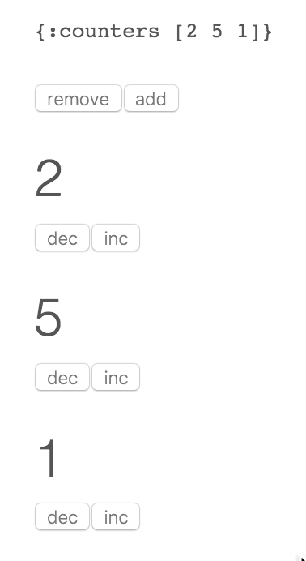

# The systems-toolbox-ui library

## Introduction

Pretty much any application out there has some a user facing aspect. Even those that don't have one would usually greatly benefit from having a user interface that tells you at a glance if your services are healthy. Also, I just generally find it more rewarding to work on something that has some presentation layer, no matter how sparse. So let's make it easy to add a presentation layer to an arbitrary piece of backend code, shall we?

## React

**[React](https://facebook.github.io/react/)** is a UI renderer by Facebook. It **only** does the rendering and is not a Framework for JavaScript applications. However, it does the rendering a) quite well and b) in a way that is particularly useful when coming from a functional programming approach.

Let me explain. What happens is that we define a function that turns some data into a DOM (sub)-tree. There is no notion of manipulating that tree, as you'd tediously have to do with the likes of jQuery. Rather, every time the data changes, the entire thing is rendered. So far, that sounds conceptually pure but at the same time very expensive, right? Well, it would be, only that this rendering does not happen in the actual, heavy-weight DOM but into a lightweight JavaScript data structure called virtual DOM. Then, there's a diffing process that compares the previous version of that virtual DOM (which corresponds to what is on the page) and the latest version, determines the changes, and only then puts those changes into effect on the page. This mechanism happens to be fast. 

Why should you care? In Clojure and ClojureScript, we strongly favor working with immutable data structures. Thus, it conceptually fits very well to think of DOM tree as something immutable, instead of something that you have to modify in place. If there are state changes, we just pass the new state to that function that creates our UI, and then let it figure out under the hood how to get there. For all we need to care about, this UI renderer recreates our UI on every single change. 

## Redux

**[Redux](https://github.com/reactjs/redux)** is one possible approach to creating a larger application that makes use of React as its renderer. Redux is not tied to React but in reality, those libraries are probably most often used together. The general idea here is that there is some protected state container. Mutations of that managed application state then cannot happen from random places in your program. Instead, you can only dispatch actions to that managed state container, which will act on that action (or not, if no such action is defined). This model defines clear borders of where state mutation can happen, and thus makes the application easier to maintain.

I have not worked with Redux extensively, but the approach is the same with the **[systems-toolbox-ui](https://github.com/matthiasn/systems-toolbox-ui)** library, and it works well there. Let's have a look at a simple example next.

## Counter example

When you go through the examples for Redux, you'll see one with some counters. Let's do the same thing with **systems-toolbox-ui** library. You can also find the code this example **[here](https://github.com/matthiasn/systems-toolbox-ui/tree/master/examples/redux-counter01)**. This is how it is going to look like:

As you can see in the screenshot above, we have a very simple UI that first of all shows us the application state, and then initially three counters, each of which with a button to increment and decrement the counter, plus buttons to add and remove another counter at the end.

Now remember from Redux that we can only interact with the state using actions. Let's have a look at the namespace implementing the store first.

~~~
(ns example.store)

(defn inc-handler
  "Handler for incrementing specific counter"
  [{:keys [current-state msg-payload]}]
    {:new-state (update-in current-state [:counters msg-payload] inc)})

(defn dec-handler
  "Handler for decrementing specific counter"
  [{:keys [current-state msg-payload]}]
    {:new-state (update-in current-state [:counters msg-payload] dec)})

(defn remove-handler
  "Handler for removing last counter"
  [{:keys [current-state]}]
  {:new-state (update-in current-state [:counters] #(into [] (butlast %)))})

(defn add-handler
  "Handler for adding counter at the end"
  [{:keys [current-state]}]
    {:new-state (update-in current-state [:counters] conj 0)})

(defn state-fn
  "Returns clean initial component state atom"
  [_put-fn]
  {:state (atom {:counters [2 0 1]})})

(defn cmp-map
  [cmp-id]
  {:cmp-id      cmp-id
   :state-fn    state-fn
   :handler-map {:cnt/inc inc-handler
                 :cnt/dec dec-handler
                 :cnt/remove remove-handler
                 :cnt/add add-handler}})
~~~
 
Okay, let's go through this namespace from the bottom up. The `cmp-map` generates a map which the `systems-toolbox` library needs to create/instantiate a component. The `cmp-id` is straight-forward, this is required when later wiring the component with other components. Then, there is the `:state-fn` key. Here, a function is expected that takes the `put-fn`, which is the function that allows a component to emit messages at any time, irrespective of incoming messages, and that returns a map with the initial component state as an atom.

Then, there's the handler map. It's a map with the different message types that the component handles as keys, and the respective handler functions as values.

Then, there are the handler functions. Handler functions take a single argument, a map, which among other things contains the `current-state` and `msg-payload`. There are other keys on the argument map, such as `msg` for the entire message (vector with msg-type plus msg-payload), `msg-type`, which is a namespaced keyword, `msg-meta` for more information on about the message and so on. For now, it's only important that the message payloads here need to be integers that correspond to indices of existing counter entries. Then, the handler functions can return the new component state after processing the message in the `new-state` key on the return map. Handlers can also emit messages themselves, but we'll look at that later. What those handlers do should be relatively straight-forward. Those take the current component state and modify it by either increasing/decreasing the value at a particular index or by adding or removing a value at the end.

That's it for the state component. Now we can let other components observe its state, for example, our UI component:

~~~
(ns example.counter-ui
  (:require [matthiasn.systems-toolbox-ui.reagent :as r]
            [matthiasn.systems-toolbox-ui.helpers :as h]))

(defn counter-view
  "Renders individual counter view, with buttons for increasing or decreasing the value."
  [idx v put-fn]
  [:div
   [:h1 v]
   [:button {:on-click #(put-fn [:cnt/dec idx])} "dec"]
   [:button {:on-click #(put-fn [:cnt/inc idx])} "inc"]])

(defn counters-view
  "Renders counters view which observes the state held by the state component.
  Contains two buttons for adding or removing counters, plus a counter-view
  for every element in the observed state."
  [{:keys [current-state put-fn]}]
  (let [indexed (map-indexed vector (:counters current-state))]
    [:div.counters
     [h/pp-div current-state]
     [:button {:on-click #(put-fn [:cnt/remove])} "remove"]
     [:button {:on-click #(put-fn [:cnt/add])} "add"]
     (for [[idx v] indexed]
            ^{:key idx} [counter-view idx v put-fn])]))

(defn cmp-map
  [cmp-id]
  (r/cmp-map {:cmp-id  cmp-id
              :view-fn counters-view
              :dom-id  "counter"}))

~~~

Here, we have two different functions that each generates a piece of the UI. `counter-view` renders an individual counter, together with buttons for either increasing or decreasing the value of the counter. Note that the buttons do not interact with the state component directly. Rather, when clicking a button, a message is sent, which is then handled by the state component. Thus, we have a clear separation of concerns, rather than state mutation from anywhere.

Next, there is the `counters-view` function, which renders the application state in a pretty-printed format, two buttons for adding or removing counters, plus a `counter-view` for every counter in the counters vector of the application state.

Now, we finally need to wire everything together. This happens in the `core` namespace of our example:

~~~
(ns example.core
  (:require [example.store :as store]
            [example.counter-ui :as cnt]
            [matthiasn.systems-toolbox.switchboard :as sb]))

(defonce switchboard (sb/component :client/switchboard))

(defn init
  []
  (sb/send-mult-cmd
    switchboard
    [[:cmd/init-comp (cnt/cmp-map :client/cnt-cmp)]
     [:cmd/init-comp (store/cmp-map :client/store-cmp)]
     [:cmd/route {:from :client/cnt-cmp :to :client/store-cmp}]
     [:cmd/observe-state {:from :client/store-cmp :to :client/cnt-cmp}]]))

(init)
~~~

Here, we declare a switchboard in a `defonce`, so that it survives application reloads. This is necessary for use with **[figwheel](https://github.com/bhauman/lein-figwheel)**, but more about that later. Then, there's an init function, in which we send multiple commands to that switchboard. The `:cmd/init-comp` tells the switchboard to instantiate both the UI and the state components for us. The order here does not matter, because, at this point, they don't need to exchange messages yet. Then, we route all messages from the UI component to the store component. These are the command messages for incrementing and decrementing counters. In Redux, these are called actions. Then finally, we tell the switchboard that the UI component is supposed to observe the state of the store component. Thus every time our application state changes, the UI is re-rendered automatically.

### Better UI development with Figwheel

**[Figwheel](https://github.com/bhauman/lein-figwheel)** is a game changer for UI development in ClojureScript. It is so much better to have your UI automatically (and almost instantly) reload after a code change that I can't imagine working without it any longer. Of course, the **systems-toolbox** and **systems-toolbox-ui** also had to support it to be of any use. So how do you use figwheel? Instead of compiling the ClojureScript with `lein cljsbuild auto release`, you instead run `lein figwheel`. This command will first compile your ClojureScript code and then watch the code for changes, recompile it and reload the application. The **systems-toolbox** supports this by preserving the state of your components upon reload. 

You can, for example, try change to the text of the buttons after clicking them a few times and adding a few counters, so that your application state is different from the initial state. Now, for example, change the "inc" text to "+" and save the file. Within about a second, you will see that your page reloads while retaining the previous state. This feature can make your development much faster.

Also, you can change the handlers on the fly. Try to change the `inc-handler` so that it resembles the following:

~~~
(defn inc-handler
  "Handler for incrementing specific counter"
  [{:keys [current-state msg-payload]}]
    {:new-state (update-in current-state [:counters msg-payload] #(+ % 10))})
~~~

Now, after reload, every click on the `inc` button of a counter will increase its value by 10, all while still retaining the previous state upon reload. Just note that reloading may not work as expected if you change the structure of the application state map. Obviously, the reload mechanism will only have the previous state at its disposal, and if that doesn't match expectations any longer, your application may not work after a reload triggered by figwheel. In that case, just do a "traditional" page reload.

By the way, the automatic reload also works for CSS changes. This is a huge time saver when you tweak the CSS of some page of the application where a `cmd-r` reload of the page will not get you to the same page yet, maybe because the routing or session persistence isn't completely implemented yet.

