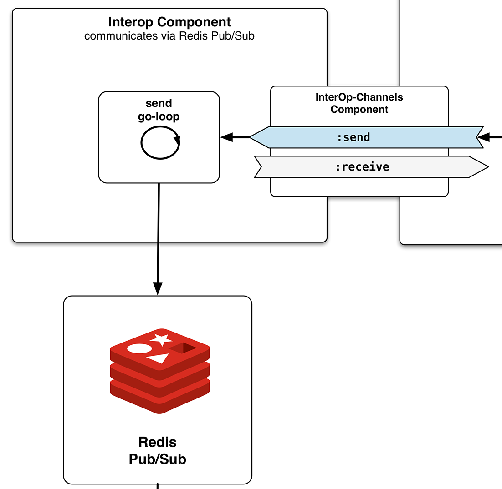

## TwitterClient - InterOp Component

In the "Scaling Out" section of the architectural overview, I drew a picture of how I wanted to break apart the initial monolithic application and instead run different parts of the application in separate processes / separate JVMs. The idea was to have a single client for the connection to the **[Twitter Streaming API](https://dev.twitter.com/streaming/overview)** and the persistence of the received Tweets in **[ElasticSearch](http://www.elasticsearch.com)**, plus multiple machines to serve WebSocket connections to the client. For the communication between the processes, I picked **[Redis Pub/Sub](http://redis.io/topics/pubsub)** because its model of communication suits the requirements really well.




### Redis Pub/Sub with Carmine

I chose **Pub/Sub** over a queue because I wanted to **[fan-out](http://en.wikipedia.org/wiki/Fan-out)** messages to multiple clients. Any connected processes are only supposed to be fed with data during their uptime, with no need to store anything for when they aren't connected. For interfacing with **Redis** from Clojure, I then chose **[Peter Taoussanis](https://twitter.com/ptaoussanis)**'s **[carmine](https://github.com/ptaoussanis/carmine)** client and it turned out to be a great choice.

Let's look at some code. First of all, I am using a **component** that provides a **send channel** and a **receive channel**. It can be reused on either side of the Pub/Sub connection (or for bidirectional communication, of course). Here's the **[code](https://github.com/matthiasn/BirdWatch/blob/4ce6d8ff70359df9f98421c12984d24d0f311f6f/Clojure-Websockets/TwitterClient/src/clj/birdwatch_tc/interop/component.clj)**.
 
~~~
(ns birdwatch-tc.interop.component
  (:gen-class)
  (:require
   [birdwatch-tc.interop.redis :as red]
   [clojure.tools.logging :as log]
   [clojure.pprint :as pp]
   [com.stuartsierra.component :as component]
   [clojure.core.async :as async :refer [chan]]))

;;; The interop component allows sending and receiving messages via Redis Pub/Sub.
;;; It has both a :send and a :receive channel and can be used on both sides of the Pub/Sub.
(defrecord Interop [conf channels]
  component/Lifecycle
  (start [component] (log/info "Starting Interop Component")
         (let [conn {:pool {} :spec {:host (:redis-host conf) :port (:redis-port conf)}}]
           (red/run-send-loop (:send channels) conn "matches")
           (assoc component :conn conn)))
  (stop  [component] (log/info "Stopping Interop Component") ;; TODO: proper teardown of resources
         (assoc component :conn nil)))

(defn new-interop [conf] (map->Interop {:conf conf}))

(defrecord Interop-Channels []
  component/Lifecycle
  (start [component] (log/info "Starting Interop Channels Component")
         (assoc component :send (chan) :receive (chan)))
  (stop  [component] (log/info "Stop Interop Channels Component")
         (assoc component :send nil :receive nil)))

(defn new-interop-channels [] (map->Interop-Channels {}))
~~~

The ````Interop-Channels```` component can now be wired into the ````Interop```` component where we create a configuration map and start a send loop with this configuration for the **"matches"** topic. Here's that **[run-send-loop](https://github.com/matthiasn/BirdWatch/blob/4ce6d8ff70359df9f98421c12984d24d0f311f6f/Clojure-Websockets/TwitterClient/src/clj/birdwatch_tc/interop/redis.clj)** function:

~~~
(ns birdwatch-tc.interop.redis
  (:gen-class)
  (:require
   [clojure.tools.logging :as log]
   [clojure.pprint :as pp]
   [clojure.core.match :as match :refer (match)]
   [taoensso.carmine :as car :refer (wcar)]
   [clojure.core.async :as async :refer [<! put! go-loop]]))

(defn run-send-loop
  "loop for sending items by publishing them on a Redis pub topic"
  [send-chan conn topic]
  (go-loop [] (let [msg (<! send-chan)]
                (car/wcar conn (car/publish topic msg))
                (recur))))

(defn- msg-handler-fn
  "create handler function for messages from Redis Pub/Sub"
  [receive-chan]
  (fn [[msg-type topic payload]]
    (when (= msg-type "message")
      (put! receive-chan payload))))

(defn subscribe-topic
  "subscribe to topic, put items on specified channel"
  [receive-chan conn topic]
  (car/with-new-pubsub-listener
    (:spec conn)
    {"matches" (msg-handler-fn receive-chan)}
    (car/subscribe topic)))

(defn unsubscribe
  "unsubscribe listener from all topics"
  [listener]
  (car/with-open-listener listener (car/unsubscribe)))

(defn close
  "close listener"
  [listener]
  (car/close-listener listener))
~~~

This **go-loop** consumes all messages that come in on **send-chan** channel and publishes them on **topic** for the specified configuration **conn**. All other functions are not used here, but this component is the same on both sides of the pub/sub. We will look at the counterpart when looking at the **MainApp** application.


### Performance of Redis

Redis does a lot with very little CPU utilization. In a non-scientific test, I fired up 50 JVMs (on four machines) subscribing to the topic on which the TwitterClient publishes tweets with matched percolation queries. Then I changed the tracked term from the **[Twitter Streaming API](https://dev.twitter.com/streaming/overview)** to **"love"**, which reliably maxes out the rate of tweets permitted. Typically, with this term I see around **60 to 70** tweets per second. With 50 connected processes, **3000 to 3500** tweets were delivered per second overall, yet the CPU utilization of Redis idled somewhere between **1.7%** and **2.3%**.

[^sierra-component]: The beauty of the component library is that during development, we can stop a component and restart it after reloading the code. This takes much less time than completely reloading the application. Watch **[Stuart Sierra's talk](https://www.youtube.com/watch?v=13cmHf_kt-Q)** for more information on the component library. I also created a **[transcript of this talk](https://github.com/matthiasn/talk-transcripts/blob/master/Sierra_Stuart/Components.md)** if you prefer reading.
