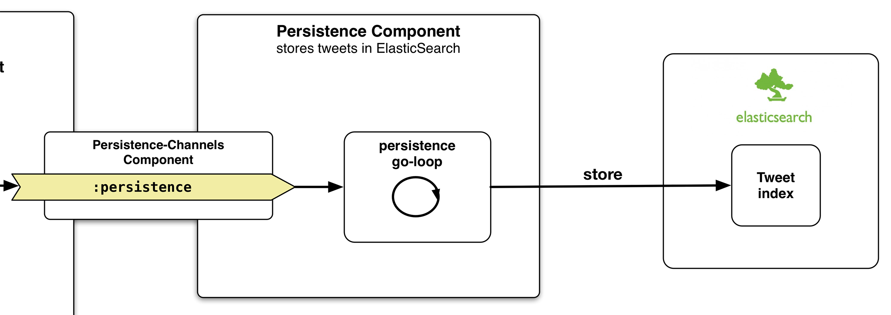

## TwitterClient - Persistence Component

This component takes care of persisting tweets to an index in ElasticSearch. Once again we have a component with the typical lifecycle functions and an associated ````Persistence-Channels```` component. Here, this component only has a single channel, ````:persistence````.



Because there is only a channel to take from but no other channel to put a result onto, we will not use a ````pipeline```` but instead run a good old ````go-loop````. Inside the **[component](https://github.com/matthiasn/BirdWatch/blob/5fe69fbfaa956039e1f89a26811d0c86775dd594/Clojure-Websockets/TwitterClient/src/clj/birdwatch_tc/persistence/component.clj)**, there aren't any surprises:

~~~
(ns birdwatch-tc.persistence.component
  (:gen-class)
  (:require
   [birdwatch-tc.persistence.tools :as pt]
   [birdwatch-tc.persistence.elastic :as es]
   [clojure.tools.logging :as log]
   [clojure.pprint :as pp]
   [clojurewerkz.elastisch.rest :as esr]
   [com.stuartsierra.component :as component]
   [clojure.core.async :as async :refer [<! chan go-loop tap]]))

(defrecord Persistence [conf channels]
  component/Lifecycle
  (start [component]
         (log/info "Starting Persistence Component")
         (let [conn (esr/connect (:es-address conf))]
           (es/run-persistence-loop (:persistence channels) conf conn)
           (assoc component :conn conn)))
  (stop [component] ;; TODO: proper teardown of resources
        (log/info "Stopping Persistence Component")
        (assoc component :conn nil)))

(defn new-persistence [conf] (map->Persistence {:conf conf}))

(defrecord Persistence-Channels []
  component/Lifecycle
  (start [component] (log/info "Starting Persistence Channels Component")
         (assoc component :persistence (chan)))
  (stop [component] (log/info "Stop Persistence Channels Component")
        (assoc component :persistence nil)))

(defn new-persistence-channels [] (map->Persistence-Channels {}))
~~~

All we see above is yet another component that really only has the single channel ````:persistence```` inside the ````Persistence-Channels```` component and that **[starts](https://github.com/matthiasn/BirdWatch/blob/43a9c09493257b9c9b5e9e5644df5f67085feb84/Clojure-Websockets/TwitterClient/src/clj/birdwatch_tc/percolator/elastic.clj)** said ````go-loop```` and passes the channel plus some configuration and the connection object.

~~~
(ns birdwatch-tc.persistence.elastic
  (:gen-class)
  (:require
   [clojure.tools.logging :as log]
   [clojure.pprint :as pp]
   [clojurewerkz.elastisch.rest :as esr]
   [clojurewerkz.elastisch.rest.document :as esd]
   [clojure.core.async :as async :refer [<! chan put! timeout go-loop]]))

(defn run-persistence-loop
  "run loop for persisting tweets"
  [persistence-chan conf conn]
  (go-loop [] (let [t (<! persistence-chan)]
                (try
                  (esd/put conn (:es-index conf) "tweet" (:id_str t) t)
                  (catch Exception ex (log/error ex "esd/put error"))))
           (recur)))
~~~

The ````go-loop```` above is pretty straightforward. Whatever we encounter on this channel, we try to persist in ElasticSearch, inside the index as specified in ````(:es-index conf)````, for type ````tweet````, with ````(:id_str t)````as the **document id** and finally with the tweet ````t```` itself. This makes me think that I've been wanting to implement **[schema](https://github.com/Prismatic/schema)** for a while now. I don't mind using the plain old map for representating a tweet, but coming from strongly typed languages, I at least would like something to blow up when the item does not conform to an expected schema as opposed to storing something completely different while still calling its type in ElasticSearch ````tweet````. Certainly an improvement to make soon.

Have you noticed a pattern? Once again, nothing in this component (and the associated namespace) knows anything about any other part of the application. The only thing I'd be okay with for sharing in this context would be a schema for the tweet as mentioned above. That should be maintained once.
