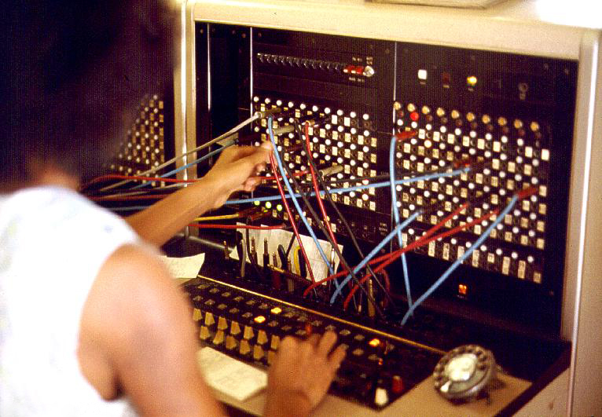

## TwitterClient - SwitchBoard Component

This component takes care of distributing data in the TwitterClient application by connecting **core.async** channels together, comparable to an operator in the early days of telephony[^sb-image]:



[^sb-image]: Photo by Joseph A. Carr, 1975, from **[Wikimedia](http://commons.wikimedia.org/wiki/File:JT_Switchboard_770x540.jpg)**

Let's have a look at the **[code](https://github.com/matthiasn/BirdWatch/blob/43a9c09493257b9c9b5e9e5644df5f67085feb84/Clojure-Websockets/TwitterClient/src/clj/birdwatch_tc/switchboard.clj)**:

~~~
(ns birdwatch-tc.switchboard
  (:gen-class)
  (:require
   [clojure.tools.logging :as log]
   [com.stuartsierra.component :as component]
   [clojure.core.async :as async :refer [chan mult tap pipe]]))

;;;; This component is the central switchboard for information flow in this application.
;;;; The individual channel components come together like wiring harnesses in a car.

(defrecord Switchboard [tc-chans pers-chans perc-chans iop-chans]
  component/Lifecycle
  (start [component] (log/info "Starting Switchboard Component")
         (let [tweets-mult (mult (:tweets tc-chans))]
           (tap tweets-mult (:percolation perc-chans))   ; Tweets are distributed to multiple channels
           (tap tweets-mult (:persistence pers-chans))   ; through tapping the mult created above
           ;; Connect channels 1 on 1. Here, it would be easy to add message logging.
           (pipe (:percolation-matches perc-chans) (:send iop-chans))
           (assoc component :tweets-mult tweets-mult)))

  (stop [component] (log/info "Stop Switchboard Component")
        (assoc component :tweets-mult nil)))

(defn new-switchboard [] (map->Switchboard {}))
~~~

Here, really the only thing that happens is that we create a ````mult```` from the ````:tweets```` channel, which is a multiplier that allows us to connect multiple channels that each consume all elements on the ````mult````. Then, we ````tap```` into the ````mult```` and connect both the ````:percolation```` and the ````:persistence```` channels.
