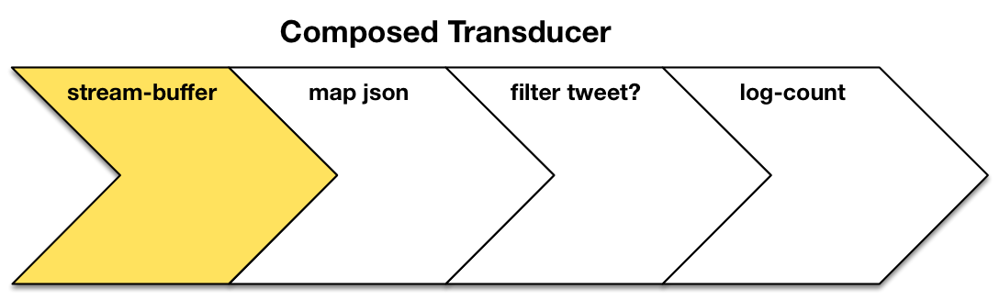

## TwitterClient Component

But these simple, per-item transducers do not not help in our case, where we know that some of the chunks are not complete but instead have to be glued together with the next one or two pieces. For that, we will need some kind of **state**. In the example above, that would be the space where we place fragments of a hundred dollar bill. But what if we want to see this aggregation process as a **black box**? Then, the aggregation cannot really have outside state. Also, as Rich Hickey mentioned in his StrangeLoop talk, there is no space in the machinery to keep state. What if one such transducer could have local state even if that is contained and not accessible from the outside? It turns out this is where stateful transducers can help.

Here’s how this stateful transducer looks like in **[code](https://github.com/matthiasn/BirdWatch/blob/f39a5692e4733784124d0f0930202d4270762d77/Clojure-Websockets/src/clj/birdwatch/twitterclient/processing.clj)**:

~~~
(defn- streaming-buffer []
  (fn [step]
    (let [buff (atom "")]
      (fn
        ([r] (step r))
        ([r x]
         (let [json-lines (-> (str @buff x) (insert-newline) (str/split-lines))
               to-process (butlast json-lines)]
           (reset! buff (last json-lines))
           (if to-process (reduce step r to-process) r)))))))
~~~

Let's go through this line by line. We have a (private) function named **streaming-buffer** that does not take any arguments. It returns a function that accepts the step function. This step function is the function that will be applied to every step from then on. This function then first creates the local state as an atom[^tc-volatile] which we will use as a buffer to store incomplete tweet fragments. It is worth noting that we don't have to use **atoms** here if we want to squeeze out the last bit of performance, but I find it easier not to introduce yet another concept unless absoletely necessary[^tc-atoms]. Next, this function returns another function which accepts two parameters, r for result and x for the current data item (in this case the - potentially incomplete - chunk). 

In the first line of the let binding, we use the **[-> (thread-first)](http://clojuredocs.org/clojure.core/-%3E)** macro. This macro makes the code more legible by simply passing the result of each function call as the first argument of the next function. Here, specifically, we **1)** concatenate the buffer with the new chunk, **2)** add newlines where missing[^tc-behavior], and **3)** split the string into a sequence on the line breaks.

Now, we cannot immediately process all those items in the resulting sequence. We know that all are complete except for the last one as otherwise there would not have been a subsequent tweet. But the last one may not be complete. Accordingly, we derive

~~~
(butlast json-lines)
~~~
 
under the name **to-process**. Then, we reset the buffer to whatever is in that last string: 

~~~
(reset! buff (last json-lines))
~~~

Finally, we have **reduce** call the **step** function for every item in **to-process**:

~~~
(if to-process (reduce step r to-process) r)
~~~

That way, only complete JSON strings are pushed down to the next operation, whereas intermediate JSON string fragments are kept locally and not passed on until certainly complete. That's all that was needed to make the tweets whole again. Next, we compose this with the JSON parsing transducer we have already met above so that this **streaming-buffer** transducer runs first and passes its result to the **JSON parser**.

Let's create a vector of JSON fragments and try it out. We have already established that transducers can be used on different data structures, it therefore should work equally well on a vector. Here's the vector for the test:

~~~
["{\"foo\"" ":1}\n{\"bar\":" "42}" "{\"baz\":42}" "{\"bla\":42}"]
~~~

Now we can check on the REPL if this will produce three complete JSON strings. It is expected here that the last one is lost because we would only check its completeness once there is a following tweet[^tc-buffer]. Once the collection to process is empty, the **arity-1** (single argument) function is called one last time, which really only returns the aggregate at that point:

{line-numbers=off,lang=text}
~~~
=> (in-ns 'birdwatch.twitterclient.processing)
#<Namespace birdwatch.twitterclient.processing>

=> (def chunks ["{\"foo\"" ":1}\n{\"bar\":" "42}" "{\"baz\":42}" "{\"bla\":42}"])
#'birdwatch.twitterclient.processing/chunks

=> (into [] (streaming-buffer) chunks)
["{\"foo\":1}" "{\"bar\":42}" "{\"baz\":42}"]
~~~

What somewhat confused me at first is what the step function actually was. Let's find out by printing it when the arity-1 function is called. We can modify the fourth line of **stream-buffer** like this:

{line-numbers=off,lang=clojure}
~~~
([r] (println step) (step r))
~~~

Now when we run the same as above on the REPL, we can see what the step function actually is:

{line-numbers=off,lang=text}
~~~
=> (into [] (streaming-buffer) chunks)
#<core$conj_BANG_ clojure.core$conj_BANG_@5fd837a>
["{\"foo\":1}" "{\"bar\":42}" "{\"baz\":42}"]
~~~

Interestingly, the step function is **conj!** which according to the **[source](https://github.com/clojure/clojure/blob/clojure-1.7.0-alpha2/src/clj/clojure/core.clj#L3208)** adds **x** to a **transient collection**[^tc-perf].

The step function is different when we use the transducer on a channel, but more about that when we use it in that scenario.

There's more to do before we can **compose all transducers** and attach them to the appropriate channel. Specifically, we can receive valid JSON from Twitter, which is not a tweet. This happens, for example, when we get a notification that we lag behind in consuming the stream. In that case we only want to pass on the parsed map if it is likely that it was a tweet and otherwise log it as an error. There is one **key** that all tweets have in common, which does not seem to appear in any status messages from Twitter: **:text**. We can thus use that key as the **predicate** for recognizing a tweet. Here's the **[code](https://github.com/matthiasn/BirdWatch/blob/f39a5692e4733784124d0f0930202d4270762d77/Clojure-Websockets/src/clj/birdwatch/twitterclient/processing.clj)**:

~~~
(defn- tweet? [data]
  "Checks if data is a tweet. If so, pass on, otherwise log error."
  (let [text (:text data)]
    (when-not text (log/error "error-msg" data))
    text))
~~~

Next, we also want to log the count of tweets received since the application started. Let's do this only for full thousands. We will need some kind of counter to keep track of the count. Let's create another **stateful transducer**:

~~~
(defn- log-count [last-received]
  "Stateful transducer, counts processed items and updating last-received atom. Logs progress every 1000 items."
  (fn [step]
    (let [cnt (atom 0)]
      (fn 
        ([r] (step r))
        ([r x]
         (swap! cnt inc)
         (when (zero? (mod @cnt 1000)) (log/info "processed" @cnt "since startup"))
         (reset! last-received (t/now))
         (step r x))))))
~~~

This transducer is comparable to the one we saw earlier, except that the local atom now holds the count. Initially, the counter is incremented and then, when the counter is divisible by 1000, the count is logged. In addition, this function also resets the **last-received** timestamp. Of course, this could be factored out into a separate function, but I think this will do.

Now, we can compose all these steps:

~~~
(defn process-chunk [last-received]
  "Creates composite transducer for processing tweet chunks. Last-received atom passed in for updates."
  (comp
   (streaming-buffer)
   (map json/read-json)
   (filter tweet?)
   (log-count last-received)))
~~~

The above creates a composed function that takes the timestamp atom provided by the TwitterClient component as an argument. The entires namespace can be found **[here](https://github.com/matthiasn/BirdWatch/blob/f39a5692e4733784124d0f0930202d4270762d77/Clojure-Websockets/src/clj/birdwatch/twitterclient/processing.clj)**. We can now use this **transducing function** and apply it to different data structures. Here, we use it to create a channel that takes tweet chunk fragments and delivers parsed tweets on the other side of the conveyor belt. 

Let's try the composed transducer on a vector to see what's happening. For that, we create a vector with two JSON strings that contain the **:text** property and two that don't. 

{line-numbers=off,lang=text}
~~~
["{\"text\"" ":\"foo\"}\n{\"text\":" "\"bar\"}" "{\"baz\":42}" "{\"bla\":42}"])
~~~

Then we should see that the invalid one is logged and the other two are returned (the final one at that point still in the buffer):

{line-numbers=off,lang=text}
~~~
=> (in-ns 'birdwatch.twitterclient.processing)
=> (def chunks ["{\"text\"" ":\"foo\"}\n{\"text\":" "\"bar\"}" "{\"baz\":42}" "{\"bla\":42}"])
=> (into [] (process-chunk (atom (t/epoch))) chunks)
ERROR birdwatch.twitterclient.processing - error-msg {:baz 42}
[{:text "foo"} {:text "bar"}]
~~~

Great, we have a composed transducer that works on vectors as expected. According to Rich Hickey this should work equally well on channels. But let's not take his word for it and instead try it out. First, here's my attempt to visualize the usage of a transducer in a channel. To make things easier, no errors occur.



You can also see the illustration above as an animation in the original **[blog post](http://matthiasnehlsen.com/blog/2014/10/06/Building-Systems-in-Clojure-2/)**.

Now for a simple example in the REPL:

{line-numbers=off,lang=text}
~~~
=> (in-ns 'birdwatch.twitterclient.processing)
#<Namespace birdwatch.twitterclient.processing>

=> (def chunks ["{\"text\"" ":\"foo\"}\r\n{\"text\":" "\"bar\"}" "{\"baz\":42}" "{\"bla\":42}"])
#'birdwatch.twitterclient.processing/chunks

=> (require '[clojure.core.async :as async :refer [chan go-loop <! put!]])
=> (def c (chan 1 (process-chunk (atom (t/now)))))
#'birdwatch.twitterclient.processing/c

=> (go-loop [] (println (<! c)) (recur))
#<ManyToManyChannel clojure.core.async.impl.channels.ManyToManyChannel@2f924b3f>

=> (put! c (chunks 0))
=> (put! c (chunks 1))
{:text foo}

=> (put! c (chunks 2))
=> (put! c (chunks 3))
{:text bar}

=> (put! c (chunks 4))
ERROR birdwatch.twitterclient.processing - error-msg {:baz 42}
~~~

Excellent, same output. In case you're not familiar with **core.async channels** yet: above we created a channel with the same transducer attached as in the previous example, then we created a **go-loop** to consume the channel and finally, we **put!** the individual chunks on the channel. No worries if this seems a little much right now. We'll cover this topic in much more detail in later chapters.


[^tc-numbers]: I don't know much about the exact mechanism at play, actual numbers or delivery guarantees. It anyhow doesn’t matter much for the purpose of this application. The interesting views focus on the most retweeted tweets. Now every retweet contains the original tweet under “retweeted_status”, with the current numbers such as retweet and favorite count for the moment in time it was retweeted. For popular ones, we thus receive the original tweet many, many times over. So even if we missed as much as half of all the tweets - which I consider unlikely - the popular tweets would only be updated less often. Worst case: retweet count is off by one or two. I can live with that. In reality, for the current selection of terms, reaching the limit also hardly ever happens. After all, 1% is still millions of tweets per day.

[^tc-atoms]: **Atoms** are essential to Clojure’s **state model**. Essentially, you have this managed reference that is thread-safe. Whenever we dereference such an atom, we get the state of the world this very second. Then, when you pass the dereferenced value to other parts of the application, it still represents the immutable state of the world at that point in time. It cannot change. Next time I dereference that atom, I will get the new state of the world. Updates to atoms can only happen in transactions, meaning that no two can run at the same time. Thus, we won't have to chase crazy concurrency issues.

[^tc-volatile]: After initial experimentation with a **[local volatile reference](http://dev.clojure.org/jira/browse/CLJ-1512)**, I decided in favor of a good old atom. The **volatile!** local reference trades off potential race conditions with speed. But there’s no performance issue when we process tweet chunks a few hundred times a second utmost, so why bother and introduce a new concept? Worth to keep in mind, though, when performance is an issue.

[^tc-behavior]: For whatever reason, the changed behavior of the streaming API also entails that not all tweets are followed by a line break, only most of them. A tiny helper function inserts those missing linebreaks where they are missing between two tweets: ````(str/replace s #"\}\{" "}\r\n{"))````.

[^tc-buffer]: One could probably check if the buffer contains a valid and complete JSON string when the arity-1 function is called, and if so, pass it on. Considering though that in this application we are interested in a stream that does not have an end, I omitted this step.

[^tc-perf]: I assume the **transient** collection is used for performance reasons.
