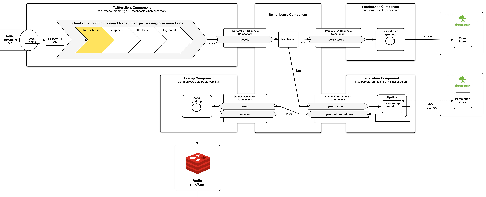
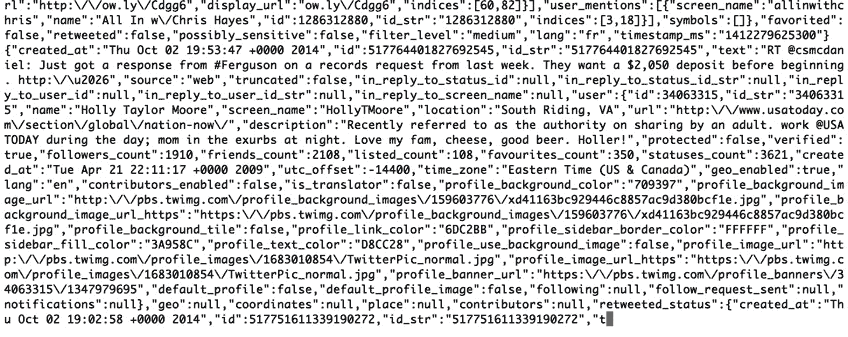

# Server-side: TwitterClient

## Architectural Overview

Here's an overview of the TwitterClient application. No worries if it's too small to read everything, we will look at different parts of it in detail later.

The purpose of the **TwitterClient** application is to maintain a streaming connection with the **[Twitter Streaming API](https://dev.twitter.com/streaming/overview)**, restart this connection if necessary, persist received tweets and make tweets available on a **[Redis Pub/Sub](http://redis.io/topics/pubsub)**. There can only be one instance of this application at any one time because Twitter does not allow you to start multiple clients at the same time.

Let’s start in **[hammock mode](https://www.youtube.com/watch?v=f84n5oFoZBc)**, without code. What is the problem we are trying to solve? It all starts with the tweet stream from the Twitter API. Very briefly, the **[Twitter Streaming API](https://dev.twitter.com/docs/streaming-apis)** allows us to subscribe to a (near) real time stream of tweets that contain one or more terms out of a set of terms. In the live instance under **[http://birdwatch2.matthiasnehlsen.com](http://birdwatch2.matthiasnehlsen.com/#*)** these terms at the moment happen to be "Ferguson", "ISIS", and "Ebola" - I am interested in all these topics. As long as that subscription does not hit a hard ceiling of **1%** of all the tweets flowing through twitter’s system, we can be sure that we will retrieve all of them. Otherwise the stream will be throttled to a maximum of **1%** of what is tweeted at any moment in time. [^tc-numbers]

Here is how that stream looks like when each chunk is simply printed to the console:

For reasons unbeknownst to me, tweets stopped respecting the chunk borders for the last half year. Instead, tweets occasionally span two or three chunks. This makes processing the tweets a little more complicated than we might wish for. One tweet per chunk is straightforward: 

{line-numbers=off,lang=text}
~~~
Receive chunk -> parse JSON into map -> put on conveyor belt (channel)
~~~

That looks like functional programming, right? No state to be kept anywhere, just functions producing results that are passed into other functions. But as desirable as that sounds, it does not align with reality. Instead, we need logical reasoning and state. What is the instruction we would give a sentient being? Imagine an intelligent agent standing between two conveyor belts. Imagine that agent being you. Here we go:

“On your left side, there’s a conveyor belt that keeps delivering hundred dollar bills. Put all of them on the other conveyor belt. Some of them come out cut into multiple pieces. These fragments are in correct order. Scotch tape is over there.”

I think we would all know what to do. There is a space where you park fragments of not-yet-complete bills / tweets. Then, with every new fragment, you inspect if the bill is complete and if so, put it back together and pass it on. Let’s try that in code. First, we will need to introduce **transducers** though.

### Transducers

> Transducers are a powerful and composable way to build algorithmic transformations that you can reuse in many contexts, and they're coming to Clojure core and core.async. **[Rich Hickey, August 2014](http://blog.cognitect.com/blog/2014/8/6/transducers-are-coming)** 

In a way, a transducer is the **essence** of a computation over data, without being bound to any kind of collection or data structure. Above, before we had to concern ourselves with the incomplete fragments, there was one step of the computation that we could **model as a transducer**: the part where we wanted to parse JSON into a map data structure.

Imagine we wanted to transform a vector of JSON strings into a vector of such parsed maps. We could simply do this:

~~~
(map json/read-json ["{\"foo\":1}" "{\"bar\":42}"])
~~~

However, the above is bound to the data structure, in this case a vector. That should not have to be the case, though. Rich Hickey provides a good example in his **[transducers talk](https://www.youtube.com/watch?v=6mTbuzafcII)**, likening the above to having to tell the guys processing luggage at the airport the same instructions twice, once for trolleys and again for conveyor belts, where in reality that should not matter. 

We could, for example, not only run the mapping function over every item in a vector but also reuse the same function on every item in a channel, stream or whatever.

With Clojure 1.7, we can now create such a transducing function by simply leaving out the data structure:

~~~
(def xform (map json/read-json))
~~~

Now, we can apply this transducing function to different kinds of data structures that are transducible processes. For example, we could transform all entries from a vector into another vector, like so:

~~~
(into [] xform ["{\"foo\":1}" "{\"bar\":42}"])
~~~

Or into a sequence, like this:

~~~
(sequence xform ["{\"foo\":1}" "{\"bar\":42}"])
~~~

It may not look terribly useful so far. But this can also be applied to a channel. Say, we want to create a channel that accepts JSON strings and transforms each message into a Clojure map. Simple:

~~~
(chan 1 xform)
~~~

The above creates a channel with a buffer size of one that applies the transducer to every element.
